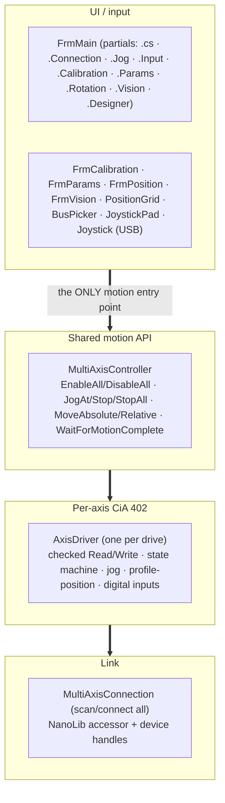
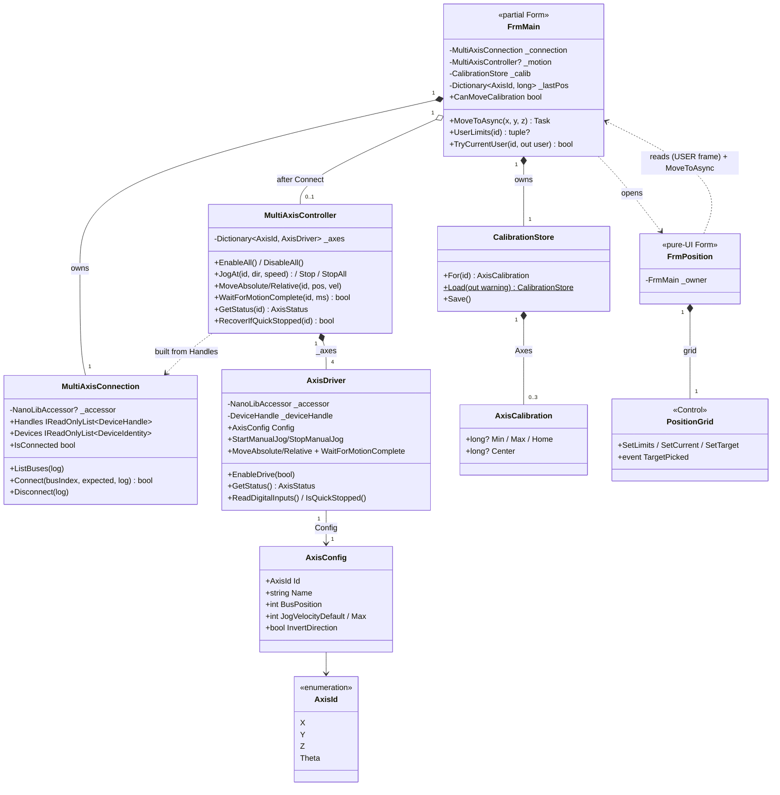
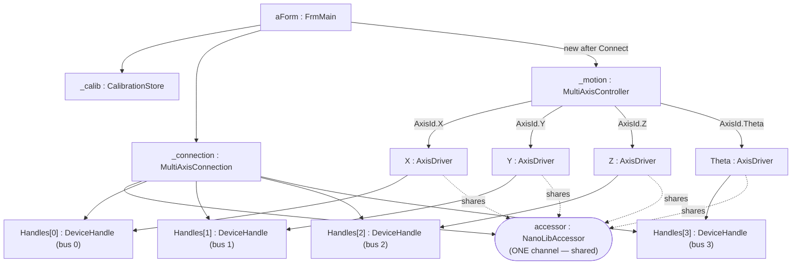
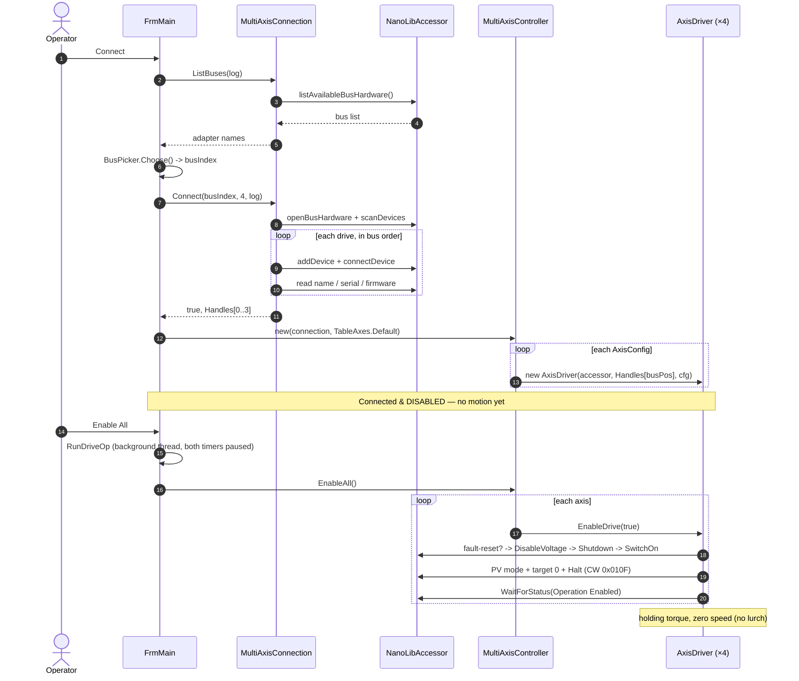
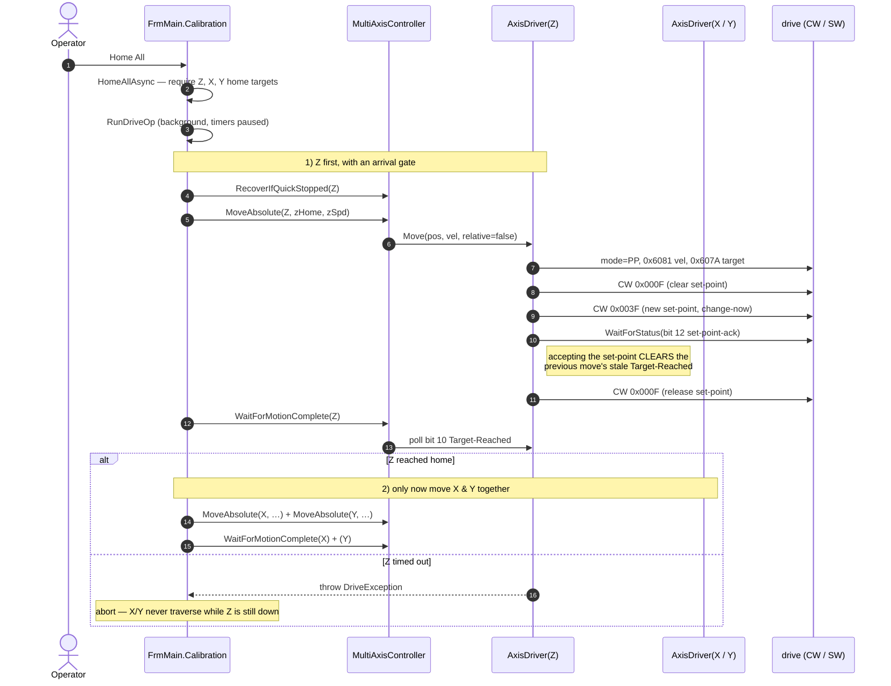

# Developer Guide — Nanotec Inspection-Table Controller

How the application is built and how each feature works internally. For operator
instructions, see **UserGuide.md**.

The app is a **.NET 10 (Windows) WinForms** program targeting **x64**, controlling four
Nanotec EtherCAT drives (X, Y, Z, Θ) through **NanoLib 1.4.0** over **EtherCAT / CoE
(CiA 402)** with an **Npcap soft master**. All code is in the single flat
`namespace NanotecController` (matching the project, assembly, and csproj `RootNamespace`).

---

## 1. Architecture & layering



**Golden rule:** every consumer (jog buttons, both joysticks, calibration, automation)
commands motion through `MultiAxisController` — **never** a drive directly. That keeps
direction inversion, the single-channel serialization, and the API surface in one place.

> `AxisDriver` models *any* axis (the chuck is just Θ). It was formerly named
> `ChuckController` (with `ChuckStatus`/`ChuckException`); the rename to the axis-neutral
> `AxisDriver`/`AxisStatus`/`DriveException` is done.

### Type model (class diagram)

The static structure of the motion stack and the tool windows. All four tool windows
(`FrmCalibration`, `FrmParams`, `FrmPosition`, `FrmVision`) follow the same **pure-UI** pattern:
they take an **`IMotionHost`** (implemented only by `FrmMain`) and call back through it, so the
windows never touch a drive directly and can be exercised against a fake. `IMotionHost` is the
one place the owner surface is documented.



### Runtime objects (object diagram)

A snapshot once connected, showing the composition that makes the **single-channel**
contract real: every `AxisDriver` shares the **one** `NanoLibAccessor`, so all SDO
access must be serialized (see §10). Each controller is bound to its drive by
**bus position** (all NodeIDs are 1).



---

## 2. File & folder organization

| Folder | Files | Role |
|---|---|---|
| **`Drive/`** | `MotionTypes.cs`, `MultiAxisConnection.cs`, `AxisDriver.cs`, `MultiAxisController.cs`, `DriveDiagnostics.cs`, `NanotecConnection.cs` | The motion stack: types, link, per-axis CiA 402, shared API, diagnostics. (`NanotecConnection` is the unused single-axis legacy link.) |
| **`Input/`** | `Joystick.cs`, `JoystickPad.cs`, `PositionGrid.cs`, `FrmPosition.cs` | USB (winmm) reader, the on-screen analog puck, and the Position Map grid control + its window. |
| **`Calibration/`** | `Calibration.cs`, `FrmCalibration.cs` | The persisted limits/home store and its UI window. |
| **`Vision/`** | `VisionCamera.cs`, `HalconBitmap.cs`, `FrmVision.cs`, detectors (`SolidCircleDetector.cs`, `ChuckEdgeDetector.cs`, `WaferEdgeDetector.cs`), `CameraCalibrator.cs`, `CentreFinder.cs`, `VisionOverlay.cs`, `VisionJogMath.cs` | HALCON camera + live-view window, the edge/fiducial detectors, and the (HALCON-bound) calibration / centre-find vision logic plus the overlay-drawing and jog-velocity helpers. |
| **`Geometry/`** | `CircleFit.cs`, `CrosshairRotation.cs` | HALCON-free maths: least-squares circle fit (centre-find) and the crosshair-pivot rotation geometry. |
| **`Params/`** | `FrmParams.cs` | The drive-parameter read/write/save-to-NV window (its host logic is `FrmMain.Params.cs`). |
| **root** | `FrmMain.*`, `IMotionHost.cs`, `BusPicker.cs`, `Program.cs` | The main window (split into partials), the owner-surface interface it implements, the bus-picker dialog, and the entry point. |

The project is **SDK-style with implicit globbing**, so folder placement doesn't affect
compilation, and all files share the one namespace (folders ≠ namespaces here).

### FrmMain is one class across partial files
`FrmMain` is a `partial class` split by concern — all files compile into a single type with
full mutual access to every field and method:

* `FrmMain.cs` — shared state (fields/constants), constructor, data-driven UI scaffolding
  (`BuildAxisRows`, `BuildPositionButton`), shared helpers (`RunDriveOp`, `RestartTimers`),
  window lifecycle, `SetState`/`RefreshButtons`/`AppendLog`.
* `FrmMain.Connection.cs` — connect/disconnect, enable/disable, `Read Params`.
* `FrmMain.Jog.cs` — per-axis jog buttons, the status poll, the soft-limit guard.
* `FrmMain.Input.cs` — USB + on-screen joystick polling and mapping.
* `FrmMain.Calibration.cs` — Home All, Move To, limit capture/find, Go Home, plus the
  Position Map window's data feed (position cache + USER-frame accessors + open-button).
* `FrmMain.Params.cs` — the per-axis parameter read-out (`Read Params`) console.
* `FrmMain.Rotation.cs` — rotate-about-crosshair: the continuous Θ + X/Y follow loop
  (`RotateAboutCrosshairAsync`, `RotateToAngleAsync`, `HoldRotateAsync`) and the handedness sign.
* `FrmMain.Vision.cs` — opens `FrmVision`; the drift-corrected vision-jog entry points
  (`VisionJogUser`/`VisionStop`) the vision window calls into.
* `FrmMain.Designer.cs` — designer-generated layout.

---

## 3. The connection layer (`Drive/MultiAxisConnection.cs`)

Connecting is **scan + verify only — it never enables a drive or commands motion.**

1. **`ListBuses()`** initialises the NanoLib accessor and enumerates network adapters.
   Results are index-aligned with what the bus picker shows; EtherCAT adapters are tagged.
   The scan result is held alive internally because the chosen `BusHardwareId` references it
   until the bus is closed.
2. **`Connect(busIndex, expectedCount, log)`** opens the adapter, scans the EtherCAT line,
   then **adds + connects every drive in scan order**. Each drive's name/serial/firmware is
   read and logged (the cross-check that bus position maps to the expected axis). A
   mid-sequence failure tears down everything connected so far (`TeardownPartial`). A
   device-count mismatch is a warning, not a hard failure.
3. **`Disconnect()`** disconnects/removes every handle, closes the bus, and releases the
   scan. Safe to call when not connected.

Handles are exposed in bus order via `Handles`; identities via `Devices`. `Result*` objects
are disposed with `using`.

---

## 4. Axis identity & configuration (`Drive/MotionTypes.cs`)

All four drives report **EtherCAT NodeID 1**, so an axis is identified by its **bus
(scan) position**, not a node ID.

* `AxisId` — `X, Y, Z, Theta`.
* `AxisConfig` — per axis: `BusPosition`, display `Name`, `JogVelocityDefault` /
  `JogVelocityMax` (slider start/ceiling, in drive velocity units), `InvertDirection`
  (flip command sign so "up/right = +" matches the mechanics), and optional soft limits.
* `TableAxes.Default` — **the single source of truth** for the mapping. On this machine the
  confirmed scan order is **X=0, Y=1, Z=2, Θ=3**. The GUI, joystick, and diagnostics all
  build from this list.

> **Units caveat:** jog/profile velocities and positions are in the **drive's own
> configured units** (set by the factor group, objects 0x6091/0x6092/0x6096), *not* mm/deg.
> Don't hard-code unit assumptions; `Read Params` dumps the scaling objects so they can be
> decoded.

---

## 5. Per-axis controller (`Drive/AxisDriver.cs`)

One instance per drive (accessor + device handle + `AxisConfig`). It owns the CiA 402
object-dictionary access for that axis.

### Checked primitives
`Write()` and `Read()` wrap `accessor.writeNumber/readNumber`, inspect the `Result`, and
throw a **`DriveException`** on any error instead of letting NanoLib return a silent `0`.
All `Result*` objects are disposed with `using`.

### The signed-read quirk (important)
NanoLib returns object values **zero-extended, not sign-extended**. Object **0x6064
(Position Actual)** is `INTEGER32` (signed), so a negative count would read back as ~4.29
billion and corrupt any maths. `ReadPosition()` casts the low 32 bits back to
two's-complement:

```csharp
private long ReadPosition() => (int)Read(OD_PosActual, "actual position");
```

**Any future signed-32 object read must do the same `(int)` cast.** (Writes are fine —
negative 32-bit writes already work, e.g. reverse jog via a negative 0x60FF.)

### `WaitForStatus`
Polls the statusword (0x6041) until a predicate holds or it times out, throwing a
`DriveException` that includes the last statusword for diagnosis. Used for every state
transition.

---

## 6. The CiA 402 state machine & **safe enable** (`EnableDrive`)

A drive ignores motion commands until walked through its power-up states. `EnableDrive(true)`
does this **and** guarantees no lurch:

1. **Fault reset** if faulted (rising edge of controlword bit 7), wait for the fault to clear.
2. **Normalise to Switch-On-Disabled** via Disable Voltage. This recovers cleanly from a
   leftover **Quick-Stop-Active** state (e.g. after a limit hit) that a plain Shutdown would
   not exit.
3. Walk **Shutdown → Switch On**, confirming `Ready To Switch On` then `Switched On` via the
   statusword masks — no blind sleeps.
4. **Force a non-moving setpoint before energising:** set Profile-Velocity mode, write target
   velocity **0**, then enter Operation Enabled **with the Halt bit set (`0x010F`)**. The
   result is holding torque with zero motion.

Step 4 is the fix for the "axis lurched on Enable" bug: entering Operation Enabled with a
plain `0x000F` would act on whatever mode/target the drive happened to hold. `EnableDrive(false)`
simply writes Disable Voltage.

State decoding (`GetStatus`) maps the statusword to `Operation Enabled / Switched On / Ready /
Fault / State 0xNN` and reports the fault bit.

---

## 7. Jogging — Profile Velocity (0x60FF)

`StartManualJog(velocity)` selects Profile-Velocity mode, writes the signed target velocity,
and clears the halt bit (`0x000F`) to run. `StopManualJog()` writes velocity 0 and re-asserts
Halt (`0x010F`).

`MultiAxisController.JogAt(id, direction, speed)` is the entry point: it applies the axis's
`InvertDirection` and converts `direction ∈ {-1,0,+1}` + speed into a signed velocity, with
`0` mapping to a stop.

---

## 8. Point-to-point — Profile Position + the set-point handshake

`MoveAbsolute/MoveRelative` use Profile-Position mode (0x6060 = 1). `Move()`:

1. Writes mode, profile velocity (0x6081), and target position (0x607A).
2. Drops controlword bit 4, then sets it (with change-immediately + abs/rel) to latch the
   move on its **rising edge**.
3. **Waits for set-point acknowledge (statusword bit 12)** — then drops bit 4 again.

Step 3 is a safety-critical fix. In Profile-Position mode the **Target-Reached bit (10)
persists from the previous move**. Without the handshake, a following `WaitForMotionComplete`
could read that *stale* bit and report "done" before the axis even started — which, in
**Home All**, could let X/Y traverse while Z was still down. Waiting for set-point-acknowledge
(which the drive raises only after accepting the new target, clearing Target-Reached) makes
completion measure *this* move. If a drive never raises bit 12, the bounded wait
(`STATE_TIMEOUT_MS`) still elapses long enough for the soft master to clear Target-Reached,
so completion is still fresh.

`WaitForMotionComplete(timeoutMs)` then polls Target-Reached and returns `false` on timeout.

> **Open verification item:** confirm on real hardware whether these drives actually set
> statusword bit 12. If not, the timeout-as-settle is load-bearing.

---

## 9. Shared motion API (`Drive/MultiAxisController.cs`)

Builds one `AxisDriver` per `AxisConfig`, mapping `BusPosition → handle`. It **throws in
the constructor** if a config points at a bus position that wasn't connected, so a miscount is
caught at build time, not as a null move later.

* `EnableAll` / `DisableAll` (disable is best-effort, never throws).
* `JogAt` / `Stop` / `StopAll` (stop paths never throw — they're safety paths).
* `MoveAbsolute` / `MoveRelative` / `WaitForMotionComplete`.
* `GetStatus` / `GetDigitalInputs` (raw 0x60FD).

**Threading contract:** these are short SDO calls but are **not** thread-safe against each
other (NanoLib is single-channel per device). Callers must serialize — see §10.

---

## 10. GUI threading & timer model

Two `System.Windows.Forms.Timer`s, both firing on the **UI thread** (so they never overlap
each other):

* **`statusTimer` (200 ms)** — reads each axis's position + state into its row and runs the
  soft-limit guard.
* **`joystickTimer` (50 ms)** — polls the active joystick and applies it (send-on-change).

Longer drive operations (enable/disable, Home, Find, Move) run on a **background thread** via
**`RunDriveOp`**, which **pauses both timers first** so the worker has the single NanoLib
channel to itself. A **`_busy`** flag gates the UI (buttons disabled, focus-loss handler
stands down) while an op owns the drives. `RestartTimers` re-baselines soft-limit tracking and
resumes the timers afterward.

This is the concurrency design: short UI-thread SDOs serialized by the single-threaded timer
model; long ops isolated on a worker with the timers parked.

---

## 11. Manual input

### Jog buttons (`FrmMain.cs` / `FrmMain.Jog.cs`)
The four axis rows are built in code from `TableAxes.Default`. Each row's −/+ buttons use
**MouseDown → `StartJog`, MouseUp → `StopJog`** so motion can't outlive the press. Speed is
read from that row's slider at press time.

### USB joystick (`Input/Joystick.cs`)
A minimal **winmm `joyGetPosEx`** P/Invoke reader (no package, no TFM change). Axis positions
are quantised to **-1/0/+1** (a digital stick parks at the rails), the POV hat folds into X/Y,
and Z/Θ accept buttons. Button map: **1 = deadman, 2 = fast, 3/4 = Z±, 5/6 = Θ±**. It only
*reads*; the caller owns the poll loop and all safety policy.

### On-screen joystick (`Input/JoystickPad.cs`)
A custom `Control`: a draggable puck in a circle that exposes a normalized **`Vector`**
(x right+, y up+, magnitude 0..1) carrying both **angle and distance** — a true analog input.
Releasing the mouse springs it back to centre → `(0,0)` → stop. Disabling the control
re-centres it.

### Mapping & send-on-change (`FrmMain.Input.cs`)
`inputSourceChanged` switches between **Off / USB / On-screen** (mutually exclusive), stopping
prior motion and reconfiguring. Per tick:
* **USB** → `ApplyJoy(axis, dir, fast)` per axis. Motion requires **deadman + enabled + not
  busy**; `fast` multiplies speed (capped at the slider max).
* **On-screen** → `TickOnScreen` scales the puck vector by the X/Y slider speeds and calls
  `ApplyVector` → `CommandVel`.

Both paths are **send-on-change**: a command is only issued when it differs from the last one
(`_lastJoy`, `_lastVx/_lastVy`), so a held stick doesn't flood the soft master and a guard's
stop stays stopped until the user actually changes input.

---

## 12. Soft-limit guard (`FrmMain.Jog.cs`)

Two cooperating mechanisms, both polarity-agnostic (they never assume which way positive
velocity moves the encoder):

### Reactive stop — `EnforceSoftLimits(id, pos)` (in the 200 ms poll)
Infers travel direction from the **position delta** (`pos - prevPos`). It stops the axis only
when it is **at/beyond a stored Min/Max AND still moving further out** — so jogging back into
range is always allowed. Send-on-change keeps it stopped. Because it runs at the poll rate,
expect some overshoot; physical switches (where present) remain the real safety.

### Pre-emptive block — `IsJogBlocked(id, dir)`
When the reactive stop fires, it records the **command direction** that pushed the axis out
(`_cmdDir → _limitBlockedDir`). Every jog entry point (`StartJog`, `ApplyJoy`, `CommandVel`)
consults `IsJogBlocked` first and refuses a **re-press/hold in that same direction**, so the
axis can't re-lurch each poll. Reversing into range clears the block. Both are recorded in
**command space**, so this works regardless of motor/encoder polarity.

`ResetSoftLimitTracking` clears all of this on connect/disconnect and after any paused op, so a
stale delta can't trigger a false stop.

> This guard is the **only** travel protection on X+ and both ends of Z (no working switches),
> so its correctness matters there more than anywhere.

---

## 13. Calibration & persistence (`Calibration/Calibration.cs`)

`AxisCalibration` holds `Min`, `Max`, `Home`, and a computed `Center` (midpoint, null until
both limits set). `CalibrationStore` is a per-axis dictionary persisted to **`calibration.json`**
next to the exe (Θ excluded). Home model: **X/Y use `Center`, Z uses explicit `Home`.**

* **`Load(out string? warning)`** — returns a fresh store on a missing/corrupt file and
  **surfaces a warning** (logged at startup as "starting with NO soft limits"). A corrupt
  file is preserved as **`calibration.corrupt.json`** so it isn't silently overwritten and can
  be inspected.
* **`Save()`** — **atomic**: writes a temp file then `File.Replace`, so a crash mid-write can't
  truncate the live calibration (which would silently drop the limits).

`FrmMain` owns the store, all motion, persistence, and timer coordination; `FrmCalibration` is
**pure UI** that calls FrmMain's `internal` methods (`SetCalibrationMin/Max/Home`,
`FindLimitsAsync`, `GoHomeAsync`, `HomeTargetFor`, `CanCapture/CanMoveCalibration`). This single
ownership is required because NanoLib is single-channel.

### Capture / Go Home / Move To
* **Set Min/Max/Home** (`CaptureInto`) reads the current 0x6064 and stores it.
* **Go Home** moves to `HomeTargetFor(id)` and logs before/after position, off-by, and whether
  Target-Reached was ever set (so a no-op move is visible).
* **Home All** (`HomeAllAsync`) requires all three home targets, then **Z-first with an
  arrival check** (§8), then X & Y together.
* **Move To** (`MoveToAsync`) parses optional X/Y/Z fields (`TryCoord`), **range-checks every
  entered target against Min/Max and rejects the whole move** if any is out of range, then moves
  the entered axes together.

### Position Map window (`Input/FrmPosition.cs`, `Input/PositionGrid.cs`)
An absolute-positioning window: an XY grid (`PositionGrid`) plus numeric X/Y/Z fields and a
**Go** button. **Stage-then-confirm** — clicking the grid (or typing) only stages a target
marker and fills the fields; nothing moves until **Go**, which calls the same `MoveToAsync`
(reusing its bounds-check and Y input-flip). Z is numeric only (no grid axis).

Like the other tool windows it is **pure UI** — it owns no drive access and reads everything
through `FrmMain` in the **USER frame**:
* **`UserLimits(id)`** / **`TryCurrentUser(id, out user)`** (in `FrmMain.Calibration.cs`) return
  the travel envelope and the live position with the **Y inversion already applied** (negating Y
  also swaps Min/Max, so the limits are re-sorted before returning). `PositionGrid` therefore
  never re-implements the Y flip — it just renders whatever user-frame numbers it's handed, and
  `MoveToAsync`'s own `TryCoord` flips the entered Y back to raw.
* The live position is served from **`_lastPos`**, a raw-per-axis cache the 200 ms status poll
  fills and `ResetSoftLimitTracking` clears. The window's own **250 ms** timer reads it and also
  reflects `CanMoveCalibration` onto the **Go** button.

`PositionGrid` is a self-contained `Control`: a filled current-position dot + a hollow target
crosshair, true XY aspect (letterboxed), greyed until both X and Y limits exist. It raises
`TargetPicked` (user-frame, clamped to limits) on click and exposes `SetCurrent` / `SetLimits` /
`SetTarget`. The old inline **Move To** console on the main form was removed (`BuildMoveToConsole`
→ `BuildPositionButton`); `MoveToAsync` now has this window as its only external caller (plus Home
All / Go Home internally).

> **Z-collision is operational, not coded:** there's no automatic Z guard. Set Z's Min limit
> above the chuck so a too-low Z target is rejected by the existing range check.

---

## 14. Fiducial detection — the solid circle (`Vision/SolidCircleDetector.cs`)

Finds the sub-pixel centre of the circular calibration fiducial — a **solid red disk, slightly
brighter than the red background**, crossed by **bright diagonal scribe lines** with a large
bright blob in one corner — in one frame. This is the 2D-localisable point that feeds the
pixel→step affine fit (§15, `Vision/CameraCalibrator.cs`); a smooth wafer edge can't serve
here because a plain arc only reveals motion along its normal (the aperture problem).

**The core idea:** clean the disk into a single near-perfect blob with morphology, then pick
the **roundest** survivor. The scribe lines and the clipped corner blob also threshold bright,
so shape alone can't separate them at the threshold step — an *opening* with a disk larger than
half a line's width erases the thin lines, and a *circularity* gate rejects whatever elongated
piece is left. The disk's centroid averages over thousands of pixels (sub-pixel, speckle-proof)
and stays valid at extreme stage positions.

The HDevelop tuning script `Halcon/solid circle fiducial detector.hdev` mirrors this pipeline
stage for stage (with `dev_display`/`stop` after each), so it can be tuned against live captures.

### The pipeline

1. **Load the frame.** Read the capture; grab `Width`/`Height` for display.
2. **Isolate the red channel → byte.** The markers are red-lit, so the red channel carries
   almost all the contrast (a luminance grey weights red only ~0.3). Mono frames pass through.
3. **Threshold the bright structures.** `binary_threshold(… 'max_separability' 'light')`
   auto-picks the cut (Otsu-style — no hand-tuned grey level) and keeps the bright side → the
   disk **plus** the scribe lines and the corner blob.
4. **Close → fill → open into a clean disk.** `closing_circle` (radius `ClosingRadius`) bridges
   the rim notch where a scribe line cuts the disk and absorbs dark internal streaks; `fill_up`
   closes any fully-enclosed holes; `opening_circle` (radius `OpenRadius`) — a disk bigger than
   half the scribe-line width — severs/erases the thin lines, leaving a near-perfect solid circle.
5. **Validate the shape.** `connection`, then `select_shape` keeps only regions that are both
   round enough (`circularity ≥ MinCircularity`) **and** the right size (`MinArea ≤ area ≤
   MaxArea`), dropping the lines, the corner blob, and vignette/background speckle.
6. **Extract the centre.** Of the survivors, take the **most circular** (`circularity` +
   `tuple_sort_index` + `select_obj`) — *not* the largest, so the round fiducial wins over any
   larger-but-elongated piece that slips the gate. `area_center` gives the centroid **`(Row,
   Column)`** in pixels — **the fiducial centre.** Radius is back-computed from area
   (`r = √(area/π)`) for the overlay (boundary in red, cross at the centre in yellow).

```
red channel → threshold bright → close + fill + open → clean solid disk
  → validate (round & sized) → pick MOST circular → area_center → centre (row, col)
```

> **Tunables** (`ClosingRadius`, `OpenRadius`, `MinCircularity`, `MinArea`, `MaxArea`) are
> exposed as properties and set **empirically**, not by formula: run the .hdev script on
> representative captures, read the real area/circularity, and set the gates with margin below
> the true values. Size `ClosingRadius` just above the widest rim gap/streak, and `OpenRadius`
> above half the widest scribe-line width but below the disk radius (too large erases the disk
> too). `MinCircularity` defaults to `0.85` — tight enough to reject the elongated corner blob.
> A missed detection costs more than a rare false hit, which the downstream circle-fit/residual
> checks catch anyway.

---

## 15. Camera-scale calibration & crosshair-pivot rotation (`Vision/CameraCalibrator.cs`, `Geometry/CrosshairRotation.cs`, `FrmMain.Rotation.cs`)

Two halves: (A) **fit** the pixel→step relationship from manually-captured fiducial samples,
then (B) **use** it to rotate the chuck about the camera crosshair — driving X/Y so the point
under the crosshair stays pinned while Θ turns.

### A. The pixel→step affine fit (`CameraCalibrator.cs` → `PixelStepAffine`)

The camera is fixed and the table moves, so moving the table by ΔM shifts the fiducial's pixel
linearly: Δpixel = J·ΔM. We fit the **inverse** directly — steps as a linear function of pixels
— because every downstream use needs "this pixel error → that motor move," with no runtime
matrix inversion:

```
X = Xr·row + Xc·col + eX
Y = Yr·row + Yc·col + eY
```

The four slopes `(Xr, Xc, Yr, Yc)` are the **steps-per-pixel matrix `A`** — carrying both scale
*and* the camera↔stage mounting rotation (the off-diagonals `Xc`, `Yr` are that rotation; if the
camera were square to the stage they'd be ~0). The offsets `eX, eY` are fit but **discarded** —
only displacements are used downstream, so a constant offset cancels.

Each sample pairs a detected fiducial pixel `(row, col)` (from §14) with the motor `(X, Y)` the
table was at when the frame was grabbed. The fit is ordinary least squares (`TrySolve`):

1. **Centre the data** — subtract the pixel and step centroids. This drops the offset from the
   slope estimation and conditions the problem.
2. **Build the 2×2 pixel covariance** `M = [[drr, drc], [drc, dcc]]` — variances of `row`/`col`
   on the diagonal, their covariance off it. `M` depends only on *where you sampled in the
   image*, not on the motors.
3. **Reject collinear samples** — if `det(M) = drr·dcc − drc² ≈ 0`, the sample points lie on a
   line and a 2-D map can't be recovered ("move the table in BOTH X and Y").
4. **Solve `M·[Xr;Xc] = [drX;dcX]` and `M·[Yr;Yc] = [drY;dcY]`** by Cramer's rule. `drX`…`dcY`
   are the pixel↔step **cross-covariances** (the only place motor data enters). The same `M`
   serves both axes — invert once, solve twice.
5. **RMS residual in steps** is reported as a quality gate: small = the relationship really is
   linear (no backlash/clipping); large = something's contaminated. ≥3 spanning samples needed.

> Fitting steps = f(pixel) (rather than the causally/statistically cleaner pixel = f(steps),
> since the *pixel* is the noisy measurement) is a deliberate trade: it yields `A = J⁻¹`
> directly for runtime, and the two directions converge as the residual → 0 — which the gate in
> step 5 enforces.

### B. Correcting the chuck jog — rotation about the crosshair (`CrosshairRotation.cs`)

Θ only ever rotates the chuck about its own **mechanical centre `C`**. A feature sitting off
`C` therefore **drifts off the crosshair** as Θ turns (runout). To keep it pinned we rotate
about the **crosshair** instead, by adding an X/Y shift that makes `C` orbit the crosshair by
the same angle. With the stored affine `A` and chuck centre `C` (both USER-frame), the X/Y
target for a Θ rotation of φ is:

```
S' = C + A·R(φ)·A⁻¹·(S − C),     φ = sign·θ
```

- **`A⁻¹·(S − C)`** — where the chuck centre sits relative to the crosshair, converted from
  steps **into pixels** (`A⁻¹` is the 2×2 inverse, `det = Xr·Yc − Xc·Yr`; degenerate → abort).
- **`R(φ)`** — orbit that pixel offset by the angle.
- **`A·(…)`** — map the rotated offset **back to steps**.

Using `A` (not a per-axis steps/mm scalar) is essential: a rotation in the image becomes a
*coupled* X-and-Y move in steps whenever the camera is mounted at an angle, and only the full
matrix (with its off-diagonals) cross-couples the correction correctly. `sign` (±1) is the
image handedness of a positive Θ move — not derivable from the translation-only affine, so it
is fixed empirically (the sign test) and persisted as `RotationSign`.

### Applying it as a continuous jog (`FrmMain.Rotation.cs`)

`RotateAboutCrosshairAsync` / `HoldRotateAsync` run all three axes **continuously**, like the
joystick — not step-and-settle (the soft master can't sync continuous multi-axis moves):

* **Θ jogs at a constant velocity** (`ROTATE_THETA_SPEED`) toward the target angle (or until the
  button is released, for hold-to-rotate).
* A **~25 ms follow loop** reads Θ's *actual* swept angle each tick, calls
  `CrosshairRotation.TryXyTarget` for the X/Y position that pins the crosshair **at that angle**,
  and drives X/Y in **velocity mode** toward it with a proportional controller (`FollowVel`:
  dead-band → stop, else gain × error clamped to `[MINVEL, VMAX]`).
* The target is recomputed from the **original start pose `S₀`** every tick (not integrated), so
  rounding error never accumulates over a long rotation.

Safety in the loop:
* **Travel guard** — `RejectIfOutOfTravel` aborts if the pinning target would leave an axis's
  stored Min/Max (rotation can need more X/Y travel than available).
* **Follow guard** — if X/Y fall more than `ROTATE_FOLLOW_MAXERR` behind Θ, abort: either Θ is
  too fast or the handedness/polarity is wrong (a velocity loop would otherwise run away).
* **Frame** — the loop follows in the **USER frame** (`userY = −rawY`); a raw-frame error would
  invert Y and drive it the wrong way.
* On exit (complete, release, or abort) **all three axes are stopped** in a `finally`.

> **Open items:** `RotationSign` defaults to +1 with a warning until the sign test fixes it;
> `ROTATE_FOLLOW_GAIN`/`VMAX` are tuned on hardware (units aren't mm/deg yet). Requires a full
> calibration — affine **and** chuck centre — gated by `CanRotate`.

---

## 16. Chuck centre-find — edge detection + circle fit (`Vision/ChuckEdgeDetector.cs`, `Geometry/CircleFit.cs`, `Vision/FrmVision.cs`)

Finds the chuck's **mechanical centre in motor-step space**, so the table can drive that
centre under the camera crosshair — and so it can serve as the **pivot** for crosshair-pinned
rotation (§15 B). The chuck is circular but the camera can't see the whole rim at once, so the
centre is dervied by finding points on the circumference. Each point is a frame where the operator
has jogged the rim onto the crosshair; the detector returns the precise rim point,
the affine (§15 A) converts it to steps, and a least-squares circle fit through ≥3
such points gives the centre. **Requires a camera-scale
calibration first** (the affine `A`); the result is persisted as `ChuckCenterX/Y` in
`calibration.json` (§13) and gates `CanRotate`.

### A. The edge detector — focus/texture, not brightness (`ChuckEdgeDetector.cs`)

The two sides of the chuck edge are **nearly the same colour**, so brightness can't separate
them. The discriminator is **focus**: the in-focus side is full of sharp, high-frequency
texture; the out-of-focus side is smooth/blurry. The detector builds a **focus-energy map**
that is bright where the image is sharp, thresholds it to keep the in-focus side, and takes that
region's boundary as the chuck edge. The HDevelop tuning script
`Halcon/chuck edge detector.hdev` mirrors this pipeline stage for stage (with
`dev_display`/`stop` after each), so it can be tuned against representative captures.

`TryDetect(image, crossRow, crossCol, …)` runs on the **full-resolution** frame:

1. **Red channel → byte.** The scene is red-lit, so channel 1 carries the contrast; mono frames
   pass through (`Preprocess`).
2. **Focus-energy map.** `sobel_amp('sum_abs', SobelWidth)` → gradient magnitude (high where
   sharp), then `mean_image(EnergyWindow, EnergyWindow)` smooths it into "how much sharp detail
   is in this neighbourhood." **Bright = in focus, dark = blurry.** `EnergyWindow` is the key
   knob.
3. **Auto-threshold.** `binary_threshold('max_separability', 'light')` (Otsu-style — no
   hand-tuned grey) keeps the in-focus side. `InFocusIsBright = false` flips to `'dark'` if the
   blurry side happens to read brighter.
4. **Clean + keep largest.** `opening_circle(CleanRadius)` drops specks, `fill_up` fills holes,
   `connection` + `select_shape_std('max_area')` keeps the one largest in-focus region.
5. **Boundary = chuck edge.** `gen_contour_region_xld('border')` traces the region outline. This
   includes segments that run along the **frame border**, but those are far from the crosshair
   and so are never selected in the next step.
6. **Nearest point wins.** Of every boundary pixel, return the one **nearest the crosshair** as
   the `EdgePoint(Row, Column)`. That single point is a true point on the rim — which is all the
   centre-find needs, and it sidesteps the aperture problem (a smooth arc only reveals motion
   along its normal, so you can't localise *along* it — but you can localise the one point under
   the crosshair). The boundary contour is optionally returned for overlay; **the caller owns
   and disposes it**. The input frame is never modified, and every HALCON temp is disposed in a
   `finally`.

```
red channel → sobel_amp (sharp=high) → mean_image (focus energy, bright=in focus)
  → threshold (keep in-focus) → open+fill+largest → boundary → point nearest crosshair
```

> **Tunables** (`SobelWidth=3`, `EnergyWindow=41`, `CleanRadius=5`, `InFocusIsBright`) are
> properties that mirror the `.hdev` script's variables; tune them there first, then copy across.

### B. Collecting rim points in step space (`FrmVision.cs`, "Add Edge")

The operator jogs the chuck so the **edge crosses the crosshair** at one spot on the rim, then
clicks **Add Edge**, which enqueues a one-shot job on the grab thread (the shared `_frameJobs`
dispatcher — see the live-view note below). On the next grab-loop tick the detector runs against
the live frame with the crosshair at the **frame centre** (`crossRow = h/2`, `crossCol = w/2`).
`OnEdgeGrabbed` then hands the detected pixel point to the chuck `CentreFinder` (`_chuckFinder`),
whose `Add(...)` converts it to step space via the stored affine:

```
E = M + A·(p_cross − p_edge)
```

where `M` is the motor `(X, Y)` at capture and `A` is the steps-per-pixel matrix (§15 A). `E`
is the motor position that *would* bring this rim point onto the crosshair — a true point on the
chuck rim expressed in **user-frame steps**. `CentreFinder` accumulates it. Repeat at several
spots **spread around the rim** (≥3).

> **Frame-request dispatcher.** Capture, calibration sample, and both edge detections all run
> their HALCON work on the grab thread (the acquisition handle is single-threaded). Each "request"
> button enqueues an `Action<HObject>` onto `_frameJobs`; `GrabLoop` drains the queue against the
> live frame, then each job marshals its bitmap + result back to the UI via `PostFrameBitmap`.

### C. The circle fit (`CentreFinder` → `CircleFit.cs`, "Compute Centre")

**Compute Centre** calls `CentreFinder.TryComputeCentre`, a thin wrapper that runs `CircleFit.TryFit`
over the accumulated points and rounds the result to whole steps. `CircleFit.TryFit` is an
algebraic least-squares (**Kåsa**) circle fit: it centres the data for
conditioning, solves the 3×3 normal equations by Gaussian elimination with partial pivoting, and
returns centre, radius, and **RMS residual** (distance of the points from the fitted circle, in
steps — small = the points really lie on a circle, a clean fit). It is exact for 3 non-collinear
points and **averages noise** over more, so extra captures help. It rejects **<3 points or a
collinear/coincident set** (no unique circle — "spread the captures around the rim"), the same
spanning requirement as the affine fit (§15 A).

The fitted centre is the motor position that puts the **chuck centre on the crosshair**. It's
stored in `_chuckCentre`, written to `Calibration.ChuckCenterX/Y`, and `Save()`d (§13);
the persistence and overlays stay in `FrmVision`, while the point-math + fit live in `CentreFinder`;
**Go to Centre** then confirms and calls `MoveToAsync(cx, cy)` (bounds-checked, Y-frame handled —
§13). A saved centre is reloaded on open so Go to Centre survives restarts.

> The standalone `Halcon/center calculation.hdev` demonstrates the closed-form **3-point**
> circle-centre via matrix determinants; `CircleFit` generalises that to a least-squares fit over
> *N* points so noisy captures average out.

> **Wafer centre-find** mirrors this exactly — its own `CentreFinder` (`_waferFinder`) +
> `WaferEdgeDetector` + a separate stored centre — differing only in the edge detector, the
> cyan rim overlay, and that it keeps its own result. The shared point/fit logic is the single
> `CentreFinder` class used by both.

---

## 17. Auto limit-find (`FrmMain.Calibration.cs`)

`FindLimitsAsync` (wired to **Y** only — two working switches that quick-stop) runs on a
background worker with timers paused:

1. **`ClearAnyActiveLimit`** — if the axis starts *on* a switch, back off first (trying both
   directions, since polarity is unverified), so the search doesn't drive into a switch for its
   whole timeout.
2. **`JogUntilLimit(+1)`** — jog at `FIND_LIMIT_SPEED`, watching 0x60FD limit bits (0/1) for a
   **newly-set** bit (direction-agnostic, so a NEG/POS wiring swap is moot), capture 0x6064, stop.
3. **`RecoverAndBackOff(-1)`** — a limit hit leaves the drive in Quick-Stop-Active;
   `EnableDrive(true)` exits it, then jog clear of the switch.
4. Repeat for the other end. Min/Max = the captured pair; Home = centre.

---

## 18. Diagnostics (`Drive/DriveDiagnostics.cs`)

`Read Params` (`readParamsButton_Click`) is a **read-only** sweep — it calls only `readNumber`,
so it can't disturb what it reports. This sidesteps the circularity of checking via PD Studio
(opening a project there may *write* it on connect). Two groups:

* **Limits** — `0x2031`, `0x6073`, `0x6075`, `0x203B:01/02`, `0x6072`, `0x6080` (fixed units:
  mA, 0.1%-rated, ms, rpm).
* **Units & scaling** — `0x60A8/0x60A9` (SI-unit codes, shown hex), `0x6091` (gear), `0x6092`
  (feed), `0x6096` (velocity factor). These **define** the position/velocity units, so jog
  targets are only meaningful relative to them.

Intended workflow: read → power-cycle → read → compare to confirm NV persistence.

---

## 19. Safety invariants (consolidated)

* **Connect = no motion**; drives come up disabled.
* **Enable = holding torque, zero speed** (Profile-Velocity + target 0 + Halt before
  Operation Enabled).
* **All jogging is momentary** (button release / deadman release / puck re-centre).
* **Focus loss** → `StopAll` + pause joystick timer (skipped while `_busy`, so it can't stomp a
  running op or race the worker on the single channel).
* **USB joystick disconnect** → stop all axes.
* **Soft limits** stop outward jog on calibrated axes; **same-direction re-press is blocked**.
* **Home All** confirms Z arrived before moving X/Y.
* **Move To** rejects the whole move if any target is out of range.
* **Form close** disables drives and disconnects.

---

## 20. Known limitations / open items

* **Unvalidated on hardware** — the full bring-up (4-drive enumeration, enable, jog, joystick,
  calibration, Home/Find) has not yet been confirmed on real drives. The **Position Map** window
  is build-verified only — not yet exercised on hardware.
* **Units unverified** — positions/velocities are raw drive units; the factor-group decode
  (0x60A8/0x60A9 + gear/feed/velocity factors) is not yet wired into a mm/deg conversion.
* **Set-point-acknowledge (bit 12)** behaviour on these drives is unconfirmed (see §8).
* **Chuck-angle members leak onto every axis** — `AxisDriver.AngleDegrees`/`TicksToAngle`/
  `GetActualChuckAngle` (chuck-specific, `ENCODER_TICKS_PER_REV = 40000` unverified) exist on all
  four instances but are effectively dead for the linear axes.
* **Partial bring-up** isn't supported: a missing drive aborts the whole connect (the
  connection layer's "partial works" comment overstates what `MultiAxisController` allows).

---

## 21. Appendix — sequence diagrams (key flows)

Dynamic views of the flows where ordering is subtle. (Static structure is in §1.)

### 21.1 Connect → build controllers → Enable All

Connecting only scans + verifies; controllers are built afterward; enabling forces a
non-moving set-point so no axis lurches (§6).



### 21.2 Profile-Position move + set-point handshake (Home All, Z-first)

The set-point-acknowledge wait (§8) is what makes completion measure *this* move, not the
previous one's stale Target-Reached bit — which is what lets Home All gate X/Y on Z arriving.



### 21.3 Auto limit-find (Find Limits, Y)

Direction-agnostic edge detection on the 0x60FD limit bits, with a Quick-Stop recovery
between ends (§17). Polarity is unverified, so the search keys off a *newly-set* bit, not a
specific direction.


