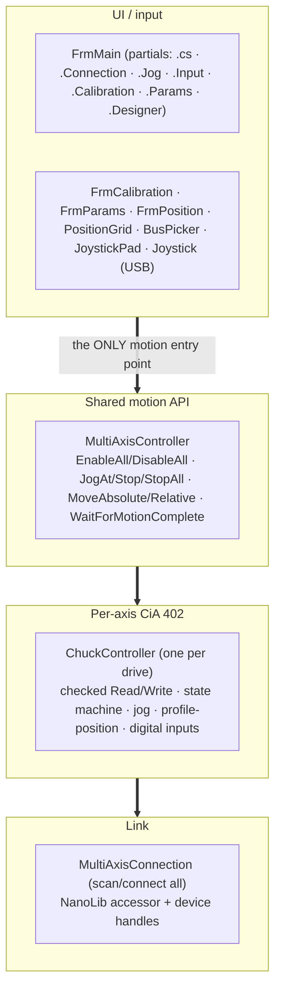
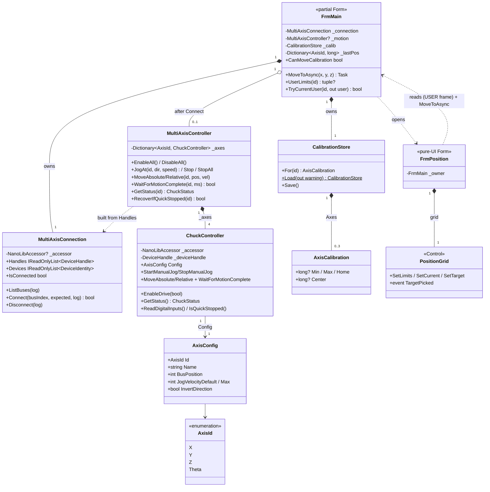
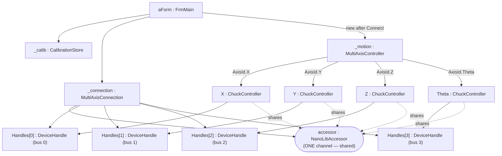
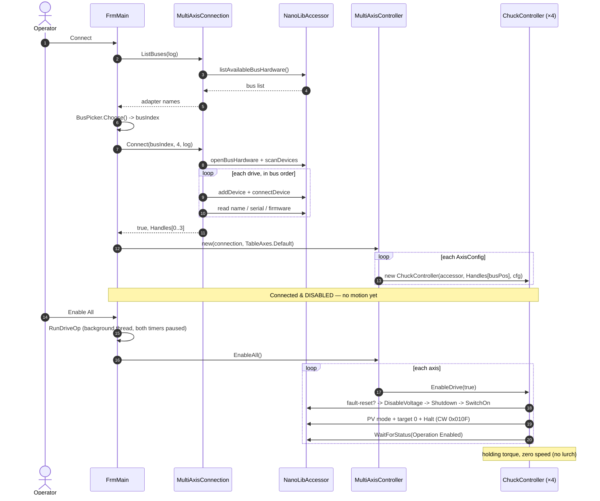
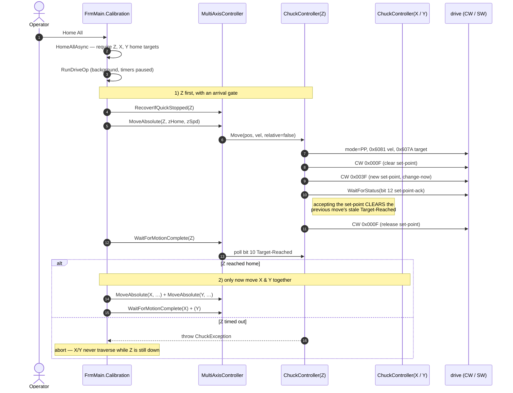
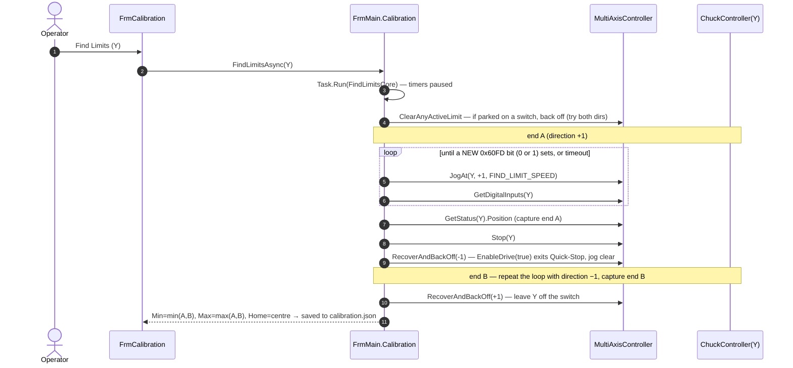

# Developer Guide — Nanotec Inspection-Table Controller

How the application is built and how each feature works internally. For operator
instructions, see **UserGuide.md**.

The app is a **.NET 10 (Windows) WinForms** program targeting **x64**, controlling four
Nanotec EtherCAT drives (X, Y, Z, Θ) through **NanoLib 1.4.0** over **EtherCAT / CoE
(CiA 402)** with an **Npcap soft master**. All code is in `namespace MotorControlApp`
(the csproj `RootNamespace` differs but the code namespace is explicit).

---

## 1. Architecture & layering



**Golden rule:** every consumer (jog buttons, both joysticks, calibration, automation)
commands motion through `MultiAxisController` — **never** a drive directly. That keeps
direction inversion, the single-channel serialization, and the API surface in one place.

> `ChuckController` is a legacy name; it models *any* axis (the chuck is just Θ). A rename
> to `AxisController` is pending; its `ChuckStatus`/`ChuckException` types leak the old name.

### Type model (class diagram)

The static structure of the motion stack and the tool windows. `FrmCalibration` and
`FrmParams` follow the same **pure-UI-over-FrmMain** pattern shown here for `FrmPosition`.



### Runtime objects (object diagram)

A snapshot once connected, showing the composition that makes the **single-channel**
contract real: every `ChuckController` shares the **one** `NanoLibAccessor`, so all SDO
access must be serialized (see §10). Each controller is bound to its drive by
**bus position** (all NodeIDs are 1).



---

## 2. File & folder organization

| Folder | Files | Role |
|---|---|---|
| **`Drive/`** | `MotionTypes.cs`, `MultiAxisConnection.cs`, `ChuckController.cs`, `MultiAxisController.cs`, `DriveDiagnostics.cs`, `NanotecConnection.cs` | The motion stack: types, link, per-axis CiA 402, shared API, diagnostics. (`NanotecConnection` is the unused single-axis legacy link.) |
| **`Input/`** | `Joystick.cs`, `JoystickPad.cs`, `PositionGrid.cs`, `FrmPosition.cs` | USB (winmm) reader, the on-screen analog puck, and the Position Map grid control + its window. |
| **`Calibration/`** | `Calibration.cs`, `FrmCalibration.cs` | The persisted limits/home store and its UI window. |
| **root** | `FrmMain.*`, `BusPicker.cs`, `Program.cs` | The main window (split into partials) plus the entry point. |

The project is **SDK-style with implicit globbing**, so folder placement doesn't affect
compilation, and all files share the one namespace (folders ≠ namespaces here).

### FrmMain is one class across partial files
`FrmMain` is a `partial class` split by concern — all files compile into a single type with
full mutual access to every field and method:

* `FrmMain.cs` — shared state (fields/constants), constructor, data-driven UI scaffolding
  (`BuildAxisRows`, `BuildPositionButton`), shared helpers (`RunDriveOp`, `RestartTimers`),
  window lifecycle, `SetState`/`RefreshButtons`/`AppendLog`.
* `FrmMain.Connection.cs` — connect/disconnect, enable/disable, `Read Params`.
* `FrmMain.Jog.cs` — per-axis jog buttons, the status poll, the soft-limit guard.
* `FrmMain.Input.cs` — USB + on-screen joystick polling and mapping.
* `FrmMain.Calibration.cs` — Home All, Move To, limit capture/find, Go Home, plus the
  Position Map window's data feed (position cache + USER-frame accessors + open-button).
* `FrmMain.Designer.cs` — designer-generated layout.

---

## 3. The connection layer (`Drive/MultiAxisConnection.cs`)

Connecting is **scan + verify only — it never enables a drive or commands motion.**

1. **`ListBuses()`** initialises the NanoLib accessor and enumerates network adapters.
   Results are index-aligned with what the bus picker shows; EtherCAT adapters are tagged.
   The scan result is held alive internally because the chosen `BusHardwareId` references it
   until the bus is closed.
2. **`Connect(busIndex, expectedCount, log)`** opens the adapter, scans the EtherCAT line,
   then **adds + connects every drive in scan order**. Each drive's name/serial/firmware is
   read and logged (the cross-check that bus position maps to the expected axis). A
   mid-sequence failure tears down everything connected so far (`TeardownPartial`). A
   device-count mismatch is a warning, not a hard failure.
3. **`Disconnect()`** disconnects/removes every handle, closes the bus, and releases the
   scan. Safe to call when not connected.

Handles are exposed in bus order via `Handles`; identities via `Devices`. `Result*` objects
are disposed with `using`.

---

## 4. Axis identity & configuration (`Drive/MotionTypes.cs`)

All four drives report **EtherCAT NodeID 1**, so an axis is identified by its **bus
(scan) position**, not a node ID.

* `AxisId` — `X, Y, Z, Theta`.
* `AxisConfig` — per axis: `BusPosition`, display `Name`, `JogVelocityDefault` /
  `JogVelocityMax` (slider start/ceiling, in drive velocity units), `InvertDirection`
  (flip command sign so "up/right = +" matches the mechanics), and optional soft limits.
* `TableAxes.Default` — **the single source of truth** for the mapping. On this machine the
  confirmed scan order is **X=0, Y=1, Z=2, Θ=3**. The GUI, joystick, and diagnostics all
  build from this list.

> **Units caveat:** jog/profile velocities and positions are in the **drive's own
> configured units** (set by the factor group, objects 0x6091/0x6092/0x6096), *not* mm/deg.
> Don't hard-code unit assumptions; `Read Params` dumps the scaling objects so they can be
> decoded.

---

## 5. Per-axis controller (`Drive/ChuckController.cs`)

One instance per drive (accessor + device handle + `AxisConfig`). It owns the CiA 402
object-dictionary access for that axis.

### Checked primitives
`Write()` and `Read()` wrap `accessor.writeNumber/readNumber`, inspect the `Result`, and
throw a **`ChuckException`** on any error instead of letting NanoLib return a silent `0`.
All `Result*` objects are disposed with `using`.

### The signed-read quirk (important)
NanoLib returns object values **zero-extended, not sign-extended**. Object **0x6064
(Position Actual)** is `INTEGER32` (signed), so a negative count would read back as ~4.29
billion and corrupt any maths. `ReadPosition()` casts the low 32 bits back to
two's-complement:

```csharp
private long ReadPosition() => (int)Read(OD_PosActual, "actual position");
```

**Any future signed-32 object read must do the same `(int)` cast.** (Writes are fine —
negative 32-bit writes already work, e.g. reverse jog via a negative 0x60FF.)

### `WaitForStatus`
Polls the statusword (0x6041) until a predicate holds or it times out, throwing a
`ChuckException` that includes the last statusword for diagnosis. Used for every state
transition.

---

## 6. The CiA 402 state machine & **safe enable** (`EnableDrive`)

A drive ignores motion commands until walked through its power-up states. `EnableDrive(true)`
does this **and** guarantees no lurch:

1. **Fault reset** if faulted (rising edge of controlword bit 7), wait for the fault to clear.
2. **Normalise to Switch-On-Disabled** via Disable Voltage. This recovers cleanly from a
   leftover **Quick-Stop-Active** state (e.g. after a limit hit) that a plain Shutdown would
   not exit.
3. Walk **Shutdown → Switch On**, confirming `Ready To Switch On` then `Switched On` via the
   statusword masks — no blind sleeps.
4. **Force a non-moving setpoint before energising:** set Profile-Velocity mode, write target
   velocity **0**, then enter Operation Enabled **with the Halt bit set (`0x010F`)**. The
   result is holding torque with zero motion.

Step 4 is the fix for the "axis lurched on Enable" bug: entering Operation Enabled with a
plain `0x000F` would act on whatever mode/target the drive happened to hold. `EnableDrive(false)`
simply writes Disable Voltage.

State decoding (`GetStatus`) maps the statusword to `Operation Enabled / Switched On / Ready /
Fault / State 0xNN` and reports the fault bit.

---

## 7. Jogging — Profile Velocity (0x60FF)

`StartManualJog(velocity)` selects Profile-Velocity mode, writes the signed target velocity,
and clears the halt bit (`0x000F`) to run. `StopManualJog()` writes velocity 0 and re-asserts
Halt (`0x010F`).

`MultiAxisController.JogAt(id, direction, speed)` is the entry point: it applies the axis's
`InvertDirection` and converts `direction ∈ {-1,0,+1}` + speed into a signed velocity, with
`0` mapping to a stop.

---

## 8. Point-to-point — Profile Position + the set-point handshake

`MoveAbsolute/MoveRelative` use Profile-Position mode (0x6060 = 1). `Move()`:

1. Writes mode, profile velocity (0x6081), and target position (0x607A).
2. Drops controlword bit 4, then sets it (with change-immediately + abs/rel) to latch the
   move on its **rising edge**.
3. **Waits for set-point acknowledge (statusword bit 12)** — then drops bit 4 again.

Step 3 is a safety-critical fix. In Profile-Position mode the **Target-Reached bit (10)
persists from the previous move**. Without the handshake, a following `WaitForMotionComplete`
could read that *stale* bit and report "done" before the axis even started — which, in
**Home All**, could let X/Y traverse while Z was still down. Waiting for set-point-acknowledge
(which the drive raises only after accepting the new target, clearing Target-Reached) makes
completion measure *this* move. If a drive never raises bit 12, the bounded wait
(`STATE_TIMEOUT_MS`) still elapses long enough for the soft master to clear Target-Reached,
so completion is still fresh.

`WaitForMotionComplete(timeoutMs)` then polls Target-Reached and returns `false` on timeout.

> **Open verification item:** confirm on real hardware whether these drives actually set
> statusword bit 12. If not, the timeout-as-settle is load-bearing.

---

## 9. Shared motion API (`Drive/MultiAxisController.cs`)

Builds one `ChuckController` per `AxisConfig`, mapping `BusPosition → handle`. It **throws in
the constructor** if a config points at a bus position that wasn't connected, so a miscount is
caught at build time, not as a null move later.

* `EnableAll` / `DisableAll` (disable is best-effort, never throws).
* `JogAt` / `Stop` / `StopAll` (stop paths never throw — they're safety paths).
* `MoveAbsolute` / `MoveRelative` / `WaitForMotionComplete`.
* `GetStatus` / `GetDigitalInputs` (raw 0x60FD).

**Threading contract:** these are short SDO calls but are **not** thread-safe against each
other (NanoLib is single-channel per device). Callers must serialize — see §10.

---

## 10. GUI threading & timer model

Two `System.Windows.Forms.Timer`s, both firing on the **UI thread** (so they never overlap
each other):

* **`statusTimer` (200 ms)** — reads each axis's position + state into its row and runs the
  soft-limit guard.
* **`joystickTimer` (50 ms)** — polls the active joystick and applies it (send-on-change).

Longer drive operations (enable/disable, Home, Find, Move) run on a **background thread** via
**`RunDriveOp`**, which **pauses both timers first** so the worker has the single NanoLib
channel to itself. A **`_busy`** flag gates the UI (buttons disabled, focus-loss handler
stands down) while an op owns the drives. `RestartTimers` re-baselines soft-limit tracking and
resumes the timers afterward.

This is the concurrency design: short UI-thread SDOs serialized by the single-threaded timer
model; long ops isolated on a worker with the timers parked.

---

## 11. Manual input

### Jog buttons (`FrmMain.cs` / `FrmMain.Jog.cs`)
The four axis rows are built in code from `TableAxes.Default`. Each row's −/+ buttons use
**MouseDown → `StartJog`, MouseUp → `StopJog`** so motion can't outlive the press. Speed is
read from that row's slider at press time.

### USB joystick (`Input/Joystick.cs`)
A minimal **winmm `joyGetPosEx`** P/Invoke reader (no package, no TFM change). Axis positions
are quantised to **-1/0/+1** (a digital stick parks at the rails), the POV hat folds into X/Y,
and Z/Θ accept buttons. Button map: **1 = deadman, 2 = fast, 3/4 = Z±, 5/6 = Θ±**. It only
*reads*; the caller owns the poll loop and all safety policy.

### On-screen joystick (`Input/JoystickPad.cs`)
A custom `Control`: a draggable puck in a circle that exposes a normalized **`Vector`**
(x right+, y up+, magnitude 0..1) carrying both **angle and distance** — a true analog input.
Releasing the mouse springs it back to centre → `(0,0)` → stop. Disabling the control
re-centres it.

### Mapping & send-on-change (`FrmMain.Input.cs`)
`inputSourceChanged` switches between **Off / USB / On-screen** (mutually exclusive), stopping
prior motion and reconfiguring. Per tick:
* **USB** → `ApplyJoy(axis, dir, fast)` per axis. Motion requires **deadman + enabled + not
  busy**; `fast` multiplies speed (capped at the slider max).
* **On-screen** → `TickOnScreen` scales the puck vector by the X/Y slider speeds and calls
  `ApplyVector` → `CommandVel`.

Both paths are **send-on-change**: a command is only issued when it differs from the last one
(`_lastJoy`, `_lastVx/_lastVy`), so a held stick doesn't flood the soft master and a guard's
stop stays stopped until the user actually changes input.

---

## 12. Soft-limit guard (`FrmMain.Jog.cs`)

Two cooperating mechanisms, both polarity-agnostic (they never assume which way positive
velocity moves the encoder):

### Reactive stop — `EnforceSoftLimits(id, pos)` (in the 200 ms poll)
Infers travel direction from the **position delta** (`pos - prevPos`). It stops the axis only
when it is **at/beyond a stored Min/Max AND still moving further out** — so jogging back into
range is always allowed. Send-on-change keeps it stopped. Because it runs at the poll rate,
expect some overshoot; physical switches (where present) remain the real safety.

### Pre-emptive block — `IsJogBlocked(id, dir)`
When the reactive stop fires, it records the **command direction** that pushed the axis out
(`_cmdDir → _limitBlockedDir`). Every jog entry point (`StartJog`, `ApplyJoy`, `CommandVel`)
consults `IsJogBlocked` first and refuses a **re-press/hold in that same direction**, so the
axis can't re-lurch each poll. Reversing into range clears the block. Both are recorded in
**command space**, so this works regardless of motor/encoder polarity.

`ResetSoftLimitTracking` clears all of this on connect/disconnect and after any paused op, so a
stale delta can't trigger a false stop.

> This guard is the **only** travel protection on X+ and both ends of Z (no working switches),
> so its correctness matters there more than anywhere.

---

## 13. Calibration & persistence (`Calibration/Calibration.cs`)

`AxisCalibration` holds `Min`, `Max`, `Home`, and a computed `Center` (midpoint, null until
both limits set). `CalibrationStore` is a per-axis dictionary persisted to **`calibration.json`**
next to the exe (Θ excluded). Home model: **X/Y use `Center`, Z uses explicit `Home`.**

* **`Load(out string? warning)`** — returns a fresh store on a missing/corrupt file and
  **surfaces a warning** (logged at startup as "starting with NO soft limits"). A corrupt
  file is preserved as **`calibration.corrupt.json`** so it isn't silently overwritten and can
  be inspected.
* **`Save()`** — **atomic**: writes a temp file then `File.Replace`, so a crash mid-write can't
  truncate the live calibration (which would silently drop the limits).

`FrmMain` owns the store, all motion, persistence, and timer coordination; `FrmCalibration` is
**pure UI** that calls FrmMain's `internal` methods (`SetCalibrationMin/Max/Home`,
`FindLimitsAsync`, `GoHomeAsync`, `HomeTargetFor`, `CanCapture/CanMoveCalibration`). This single
ownership is required because NanoLib is single-channel.

### Capture / Go Home / Move To
* **Set Min/Max/Home** (`CaptureInto`) reads the current 0x6064 and stores it.
* **Go Home** moves to `HomeTargetFor(id)` and logs before/after position, off-by, and whether
  Target-Reached was ever set (so a no-op move is visible).
* **Home All** (`HomeAllAsync`) requires all three home targets, then **Z-first with an
  arrival check** (§8), then X & Y together.
* **Move To** (`MoveToAsync`) parses optional X/Y/Z fields (`TryCoord`), **range-checks every
  entered target against Min/Max and rejects the whole move** if any is out of range, then moves
  the entered axes together.

### Position Map window (`Input/FrmPosition.cs`, `Input/PositionGrid.cs`)
An absolute-positioning window: an XY grid (`PositionGrid`) plus numeric X/Y/Z fields and a
**Go** button. **Stage-then-confirm** — clicking the grid (or typing) only stages a target
marker and fills the fields; nothing moves until **Go**, which calls the same `MoveToAsync`
(reusing its bounds-check and Y input-flip). Z is numeric only (no grid axis).

Like the other tool windows it is **pure UI** — it owns no drive access and reads everything
through `FrmMain` in the **USER frame**:
* **`UserLimits(id)`** / **`TryCurrentUser(id, out user)`** (in `FrmMain.Calibration.cs`) return
  the travel envelope and the live position with the **Y inversion already applied** (negating Y
  also swaps Min/Max, so the limits are re-sorted before returning). `PositionGrid` therefore
  never re-implements the Y flip — it just renders whatever user-frame numbers it's handed, and
  `MoveToAsync`'s own `TryCoord` flips the entered Y back to raw.
* The live position is served from **`_lastPos`**, a raw-per-axis cache the 200 ms status poll
  fills and `ResetSoftLimitTracking` clears. The window's own **250 ms** timer reads it and also
  reflects `CanMoveCalibration` onto the **Go** button.

`PositionGrid` is a self-contained `Control`: a filled current-position dot + a hollow target
crosshair, true XY aspect (letterboxed), greyed until both X and Y limits exist. It raises
`TargetPicked` (user-frame, clamped to limits) on click and exposes `SetCurrent` / `SetLimits` /
`SetTarget`. The old inline **Move To** console on the main form was removed (`BuildMoveToConsole`
→ `BuildPositionButton`); `MoveToAsync` now has this window as its only external caller (plus Home
All / Go Home internally).

> **Z-collision is operational, not coded:** there's no automatic Z guard. Set Z's Min limit
> above the chuck so a too-low Z target is rejected by the existing range check.

---

## 14. Auto limit-find (`FrmMain.Calibration.cs`)

`FindLimitsAsync` (wired to **Y** only — two working switches that quick-stop) runs on a
background worker with timers paused:

1. **`ClearAnyActiveLimit`** — if the axis starts *on* a switch, back off first (trying both
   directions, since polarity is unverified), so the search doesn't drive into a switch for its
   whole timeout.
2. **`JogUntilLimit(+1)`** — jog at `FIND_LIMIT_SPEED`, watching 0x60FD limit bits (0/1) for a
   **newly-set** bit (direction-agnostic, so a NEG/POS wiring swap is moot), capture 0x6064, stop.
3. **`RecoverAndBackOff(-1)`** — a limit hit leaves the drive in Quick-Stop-Active;
   `EnableDrive(true)` exits it, then jog clear of the switch.
4. Repeat for the other end. Min/Max = the captured pair; Home = centre.

---

## 15. Diagnostics (`Drive/DriveDiagnostics.cs`)

`Read Params` (`readParamsButton_Click`) is a **read-only** sweep — it calls only `readNumber`,
so it can't disturb what it reports. This sidesteps the circularity of checking via PD Studio
(opening a project there may *write* it on connect). Two groups:

* **Limits** — `0x2031`, `0x6073`, `0x6075`, `0x203B:01/02`, `0x6072`, `0x6080` (fixed units:
  mA, 0.1%-rated, ms, rpm).
* **Units & scaling** — `0x60A8/0x60A9` (SI-unit codes, shown hex), `0x6091` (gear), `0x6092`
  (feed), `0x6096` (velocity factor). These **define** the position/velocity units, so jog
  targets are only meaningful relative to them.

Intended workflow: read → power-cycle → read → compare to confirm NV persistence.

---

## 16. Safety invariants (consolidated)

* **Connect = no motion**; drives come up disabled.
* **Enable = holding torque, zero speed** (Profile-Velocity + target 0 + Halt before
  Operation Enabled).
* **All jogging is momentary** (button release / deadman release / puck re-centre).
* **Focus loss** → `StopAll` + pause joystick timer (skipped while `_busy`, so it can't stomp a
  running op or race the worker on the single channel).
* **USB joystick disconnect** → stop all axes.
* **Soft limits** stop outward jog on calibrated axes; **same-direction re-press is blocked**.
* **Home All** confirms Z arrived before moving X/Y.
* **Move To** rejects the whole move if any target is out of range.
* **Form close** disables drives and disconnects.

---

## 17. Known limitations / open items

* **Unvalidated on hardware** — the full bring-up (4-drive enumeration, enable, jog, joystick,
  calibration, Home/Find) has not yet been confirmed on real drives. The **Position Map** window
  is build-verified only — not yet exercised on hardware.
* **Units unverified** — positions/velocities are raw drive units; the factor-group decode
  (0x60A8/0x60A9 + gear/feed/velocity factors) is not yet wired into a mm/deg conversion.
* **Set-point-acknowledge (bit 12)** behaviour on these drives is unconfirmed (see §8).
* **`ChuckController` rename** to `AxisController` is pending; `AngleDegrees`/`TicksToAngle`
  (chuck-specific, `ENCODER_TICKS_PER_REV = 40000` unverified) are effectively dead for the
  linear axes.
* **Partial bring-up** isn't supported: a missing drive aborts the whole connect (the
  connection layer's "partial works" comment overstates what `MultiAxisController` allows).

---

## 18. Appendix — sequence diagrams (key flows)

Dynamic views of the flows where ordering is subtle. (Static structure is in §1.)

### 18.1 Connect → build controllers → Enable All

Connecting only scans + verifies; controllers are built afterward; enabling forces a
non-moving set-point so no axis lurches (§6).



### 18.2 Profile-Position move + set-point handshake (Home All, Z-first)

The set-point-acknowledge wait (§8) is what makes completion measure *this* move, not the
previous one's stale Target-Reached bit — which is what lets Home All gate X/Y on Z arriving.



### 18.3 Auto limit-find (Find Limits, Y)

Direction-agnostic edge detection on the 0x60FD limit bits, with a Quick-Stop recovery
between ends (§14). Polarity is unverified, so the search keys off a *newly-set* bit, not a
specific direction.


