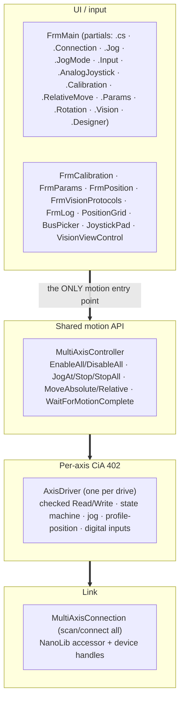
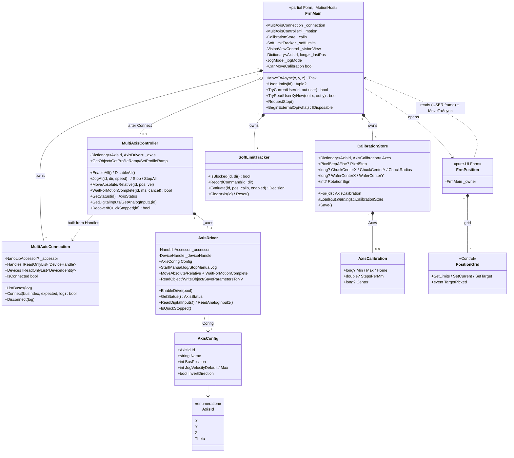
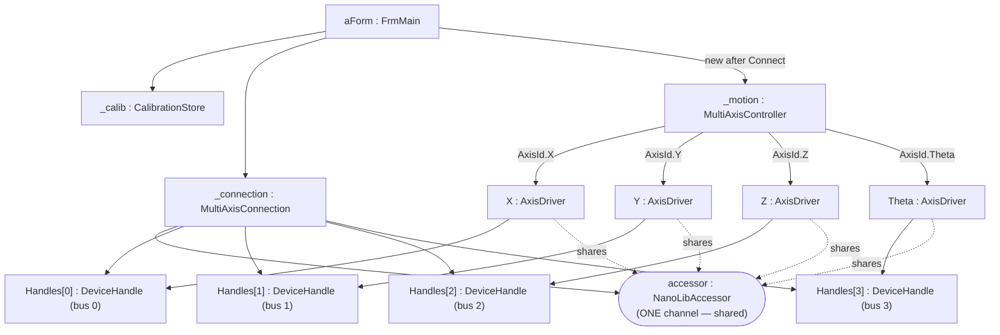
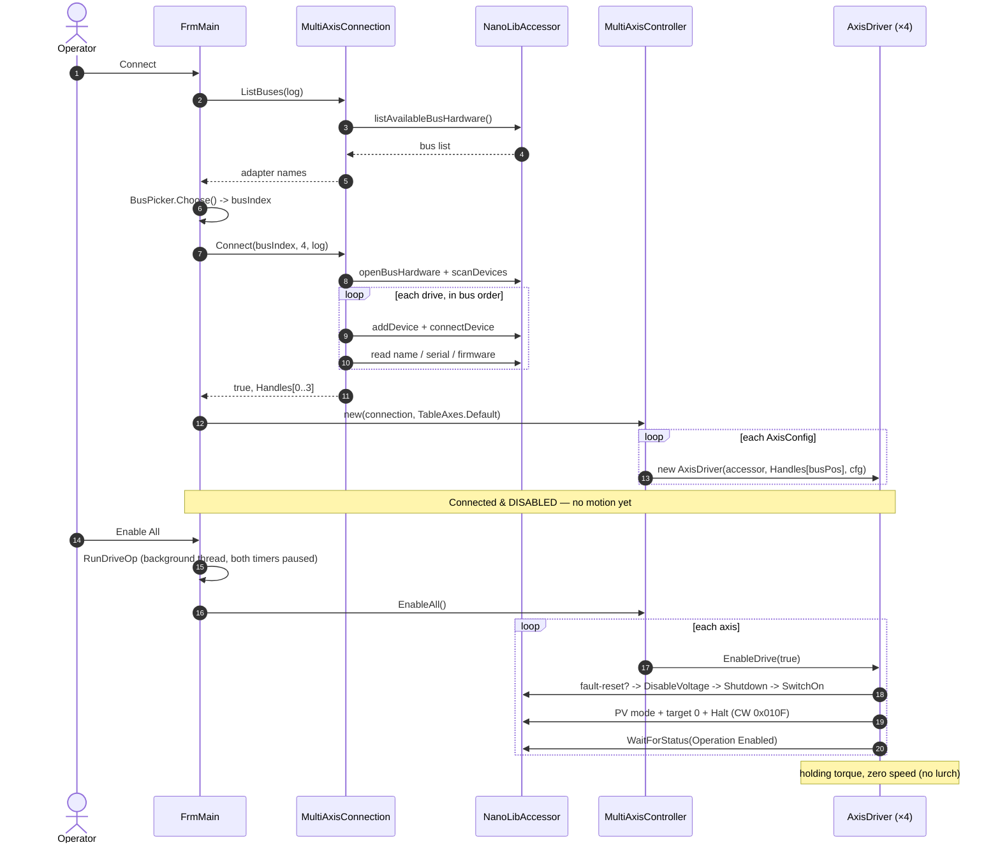
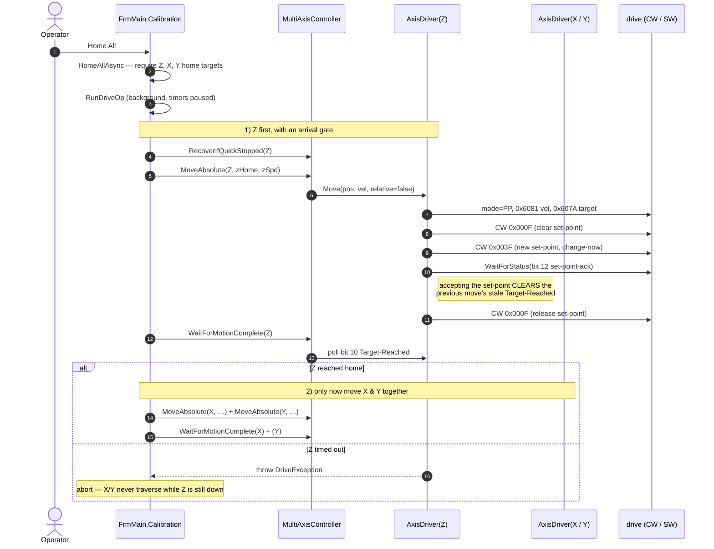

# Developer Guide — Nanotec Inspection-Table Controller

How the application is built and how each feature works internally. For operator
instructions, see the **[User Guide](../user-guide/)**.

The app is a **.NET 10 (Windows) WinForms** program targeting **x64**, controlling four
Nanotec EtherCAT drives (X, Y, Z, Θ) through **NanoLib 1.4.0** over **EtherCAT / CoE
(CiA 402)** with an **Npcap soft master**, plus a **HALCON** machine-vision camera for the
calibration / centre-find protocols. All code is in the single flat
`namespace NanotecController` (matching the project, assembly, and csproj `RootNamespace`).
HALCON is referenced by absolute `HintPath` in the csproj (HALCON 26.05 Progress), and
`AllowUnsafeBlocks` is on for `HalconBitmap`'s direct pixel interleave.

---

## 1. Architecture & layering



**Golden rule:** every consumer (jog buttons, the analog joystick, the on-screen puck, the
vision jog, calibration, the auto centre-find) commands motion through `MultiAxisController`
— **never** a drive directly. That keeps direction inversion, the single-channel
serialization, and the API surface in one place.

> `AxisDriver` models *any* axis (the chuck is just Θ) — hence the axis-neutral
> `AxisDriver` / `AxisStatus` / `DriveException` naming throughout.

### Type model (class diagram)

The static structure of the motion stack and the tool windows. All four tool windows
(`FrmCalibration`, `FrmParams`, `FrmPosition`, `FrmVisionProtocols`) follow the same
**pure-UI** pattern: they take an **`IMotionHost`** (implemented only by `FrmMain`) and call
back through it, so the windows never touch a drive directly and can be exercised against a
fake. `IMotionHost` is the one place the owner surface is documented.



### Runtime objects (object diagram)

A snapshot once connected, showing the composition that makes the **single-channel**
contract real: every `AxisDriver` shares the **one** `NanoLibAccessor`, so all SDO
access must be serialized (see §10). Each controller is bound to its drive by
**bus position** (all NodeIDs are 1).



---

## 2. File & folder organization

| Folder | Files | Role |
|---|---|---|
| **`Drive/`** | `MotionTypes.cs`, `MultiAxisConnection.cs`, `AxisDriver.cs`, `MultiAxisController.cs`, `DrivePoller.cs`, `SoftLimitTracker.cs`, `DriveDiagnostics.cs` | The motion stack: types, link, per-axis CiA 402, shared API, the background read poller, the soft-limit state machine, diagnostics. |
| **`Input/`** | `JoystickPad.cs`, `PositionGrid.cs`, `FrmPosition.cs` | The on-screen analog puck, and the Position Map grid control + its window. (The physical joystick is **analog, wired into the drives** — see §11 — so there is no HID reader here.) |
| **`Calibration/`** | `Calibration.cs`, `FrmCalibration.cs` | The persisted limits / home / steps-per-mm / vision-calibration store and its UI window. |
| **`Vision/`** | `VisionCamera.cs`, `VisionViewControl.cs`, `IVisionFrameSource.cs`, `HalconBitmap.cs`, `FrmVisionProtocols.*.cs`, detectors (`SolidCircleDetector.cs`, `ChuckEdgeDetector.cs`, `WaferEdgeDetector.cs`), `CameraCalibrator.cs`, `CentreFinder.cs`, `VisionOverlay.cs`, `VisionJogMath.cs` | The HALCON camera, the embeddable live-view control + the frame-source interface windows share, the protocols window (split into partials), the edge/fiducial detectors, and the calibration / centre-find vision logic plus overlay and jog-velocity helpers. |
| **`Geometry/`** | `CircleFit.cs`, `CrosshairRotation.cs` | HALCON-free maths: the Pratt circle fit (centre-find) and the crosshair-pivot rotation geometry. |
| **`Params/`** | `FrmParams.cs` | The drive-parameter read/write/save-to-NV window (its host logic is `FrmMain.Params.cs`). |
| **root** | `FrmMain.*`, `IMotionHost.cs`, `FrmLog.cs`, `BusPicker.cs`, `Program.cs` | The main window (split into partials), the owner-surface interface it implements, the pop-out log window, the bus-picker dialog, and the entry point. |
| **`Halcon/`** | `*.hdev` | HDevelop tuning scripts that mirror the C# detector pipelines stage for stage: `solid circle fiducial detector`, `chuck edge detector`, `wafer center`, `reflective mark detector`, `center calculation`. Not compiled — tune here, then copy the constants across. |

`Program.cs` is only the entry point: the x64 guard, the global crash handler (writes
`Desktop\nanotec_crash.log`), and `Application.Run(new FrmMain())`. No connection or motion
logic lives there.

The project is **SDK-style with implicit globbing**, so folder placement doesn't affect
compilation, and all files share the one namespace (folders ≠ namespaces here).

### FrmMain is one class across partial files
`FrmMain` is a `partial class` split by concern — all files compile into a single type with
full mutual access to every field and method:

* `FrmMain.cs` — shared state (fields/constants), constructor, data-driven UI scaffolding
  (`BuildAxisRows`, `BuildPositionButton`, `BuildVisionColumn`, `BuildRelativeMovePanel`,
  `BuildStopButton`), shared helpers (`RunDriveOp`, `BeginBusy`, `BeginExternalOp`,
  `RequestStop`/`WaitOrStop`, `RestartTimers`), window lifecycle,
  `SetState`/`RefreshButtons`/`AppendLog`.
* `FrmMain.Connection.cs` — connect/disconnect, enable/disable.
* `FrmMain.Jog.cs` — per-axis jog buttons, `CommandAxisVelocity`, the status poll, the
  soft-limit guard, the movement-inversion toggle.
* `FrmMain.JogMode.cs` — the **RAW / VISION** mode switch: arrow dispatch, per-mode slider
  ranges, and the vision-jog maths (`VisionJog`, `VisionPadTick`).
* `FrmMain.Input.cs` — input-source selection and the on-screen puck's polling/mapping.
* `FrmMain.AnalogJoystick.cs` — the drive-wired analog joystick: pot reads (0x3220:01),
  auto-centring, and the RAW / VISION dispatch (including twist → rotate-about-crosshair).
* `FrmMain.Calibration.cs` — Home All, Move To, limit capture/find, Go Home, plus the
  Position Map window's data feed (position cache + USER-frame accessors + open-button).
  Self-contained: the `CalibrationStore` field, the fixed home/find speeds (`HOME_SPEED_*`,
  `FIND_LIMIT_SPEED`) and the poll/timeout ceilings (`FIND_POLL_MS`, `FIND_TIMEOUT_MS`,
  `BACKOFF_TIMEOUT_MS`, `SW_LIMIT_BITS`) are declared at the top of this file, not in
  `FrmMain.cs`. `FIND_TIMEOUT_MS` doubles as the arrival ceiling for every preplanned move
  in the app, so `FrmMain.RelativeMove.cs` reaches across for it.
* `FrmMain.RelativeMove.cs` — physical-unit relative moves (mm / °) and the go-to-stored-centre
  buttons.
* `FrmMain.Params.cs` — the per-axis parameter read-out plus the object write / save-to-NV host
  logic behind `FrmParams`.
* `FrmMain.Rotation.cs` — rotate-about-crosshair: the continuous Θ + X/Y follow loop
  (`RotateAboutCrosshairAsync`, `RotateToAngleAsync`, `HoldRotateAsync`) and the handedness sign.
* `FrmMain.Vision.cs` — owns the **live camera on the main screen** (`VisionViewControl` +
  its toolbar, capture/save), and the drift-corrected vision-jog entry points
  (`VisionJogUser`/`VisionStop`) every vision consumer calls into.
* `FrmMain.Designer.cs` — designer-generated layout.

---

## 3. The connection layer (`Drive/MultiAxisConnection.cs`)

Connecting is **scan + verify only — it never enables a drive or commands motion.**

1. **`ListBuses()`** initialises the NanoLib accessor and enumerates network adapters.
   Results are index-aligned with what the bus picker shows; EtherCAT adapters are tagged.
   The scan result is held alive internally because the chosen `BusHardwareId` references it
   until the bus is closed.
2. **`Connect(busIndex, expectedCount, log)`** opens the adapter, scans the EtherCAT line,
   then **adds + connects every drive in scan order**. Each drive's name/serial/firmware is
   read and logged (the cross-check that bus position maps to the expected axis). A
   mid-sequence failure tears down everything connected so far (`TeardownPartial`). A
   device-count mismatch is a warning, not a hard failure.
3. **`Disconnect()`** disconnects/removes every handle, closes the bus, and releases the
   scan. Safe to call when not connected.

Handles are exposed in bus order via `Handles`; identities via `Devices`. `Result*` objects
are disposed with `using`.

---

## 4. Axis identity & configuration (`Drive/MotionTypes.cs`)

All four drives report **EtherCAT NodeID 1**, so an axis is identified by its **bus
(scan) position**, not a node ID.

* `AxisId` — `X, Y, Z, Theta`.
* `AxisConfig` — per axis: `BusPosition`, display `Name`, `JogVelocityDefault` /
  `JogVelocityMax` (slider start/ceiling, in drive velocity units), and `InvertDirection`
  (flip command sign so "up/right = +" matches the mechanics — set on **Z**, which is mounted
  inverted relative to the others).
* `TableAxes.Default` — **the single source of truth** for the mapping. On this machine the
  confirmed scan order is **X=0, Y=1, Z=2, Θ=3**. The GUI, joystick, and diagnostics all
  build from this list.

> **Soft travel limits are deliberately NOT in `AxisConfig`.** They are captured per machine,
> persisted in `CalibrationStore` (§13), and enforced by `SoftLimitTracker` (§12). Don't
> reintroduce a second, unenforced copy here.

> **Units caveat:** jog/profile velocities and positions are in the **drive's own
> configured units** (set by the factor group, objects 0x6091/0x6092/0x6096), *not* mm/deg.
> Don't hard-code unit assumptions; `Read Params` dumps the scaling objects so they can be
> decoded.

---

## 5. Per-axis controller (`Drive/AxisDriver.cs`)

One instance per drive (accessor + device handle + `AxisConfig`). It owns the CiA 402
object-dictionary access for that axis.

### Checked primitives
`Write()` and `Read()` wrap `accessor.writeNumber/readNumber`, inspect the `Result`, and
throw a **`DriveException`** on any error instead of letting NanoLib return a silent `0`.
All `Result*` objects are disposed with `using`.

### The signed-read quirk (important)
NanoLib returns object values **zero-extended, not sign-extended**. Object **0x6064
(Position Actual)** is `INTEGER32` (signed), so a negative count would read back as ~4.29
billion and corrupt any maths. `ReadPosition()` casts the low 32 bits back to
two's-complement:

```csharp
private long ReadPosition() => (int)Read(OD_PosActual, "actual position");
```

**Any future signed-32 object read must do the same `(int)` cast.** (Writes are fine —
negative 32-bit writes already work, e.g. reverse jog via a negative 0x60FF.)
`ReadAnalogInput1()` does the 16-bit version of this — `(short)` on 0x3220:01 — and
`DriveDiagnostics` generalises it via its `SignedBits` field (§21).

### Other object access
Beyond the CiA 402 motion objects, `AxisDriver` exposes `ReadAnalogInput1()` (0x3220:01, the
analog joystick pot — §11), `GetProfileRamp`/`SetProfileRamp` (0x6083/0x6084, saved and
restored around a rotation — §15), a generic `ReadObject`/`WriteObject`, and
`SaveParametersToNV()` (the `"save"` signature to 0x1010:01) behind the parameters window (§21).

### `WaitForStatus`
Polls the statusword (0x6041) until a predicate holds or it times out, throwing a
`DriveException` that includes the last statusword for diagnosis. Used for every state
transition.

---

## 6. The CiA 402 state machine & **safe enable** (`EnableDrive`)

A drive ignores motion commands until walked through its power-up states. `EnableDrive(true)`
does this **and** guarantees no lurch:

1. **Fault reset** if faulted (rising edge of controlword bit 7), wait for the fault to clear.
2. **Normalise to Switch-On-Disabled** via Disable Voltage. This recovers cleanly from a
   leftover **Quick-Stop-Active** state (e.g. after a limit hit) that a plain Shutdown would
   not exit.
3. Walk **Shutdown → Switch On**, confirming `Ready To Switch On` then `Switched On` via the
   statusword masks — no blind sleeps.
4. **Force a non-moving setpoint before energising:** set Profile-Velocity mode, write target
   velocity **0**, then enter Operation Enabled **with the Halt bit set (`0x010F`)**. The
   result is holding torque with zero motion.

Step 4 is the fix for the "axis lurched on Enable" bug: entering Operation Enabled with a
plain `0x000F` would act on whatever mode/target the drive happened to hold. `EnableDrive(false)`
simply writes Disable Voltage.

State decoding (`GetStatus`) maps the statusword to `Operation Enabled / Switched On / Ready /
Fault / State 0xNN` and reports the fault bit.

---

## 7. Jogging — Profile Velocity (0x60FF)

`StartManualJog(velocity)` selects Profile-Velocity mode, writes the signed target velocity,
and clears the halt bit (`0x000F`) to run. `StopManualJog()` writes velocity 0 and re-asserts
Halt (`0x010F`).

`MultiAxisController.JogAt(id, direction, speed)` is the entry point: it applies the axis's
`InvertDirection` and converts `direction ∈ {-1,0,+1}` + speed into a signed velocity, with
`0` mapping to a stop.

`UpdateJogVelocity(velocity)` is the hot-loop variant: a **velocity-only** rewrite of 0x60FF on
an already-running jog (one SDO transaction instead of mode + target + controlword), where zero
decelerates to a servo hold *without* the halt bit — so there is no halt/run controlword
flipping around zero. Arm with `StartManualJog` first. The rotation follow loop (§15 B) uses
it because it re-commands three axes every 25 ms and SDO traffic sets the loop period.

---

## 8. Point-to-point — Profile Position + the set-point handshake

`MoveAbsolute/MoveRelative` use Profile-Position mode (0x6060 = 1). `Move()`:

1. Writes mode **and waits for the drive to actually enter it** (`SetModeOfOperation` polls
   0x6061), then writes profile velocity (0x6081) and target position (0x607A).
2. Drops controlword bit 4, then sets it (with change-immediately + abs/rel) to latch the
   move on its **rising edge**.
3. **Waits for set-point acknowledge (statusword bit 12)** — then drops bit 4 again.

Step 1's mode wait is not cosmetic. The mode change is not instantaneous — on the rotary
chuck it takes about one cycle — and triggering the new-set-point edge before the drive has
left the previous mode makes it read the set-point as velocity-mode bits and **silently
ignore the move**. Confirming 0x6061 first fixes that.

Step 3 is a safety-critical fix. In Profile-Position mode the **Target-Reached bit (10)
persists from the previous move**. Without the handshake, a following `WaitForMotionComplete`
could read that *stale* bit and report "done" before the axis even started — which, in
**Home All**, could let X/Y traverse while Z was still down. Waiting for set-point-acknowledge
(which the drive raises only after accepting the new target, clearing Target-Reached) makes
completion measure *this* move. If a drive never raises bit 12, the bounded wait
(`STATE_TIMEOUT_MS`) still elapses long enough for the soft master to clear Target-Reached,
so completion is still fresh.

`WaitForMotionComplete(timeoutMs, cancel)` then polls Target-Reached and returns `false` on
timeout. The optional `cancel` predicate is how the **STOP** button aborts a preplanned move:
`FrmMain.WaitOrStop` passes `() => _stopRequested`, and on a stop the wait throws
`OperationCanceledException` after halting all axes, so the op abandons its follow-on steps
too (§10).

> The set-point-acknowledge wait is wrapped in a `try`/`catch (DriveException)`: if a drive
> never raises bit 12 the elapsed timeout is itself the settle, so the handshake degrades
> safely rather than failing the move.

---

## 9. Shared motion API (`Drive/MultiAxisController.cs`)

Builds one `AxisDriver` per `AxisConfig`, mapping `BusPosition → handle`. It **throws in
the constructor** if a config points at a bus position that wasn't connected, so a miscount is
caught at build time, not as a null move later.

* `EnableAll` / `DisableAll` (disable is best-effort, never throws).
* `JogAt` / `Stop` / `StopAll` (stop paths never throw — they're safety paths).
* `MoveAbsolute` / `MoveRelative` / `WaitForMotionComplete(id, ms, cancel)`.
* `RecoverIfQuickStopped(id)` — re-enables an axis a limit hit left in Quick-Stop-Active
  (returns whether it had to).
* `GetStatus` / `GetPosition` / `GetDigitalInputs` (raw 0x60FD) / `GetAnalogInput1`
  (0x3220:01, the joystick pot).
* `GetObject` / `WriteObject` / `SaveParametersToNV` / `GetProfileRamp` / `SetProfileRamp` —
  the generic object access behind the parameters window and the rotation loop.

**Threading contract:** these are short SDO calls but are **not** thread-safe against each
other (NanoLib is single-channel per device). Callers must serialize — see §10.

---

## 10. GUI threading & the drive poller

**No drive read runs on the UI thread.** `DrivePoller` (`Drive/DrivePoller.cs`) owns a
dedicated background thread and pushes each result to the UI thread as a `DriveSample`;
`FrmMain.OnDriveSample` consumes it (axis readouts, soft-limit guard, analog joystick).

This was not always so, and the reason it changed is worth keeping: both polls used to be
`System.Windows.Forms.Timer`s running on the UI thread — a 200 ms `GetStatus` sweep (2 SDOs ×
4 axes) plus a 50 ms 3-pot joystick read, about **100 blocking SDO round-trips per second on
the thread that paints**. Each one stalls the message pump for its round-trip, so the live
camera view visibly juddered *while jogging* but stayed smooth during a preplanned move —
because those pause the polls and run on a worker, leaving the UI thread free. Moving the
polling off the UI thread gives manual jogging the same freedom. The UI thread keeps only the
**commands** (press/release), where exact ordering matters and the traffic is send-on-change.

Poller cadence, per 50 ms tick:

| What | Rate | Cost |
|---|---|---|
| Analogue inputs (3 pots), while `PollAnalog` | every tick | 3 SDO |
| Positions (`GetPosition`, all axes) | every 4th tick (200 ms) | 4 SDO |
| Statuswords (`GetState`, all axes) | every 3rd position poll (600 ms) | 4 SDO |

Splitting `GetStatus` into `GetPosition` + `GetState` is what halves the old cost: the decoded
CiA 402 state is display-only and changes far more slowly than the position, so it no longer
pays the position's rate. Idle (no joystick) went from 40 to ~25 SDO/s.

Samples are **newest-only** — one the UI hasn't taken yet is superseded rather than queued, so
a busy UI thread can never build a backlog. `Positions`/`States` are carried forward in every
sample, so a superseded one loses no value.

Serialization is by **`MultiAxisController`'s channel lock**: NanoLib is single-channel per
device, so every method there takes it, which is what makes the poller thread and the UI
thread safe against each other. It is re-entrant, so the multi-step ops nest on one thread.

Longer drive operations (enable/disable, Home, Find, Move, rotate) run on a **background
thread** via **`RunDriveOp`**, which calls **`PausePolling()`** first. That is *not* needed for
correctness — the lock covers it — but so the poller neither parks on the lock for the whole op
nor adds bus traffic to the timing-sensitive rotate follow loop. It uses
`TaskCreationOptions.LongRunning` rather than `Task.Run`,
because these ops sleep for their whole duration (up to minutes) and would otherwise mislead
the thread pool's injection heuristic. Its `catch`-all is the last line of defence: it
best-effort `StopAll`s before reporting, so an op that threw outside its own `finally` can't
leave an axis under a velocity command.

One `System.Windows.Forms.Timer` survives: **`joystickTimer` (50 ms)** now drives *only* the
on-screen puck, which reads a UI control and needs no bus traffic. `ApplyInputSourcePolling`
routes the selected input to its ticker — puck to the timer, analog joystick to the poller's
`PollAnalog` — so the two are started and stopped in one place.

Three scopes coordinate the UI:

* **`BeginBusy()`** (`using var busyScope = BeginBusy();`) sets `_busy`, clears any stale stop
  request, and on `Dispose` clears `_busy`, resumes polling, and refreshes the buttons —
  so the invariant runs even when the op throws. `ResumePolling` re-baselines soft-limit
  tracking first.
* **`BeginExternalOp(what)`** latches `_externalBusy` for a **sequence** of awaited drive ops
  driven from another window (the auto centre-find, §17). Between those ops `_busy` is false,
  so without this the d-pad and the *polled* analog joystick would come back to life mid-run
  and an operator nudge would silently invalidate every rim point collected afterwards. It
  gates only the **manual** paths — the running op still reaches the drives through
  `MoveToAsync`/`CanMoveCalibration`.
* **`RequestStop()`** (the big red **STOP**) is cooperative: it only sets `_stopRequested` /
  `_holdRotateStop` from the UI thread — never touching the drives, which would race the
  worker on the single channel. The running op sees the flag at its next poll (`WaitOrStop`,
  or the rotate loop), halts all axes **on its own thread**, and unwinds.

`ManualInputAllowed` (`_drivesEnabled && !_busy && !_externalBusy && _motion != null`) is the
single gate every manual input path consults.

This is the concurrency design: short UI-thread SDOs serialized by the single-threaded timer
model; long ops isolated on a worker with the timers parked; cancellation by flag, never by a
cross-thread drive write.

---

## 11. Manual input

### Jog mode: RAW vs VISION (`FrmMain.JogMode.cs`)
**One** motion cluster (d-pad + puck + speed sliders) drives either the raw drive axes or
screen-space vision motion, chosen by a mode switch:

| | RAW | VISION |
|---|---|---|
| X / Y | hold-to-jog the drive axis | drift-corrected **screen** jog through the pixel→step affine |
| Z | hold-to-jog | hold-to-jog (Z is *always* raw) |
| Θ | hold-to-jog the chuck | hold-to-**rotate about the crosshair** (§15 B) |

`ApplyJogMode` stops everything first (`StopJoyAxes` + `VisionStop` + `StopHoldRotate`) before
the controls change meaning, then swaps the per-mode slider ranges and re-gates the UI. Only
Θ's row slider changes range with the mode (raw jog speed vs 50..2000 rotate speed); VISION
X/Y speed lives on a **dedicated** `_visionSpeed` slider. The movement-inversion toggle is
disabled in VISION mode, because the drift-corrected jog deliberately ignores it.

`ArrowDown`/`ArrowUp` are the mode-aware dispatch; the heavy motion code is shared
(`StartJog`/`StopJog`, `VisionJogUser`, `HoldRotateAsync`).

### Jog buttons (`FrmMain.cs` / `FrmMain.Jog.cs`)
The four axis rows are built in code from `TableAxes.Default`. Each row's −/+ arrows use
**MouseDown → `ArrowDown`, MouseUp → `ArrowUp`** so motion can't outlive the press. Speed is
read from that row's slider at press time. `StartJog` also calls `RecoverIfQuickStopped` first,
so an axis a limit hit left in Quick-Stop can be jogged back off the switch.

### Analog joystick (`FrmMain.AnalogJoystick.cs`)
The physical joystick is **analog, wired directly into the drives' I/O — not a USB HID
device**, so there is no HID reader in the app. Each pot is read as **analogue input 1
(0x3220:01)** of the drive it is wired to, by `DrivePoller` on its 50 ms tick (§10) and applied
on the UI thread from `OnDriveSample`:

| Pot | Read from | Commands |
|---|---|---|
| stick X | **X** drive's AI1 | X (RAW) / screen-X (VISION) |
| stick Y | **Y** drive's AI1 | Y (RAW) / screen-Y (VISION) |
| knob twist | **Z** drive's AI1 | Θ (RAW jog) / rotate-about-crosshair (VISION) |

Read drive ≠ command axis for the twist — the twist pot is physically on the Z drive
(measured), while the Θ drive's own AI1 is a dead channel.

* **Auto-captured centre.** The stick is spring-centred, so the mean of the first
  `AI_CENTRE_SAMPLES` polls *is* the centre. A spread guard (`AI_CENTRE_MAX_SPREAD`) restarts
  the window if the knob moved during it — a biased twist centre is the perpetual-rotation
  bug, because rest then reads as a fixed deflection the release predicate can never clear.
  The centre is re-captured only when the source is (re)selected, not after every drive op.
* **No deadman.** The machine's candidate deadman button (Input 4) is configured as the
  CiA-402 interlock on the X and Z drives, so pressing it *faults* them — it is a stop, not a
  hold-to-run enable. Moving therefore needs only the drives enabled and the stick deflected.
  **Do not re-add a hardware deadman on that input** without first fixing the drive-side
  interlock config.
* **VISION twist** starts `HoldRotateAsync` with a stop-predicate that watches the twist pot
  return to centre (throttled to `TWIST_RELEASE_POLL_MS`, since it runs inside the rotate hot
  loop; a failed read stops the rotation).

### On-screen joystick (`Input/JoystickPad.cs`)
A custom `Control`: a draggable puck in a circle that exposes a normalized **`Vector`**
(x right+, y up+, magnitude 0..1) carrying both **angle and distance** — a true analog input.
Releasing the mouse springs it back to centre → `(0,0)` → stop. Disabling the control
re-centres it.

### Mapping & send-on-change (`FrmMain.Input.cs`)
`inputSourceChanged` switches between **Off / Joystick / On-screen** (mutually exclusive),
stopping prior motion and reconfiguring. Per tick the timer dispatches to `TickAnalogJoystick`
or `TickOnScreen`, each of which further splits on `_jogMode`.

Every path is **send-on-change**: a command is only issued when it differs from the last one
(`_lastAnalogVel`, `_lastVx/_lastVy`, `_visionLastVx/_visionLastVy`), so a held stick doesn't
flood the soft master and a guard's stop stays stopped until the user actually changes input.
Analog velocities are additionally **quantised** (`AI_SPEED_STEPS`) so pot jitter doesn't
re-command. `CommandAxisVelocity` (`FrmMain.Jog.cs`) is the single velocity-mode path for the
puck, the analog stick, and the vision jog, so the JogAt/Stop + `RecordCommand` bookkeeping
can't drift between them.

---

## 12. Soft-limit guard (`Drive/SoftLimitTracker.cs`, `FrmMain.Jog.cs`)

The decision logic lives in **`SoftLimitTracker`** — pure state, no drive or UI dependency, so
it is unit-testable on its own. `FrmMain` performs the actual `Stop` and the logging. Two
cooperating mechanisms, both polarity-agnostic (they never assume which way positive velocity
moves the encoder):

### Reactive stop — `Evaluate(id, pos, calib, drivesEnabled)` (in the 200 ms position poll)
Infers travel direction from the **position delta** (`pos - prevPos`). It returns
`Decision(Stop, Log)` — stop only when the axis is **at/beyond a stored Min/Max AND still
moving further out**, so jogging back into range is always allowed. The log line fires once per
approach, not every poll. Because it runs at the poll rate, expect some overshoot; physical
switches (where present) remain the real safety.

### Pre-emptive block — `IsBlocked(id, dir)`
When the reactive stop fires, it records the **command direction** that pushed the axis out
(`_cmdDir → _blockedDir`; every jog path calls `RecordCommand`). Every jog entry point
(`StartJog`, `CommandAxisVelocity`, `ApplyAnalogVel`) consults `IsBlocked` first and refuses a
**re-press/hold in that same direction**, so the axis can't re-lurch each poll. Reversing into
range clears the block. Both are recorded in **command space**, so this works regardless of
motor/encoder polarity.

`ClearAxis(id)` drops the block when a stored limit is cleared from the calibration window;
`Reset()` (via `ResetSoftLimitTracking`) clears everything on connect/disconnect and after any
paused op, so a stale delta can't trigger a false stop.

> This guard is the **only** travel protection on both ends of Z (no working switches) and on X
> (switches at both ends, but `0x3701 = -1` makes the drive ignore them), so its correctness
> matters there more than anywhere.

---

## 13. Calibration & persistence (`Calibration/Calibration.cs`)

`AxisCalibration` holds `Min`, `Max`, `Home`, `StepsPerMm`, and a computed `Center` (midpoint,
null until both limits set). `CalibrationStore` is a per-axis dictionary persisted to
**`calibration.json`** next to the exe (Θ excluded from the per-axis records). Home model:
**X/Y use `Center`, Z uses explicit `Home`.**

The store is also where every *machine-level* calibration lands, so one file carries the whole
setup:

| Field | Set by | Used by |
|---|---|---|
| `Axes[id].Min/Max/Home` | Calibration window (§13, §20) | soft limits, Home, Move To bounds |
| `Axes[id].StepsPerMm` | Calibration window (typed from the stage's mechanical spec) | mm relative moves (§19), the crosshair mm ticks (§18) |
| `PixelStep` (`PixelStepAffine`) | camera-scale calibration (§15 A) | vision jog, centre-find, rotation |
| `ChuckCenterX/Y`, `ChuckRadius` | chuck centre-find (§16) | Go to Centre, rotation pivot, the auto-find's guard |
| `WaferCenterX/Y` | wafer centre-find (§16) | Go to wafer centre |
| `RotationSign` | the one-time sign test (§15 B) | rotate-about-crosshair handedness |

* **`Load(out string? warning)`** — returns a fresh store on a missing/corrupt file and
  **surfaces a warning** (logged at startup as "starting with NO soft limits"). A corrupt
  file is preserved as **`calibration.corrupt.json`** so it isn't silently overwritten and can
  be inspected.
* **`Save()`** — **atomic**: writes a temp file then `File.Replace`, so a crash mid-write can't
  truncate the live calibration (which would silently drop the limits).

`FrmMain` owns the store, all motion, persistence, and timer coordination; `FrmCalibration` is
**pure UI** that calls back through `IMotionHost` (`SetCalibrationMin/Max/Home`,
`ClearCalibrationMin/Max`, `FindXyLimitsAsync`, `GoHomeAsync`, `HomeTargetFor`,
`CanCaptureCalibration`/`CanMoveCalibration`), plus a per-axis **steps/mm** box it saves
straight into the store. This single ownership is required because NanoLib is single-channel.

### Capture / Go Home / Move To
* **Set Min/Max/Home** (`CaptureInto`) reads the current 0x6064 and stores it.
* **Go Home** moves to `HomeTargetFor(id)` and logs before/after position, off-by, and whether
  Target-Reached was ever set (so a no-op move is visible).
* **Home All** (`HomeAllAsync`) requires all three home targets, then **Z-first with an
  arrival check** (§8), then X & Y together.
* **Move To** (`MoveToAsync`) parses optional X/Y/Z fields (`TryCoord`), **range-checks every
  entered target against Min/Max and rejects the whole move** if any is out of range, then moves
  the entered axes together.

### Position Map window (`Input/FrmPosition.cs`, `Input/PositionGrid.cs`)
An absolute-positioning window: an XY grid (`PositionGrid`) plus numeric X/Y/Z fields and a
**Go** button. **Stage-then-confirm** — clicking the grid (or typing) only stages a target
marker and fills the fields; nothing moves until **Go**, which calls the same `MoveToAsync`
(reusing its bounds-check and Y input-flip). Z is numeric only (no grid axis).

Like the other tool windows it is **pure UI** — it owns no drive access and reads everything
through `FrmMain` in the **USER frame**:
* **`UserLimits(id)`** / **`TryCurrentUser(id, out user)`** (in `FrmMain.Calibration.cs`) return
  the travel envelope and the live position with the **Y inversion already applied** (negating Y
  also swaps Min/Max, so the limits are re-sorted before returning). `PositionGrid` therefore
  never re-implements the Y flip — it just renders whatever user-frame numbers it's handed, and
  `MoveToAsync`'s own `TryCoord` flips the entered Y back to raw.
* The live position is served from **`_lastPos`**, a raw-per-axis cache the 200 ms position poll
  fills (via `OnDriveSample`) and `ResetSoftLimitTracking` clears. The window's own **250 ms** timer reads it and also
  reflects `CanMoveCalibration` onto the **Go** button.

`PositionGrid` is a self-contained `Control`: a filled current-position dot + a hollow target
crosshair, true XY aspect (letterboxed), greyed until both X and Y limits exist. It raises
`TargetPicked` (user-frame, clamped to limits) on click and exposes `SetCurrent` / `SetLimits` /
`SetTarget`. `MoveToAsync` is the single absolute-move entry point: the Position Map, the
relative-move panel (§19), the go-to-centre buttons, and the auto centre-find (§17) all funnel
through it, plus Home All / Go Home internally.

> **Z-collision is operational, not coded:** there's no automatic Z guard. Set Z's Min limit
> above the chuck so a too-low Z target is rejected by the existing range check.

---

## 14. Fiducial detection — the solid circle (`Vision/SolidCircleDetector.cs`)

Finds the sub-pixel centre of the circular calibration fiducial — a **solid disk distinctly
brighter than a uniform background**, with **bright diagonal scribe lines** nearby that may or
may not cross it — in one frame. This is the 2D-localisable point that feeds the pixel→step
affine fit (§15, `Vision/CameraCalibrator.cs`); a smooth wafer edge can't serve here because a
plain arc only reveals motion along its normal (the aperture problem).

The scene is **not** fixed, and the detector is deliberately not tuned to one instance of it.
The two captures on record differ completely: the colour acA5472 saw a red-lit field
(background ~183 in the red channel) with a scribe line cutting the disk and a large bright
blob in one corner; the mono acA4024 now in use sees a dark field (background ~53, disk ~120)
with the lines clear of the disk.

**The core idea:** clean the disk into a single near-perfect blob with morphology, then pick
the **roundest** survivor. The scribe lines and the clipped corner blob also threshold bright,
so shape alone can't separate them at the threshold step — an *opening* with a disk larger than
half a line's width erases the thin lines, and a *circularity* gate rejects whatever elongated
piece is left. The disk's centroid averages over thousands of pixels (sub-pixel, speckle-proof)
and stays valid at extreme stage positions.

The HDevelop tuning script `Halcon/solid circle fiducial detector.hdev` mirrors this pipeline
stage for stage (with `dev_display`/`stop` after each), so it can be tuned against live captures.

### The pipeline

1. **Load the frame.** Read the capture; grab `Width`/`Height` for display.
2. **Reduce to one byte channel.** A mono frame (the current acA4024) passes straight through.
   A colour frame yields its **red** channel, not a luminance grey: the markers were red-lit
   under the previous acA5472, and luminance weights red only ~0.3.
3. **Threshold the bright structures — over a ladder of candidate cuts.** Steps 4-6 run once
   per candidate and the **roundest** result wins; `LastThreshold` reports which cut that was
   (`NaN` when nothing was found, never a stale value from an earlier call).
   The candidates are Otsu (`binary_threshold(… 'max_separability' 'light')`) plus the 99th,
   97th, 95th, 93rd and 90th **percentiles** of the frame's own grey histogram. No single
   statistic suffices — see the note below. Each keeps the bright side → the disk **plus** the
   scribe lines and any corner blob.
4. **Close → fill → open into a clean disk.** `closing_circle` (radius `ClosingRadius`) bridges
   the rim notch where a scribe line cuts the disk and absorbs dark internal streaks; `fill_up`
   closes any fully-enclosed holes; `opening_circle` (radius `OpenRadius`) severs thin structures
   from the disk, leaving a near-perfect solid circle. The opening need not erase a line
   outright — on the mono frames the ~65 px lines outlive a radius-20 opening, and step 5 drops
   them on shape instead. What matters is that nothing thin stays *attached* to the disk.
5. **Validate the shape.** `connection`, then `select_shape` keeps only regions that are both
   round enough (`circularity ≥ MinCircularity`) **and** the right size (`MinArea ≤ area ≤
   MaxArea`), dropping the lines, the corner blob, and vignette/background speckle.
6. **Extract the centre.** Of the survivors, take the **most circular** (`circularity` +
   `tuple_sort_index` + `select_obj`) — *not* the largest, so the round fiducial wins over any
   larger-but-elongated piece that slips the gate. `area_center` gives the centroid **`(Row,
   Column)`** in pixels — **the fiducial centre.** Radius is back-computed from area
   (`r = √(area/π)`) for the overlay (boundary in red, cross at the centre in yellow).

```
one byte channel → for each candidate cut:
                     threshold bright → close + fill + open → clean solid disk
                       → validate (round & sized) → pick MOST circular
                 → keep the roundest across all cuts → area_center → centre (row, col)
```

> **Why a ladder of cuts and not one statistic.** Measured over every capture on record, each
> frame accepts a *band* of thresholds 11-15 grey levels wide — but no single statistic lands
> inside all of them. Otsu is right on the mono frames (picks 85, band 60-130) and on the clean
> colour frame (211, band 195-245), yet reads **130** on the colour frames containing a dark
> strip at one edge: it locks onto the valley between that strip and everything else, far below
> their 190-245 band, and the whole frame segments as one blob that fails the circularity gate.
> The 99th percentile covers the mono frames but overshoots the colour ones (251-255); the 95th
> only scrapes the band edges. Taken together the six candidates cover every capture at least
> twice. Scoring on circularity — rather than taking the first cut that passes — also lands
> mid-band, where the segmented rim is truest. A pass costs 1-17 ms and detection runs once per
> **Add Sample** click (never per frame), so the sweep costs 100-300 ms and nothing in the live
> path. A hard-coded cut is what broke this before: 200, measured off the colour camera,
> segmented **four pixels** of a mono frame and the detector simply reported "not found".

> **Tunables** (`ClosingRadius`, `OpenRadius`, `MinCircularity`, `MinArea`, `MaxArea`) are
> exposed as properties and set **empirically**, not by formula: run the .hdev script on
> representative captures, read the real area/circularity, and set the gates with margin below
> the true values. Size `ClosingRadius` just above the widest rim gap/streak, and `OpenRadius`
> big enough to sever a line where it crosses the disk but well below the disk radius (too large
> erases the disk too). `MinCircularity` defaults to `0.85` — tight enough to reject a line left
> whole by the opening. These are in **pixels**, so they assume a disk far larger than what is
> being removed; both captures on record clear that easily (disk r = 402 px mono, 310 px colour),
> but a heavy zoom-out would need them revisited. `BrightThreshold` is normally left **null**
> (auto, per the ladder above) and set only to pin one cut while tuning.
> A missed detection costs more than a rare false hit, which the downstream circle-fit/residual
> checks catch anyway.

---

## 15. Camera-scale calibration & crosshair-pivot rotation (`Vision/CameraCalibrator.cs`, `Geometry/CrosshairRotation.cs`, `FrmMain.Rotation.cs`)

Two halves: (A) **fit** the pixel→step relationship from manually-captured fiducial samples,
then (B) **use** it to rotate the chuck about the camera crosshair — driving X/Y so the point
under the crosshair stays pinned while Θ turns.

### A. The pixel→step affine fit (`CameraCalibrator.cs` → `PixelStepAffine`)

The camera is fixed and the table moves, so moving the table by ΔM shifts the fiducial's pixel
linearly: Δpixel = J·ΔM. We fit the **inverse** directly — steps as a linear function of pixels
— because every downstream use needs "this pixel error → that motor move," with no runtime
matrix inversion:

```
X = Xr·row + Xc·col + eX
Y = Yr·row + Yc·col + eY
```

The four slopes `(Xr, Xc, Yr, Yc)` are the **steps-per-pixel matrix `A`** — carrying both scale
*and* the camera↔stage mounting rotation (the off-diagonals `Xc`, `Yr` are that rotation; if the
camera were square to the stage they'd be ~0). The offsets `eX, eY` are fit but **discarded** —
only displacements are used downstream, so a constant offset cancels.

Each sample pairs a detected fiducial pixel `(row, col)` (from §14) with the motor `(X, Y)` the
table was at when the frame was grabbed. The fit is ordinary least squares (`TrySolve`):

1. **Centre the data** — subtract the pixel and step centroids. This drops the offset from the
   slope estimation and conditions the problem.
2. **Build the 2×2 pixel covariance** `M = [[drr, drc], [drc, dcc]]` — variances of `row`/`col`
   on the diagonal, their covariance off it. `M` depends only on *where you sampled in the
   image*, not on the motors.
3. **Reject collinear samples** — if `det(M) = drr·dcc − drc² ≈ 0`, the sample points lie on a
   line and a 2-D map can't be recovered ("move the table in BOTH X and Y").
4. **Solve `M·[Xr;Xc] = [drX;dcX]` and `M·[Yr;Yc] = [drY;dcY]`** by Cramer's rule. `drX`…`dcY`
   are the pixel↔step **cross-covariances** (the only place motor data enters). The same `M`
   serves both axes — invert once, solve twice.
5. **RMS residual in steps** is reported as a quality gate: small = the relationship really is
   linear (no backlash/clipping); large = something's contaminated. ≥3 spanning samples needed.

> Fitting steps = f(pixel) (rather than the causally/statistically cleaner pixel = f(steps),
> since the *pixel* is the noisy measurement) is a deliberate trade: it yields `A = J⁻¹`
> directly for runtime, and the two directions converge as the residual → 0 — which the gate in
> step 5 enforces.

### B. Correcting the chuck jog — rotation about the crosshair (`CrosshairRotation.cs`)

Θ only ever rotates the chuck about its own **mechanical centre `C`**. A feature sitting off
`C` therefore **drifts off the crosshair** as Θ turns (runout). To keep it pinned we rotate
about the **crosshair** instead, by adding an X/Y shift that makes `C` orbit the crosshair by
the same angle. With the stored affine `A` and chuck centre `C` (both USER-frame), the X/Y
target for a Θ rotation of φ is:

```
S' = C + A·R(φ)·A⁻¹·(S − C),     φ = sign·θ
```

- **`A⁻¹·(S − C)`** — where the chuck centre sits relative to the crosshair, converted from
  steps **into pixels** (`A⁻¹` is the 2×2 inverse, `det = Xr·Yc − Xc·Yr`; degenerate → abort).
- **`R(φ)`** — orbit that pixel offset by the angle.
- **`A·(…)`** — map the rotated offset **back to steps**.

Using `A` (not a per-axis steps/mm scalar) is essential: a rotation in the image becomes a
*coupled* X-and-Y move in steps whenever the camera is mounted at an angle, and only the full
matrix (with its off-diagonals) cross-couples the correction correctly. `sign` (±1) is the
image handedness of a positive Θ move — not derivable from the translation-only affine, so it
is fixed empirically (the sign test) and persisted as `RotationSign`.

> **Θ angle units.** Θ turns through a ~9:1 reduction, so chuck angles come from
> `CrosshairRotation.ChuckTicksPerRev` (**359859**) — *not* `AxisDriver.ENCODER_TICKS_PER_REV`
> (40000), which is ticks per **motor** revolution. `DegreesToChuckTicks` /
> `ChuckTicksToDegrees` are the only correct conversions.

### Applying it as a continuous jog (`FrmMain.Rotation.cs`)

`RotateAboutCrosshairAsync` / `RotateToAngleAsync` / `HoldRotateAsync` run all three axes
**continuously**, like the joystick — not step-and-settle (the soft master can't sync
continuous multi-axis moves). The hot loop is deliberately lean: it arms mode/controlword
**once** up front, then does velocity-only writes and position-only reads, so SDO traffic
doesn't set the loop period.

* **Θ jogs toward the target angle** at `RotateThetaSpeed` (the VISION-mode Θ slider,
  clamped 50..2000), with the setpoint **soft-ramped** up over `ROTATE_THETA_RAMP_MS` at the
  start and back down as it nears the target. That ramp is what removes the start/stop
  swing-out: Θ never accelerates faster than the X/Y follower can track.
* A **~25 ms follow loop** (`ROTATE_FOLLOW_MS`) reads Θ's actual position, calls
  `CrosshairRotation.TryXyTarget` for the X/Y position that pins the crosshair **at that
  angle**, and drives X/Y in **velocity mode** toward it as
  **analytic feedforward + proportional trim**:
  * **FF** — `CrosshairRotation.TryXyTargetVelocity` × the Θ tick-rate gives the target's
    *exact* velocity (not a numeric difference of quantised targets, so it is noise-free),
    scaled by a measured per-axis constant (`ROTATE_FOLLOW_FF_X/Y` ≈ 40 = steps per
    velocity-unit per second). FF carries the baseline velocity and cancels the follower's
    constant time-lag.
  * **P** — `ROTATE_FOLLOW_GAIN` only trims the residual, deliberately *soft* (4.0): the gain
    multiplies error noise straight into the velocity command, and error noise scales with the
    pin radius, so a high gain is exactly the visible jitter.
  * Output is dead-banded (`ROTATE_FOLLOW_DEADBAND`) and clamped to
    `[ROTATE_FOLLOW_MINVEL, ROTATE_FOLLOW_VMAX]`.
* **Θ is complementary-filtered** (`ROTATE_THETA_BLEND`) before it feeds the pin target:
  predicted forward each tick from the *commanded* setpoint velocity (exact and lag-free — we
  command it), then corrected by a fraction of the remaining measurement error, so it can't
  drift. A plain EMA would lag a moving Θ and reintroduce the swing.
* **Drive-side profile ramps** (0x6083/0x6084) are raised for the duration and **restored on
  exit** — the stored defaults were an unmodelled lag on every 25 ms velocity step.
* The target is recomputed from the **original start pose `S₀`** every tick (not integrated), so
  rounding error never accumulates over a long rotation.

Safety in the loop:
* **Travel guard** — aborts if the pinning target would leave an axis's stored Min/Max
  (rotation can need more X/Y travel than available).
* **Follow guard** — if X/Y fall more than `ROTATE_FOLLOW_MAXERR` behind Θ, abort: either Θ is
  too fast or the handedness/polarity is wrong (a velocity loop would otherwise run away).
* **Frame** — the loop follows in the **USER frame** (`userY = −rawY`); a raw-frame error would
  invert Y and drive it the wrong way.
* **Operator STOP** ends it (`_holdRotateStop`), as does losing window focus mid-hold — which
  is checked *before* the `_busy` early-return in `FrmMain_Deactivate`, since a hold-rotate runs
  with `_busy` set and its MouseUp never arrives when focus is stolen.
* On exit (complete, release, or abort) **all three axes are stopped** and the profile ramps
  restored in a `finally`.

> Requires a full calibration — affine **and** chuck centre — gated by `CanRotate`.
> `RotationSign` defaults to +1 with a warning until the sign test fixes it. The FF constants
> `ROTATE_FOLLOW_FF_X/Y` were measured by a temporary K-capture diagnostic (since removed) —
> **re-measure them if the drives' velocity scaling ever changes.**

---

## 16. Chuck centre-find — edge detection + circle fit (`Vision/ChuckEdgeDetector.cs`, `Geometry/CircleFit.cs`, `Vision/FrmVisionProtocols.CentreFind.cs`)

Finds the chuck's **mechanical centre in motor-step space**, so the table can drive that
centre under the camera crosshair — and so it can serve as the **pivot** for crosshair-pinned
rotation (§15 B). The chuck is circular but the camera can't see the whole rim at once, so the
centre is derived by finding points on the circumference. Each point is a frame with the rim in
view; the detector returns the precise rim point, the affine (§15 A) converts it to steps, and
a least-squares circle fit through ≥3 such points gives the centre. **Requires a camera-scale
calibration first** (the affine `A`); the result is persisted as `ChuckCenterX/Y` (+
`ChuckRadius`) in `calibration.json` (§13) and gates `CanRotate`. The points can be collected
by hand (B below) or by the stage itself (§17).

### A. The edge detector (`ChuckEdgeDetector.cs`)

`TryDetect(image, crossRow, crossCol, …)` runs on the **full-resolution** frame and returns the
rim point **nearest the crosshair**, as soon as the boundary is anywhere in the field of view —
it does not require the edge to sit *on* the crosshair.

It tracks the chuck's **inner** circle — the boundary between the brightly-lit machined face and
the large near-black region inside it — not the outer rim, because the outer rim has two gaps on
*opposite* sides and the automatic scan probes in opposite pairs, so one gap pair takes out both
ends of a pair at once. At that boundary the two sides differ by ~219 grey levels, so it cuts on
**brightness** with a **fixed** threshold; focus is unusable there because ~19% of the frame is
saturated and flat saturated areas have zero gradient.

> **The pipeline, its tunables, the measured sweeps, and why focus fails here are documented in
> [Automated Chuck Centre-Finding](ChuckCenterFindingAutomation/)**, with the full parameter
> sweeps in `Halcon/innerCircleDetection.hdev`. This is the one detector behind both the manual
> collection (B below) and the automatic run (§17). The previous focus-based **outer-rim**
> detector is preserved in `Halcon/chuck edge detector.hdev` and in git history.

### B. Collecting rim points in step space (`FrmVisionProtocols.CentreFind.cs`)

The operator jogs the chuck so the rim is **in view** at one spot, then clicks **Add Edge**,
which enqueues a one-shot job on the grab thread (the shared `_frameJobs` dispatcher — see the
live-view note below). On the next grab-loop tick the detector runs against the live frame with
the crosshair at the **frame centre** (`crossRow = h/2`, `crossCol = w/2`). `OnEdgeGrabbed`
then hands the detected pixel point to the chuck `CentreFinder` (`_chuckFinder`), whose
`Add(...)` converts it to step space via the stored affine:

```
E = M + A·(p_cross − p_edge)
```

where `M` is the motor `(X, Y)` at capture and `A` is the steps-per-pixel matrix (§15 A). `E`
is the motor position that *would* bring this rim point onto the crosshair — a true point on the
chuck rim expressed in **user-frame steps**. `CentreFinder` accumulates it. Repeat at several
spots **spread around the rim** (≥3).

The collected points are listed in the window and can be pruned before fitting — **Delete
Selected** (`CentreFinder.RemoveAt`) or **Clear Edges**. There is also a detector-free
alternative: **Add at Crosshair** (`AddPoint`) takes the current motor position directly, for
when the operator has jogged the rim onto the crosshair by eye (then `p_edge = p_cross`, so
`E = M` and no conversion is needed).

> **Frame-request dispatcher.** Capture, calibration sample, and every edge detection run their
> HALCON work on the grab thread (the acquisition handle is single-threaded). Each "request"
> enqueues an `Action<HObject>` onto `VisionViewControl`'s `_frameJobs`; the grab loop drains the
> queue against the live frame, then each job marshals its bitmap + result back to the UI via
> `PostFrameBitmap`. `IVisionFrameSource` is the interface the protocols window sees, so it can
> request frames from the main screen's camera without owning one (§18).

### C. The circle fit (`CentreFinder` → `CircleFit.cs`, "Compute Centre")

**Compute Centre** calls `CentreFinder.TryComputeCentre`, a thin wrapper that runs
`CircleFit.TryFit` over the accumulated points and rounds the result to whole steps.

`CircleFit.TryFit` is an algebraic least-squares **Pratt** fit. Pratt fixes the arbitrary scale
of the algebraic circle `A(x²+y²)+Bx+Cy+D = 0` with the constraint `B²+C²−4AD = 1`, which keeps
the algebraic error close to the true *geometric* error. Unlike Kåsa (`A = 1`) this removes the
small-radius / short-arc bias, so partial arcs and noisy edge points fit without systematically
under-estimating the radius — see the
**[Chuck Center-Finding Analysis](ChuckCenterFindingAnalysis/)** for the derivation and the
comparison that motivated the choice.

Implementation: centre the data for conditioning, accumulate the 4×4 moment matrix, then solve
Pratt's characteristic polynomial by **Newton iteration** (Chernov's *PrattNewton*) — no SVD or
eigen-decomposition, so the cost is a single `O(n)` pass plus a fixed-size solve. It returns
centre, radius, and **RMS residual** (distance of the points from the fitted circle, in steps —
small = the points really lie on a circle, a clean fit). Exact for 3 non-collinear points, and it
**averages noise** over more, so extra captures help. It rejects **<3 points or a
collinear/coincident set** (no unique circle — "spread the captures around the rim"), the same
spanning requirement as the affine fit (§15 A).

The fitted centre is the motor position that puts the **chuck centre on the crosshair**. It's
stored in `_chuckCentre`, written to `Calibration.ChuckCenterX/Y` (with the fitted radius to
`ChuckRadius`, which arms the auto centre-find's guard next run), and `Save()`d (§13). The
persistence and overlays stay in the protocols window while the point-math + fit live in
`CentreFinder`; **Go to Centre** then confirms and calls `MoveToAsync(cx, cy)` (bounds-checked,
Y-frame handled — §13). A saved centre is reloaded on open, so Go to Centre survives restarts.

> The standalone `Halcon/center calculation.hdev` demonstrates the closed-form **3-point**
> circle-centre via matrix determinants; `CircleFit` generalises that to a least-squares fit over
> *N* points so noisy captures average out.

### D. Wafer centre-find (`WaferEdgeDetector.cs`)

The wafer flow mirrors the chuck's — its own `CentreFinder` (`_waferFinder`), its own stored
centre (`WaferCenterX/Y`), the same Pratt fit — but the **detector is different**, because the
two problems are different:

* **Chuck** (`ChuckEdgeDetector`): thresholds the inner circle's ~219-level step with a **fixed**
  cut, because those grey levels are set by the illumination and the material and do not move
  with framing — while Otsu, being *relative*, would shift with how much of the frame each side
  occupies, which is exactly what changes as the stage scans (A above).
* **Wafer** (`WaferEdgeDetector`): the lit wafer reads clearly **brighter** than the off-wafer
  background, and here exposure *is* what varies, so it thresholds **auto-adaptively** —
  `binary_threshold('max_separability', 'light')` — then `opening_circle` (`CleanRadius`) to erase
  speckle, `closing_circle` (`CloseRadius`) + `fill_up` to merge dies/droplets/bevel into **one**
  solid blob, `select_shape` by `MinArea`, take the largest, and return the boundary point
  **nearest the crosshair**. `WaferIsBrighter` flips the polarity if the lighting ever inverts.

Frame-border segments of that boundary are far from the crosshair, so they can never be the
nearest point. Tuning mirror: `Halcon/wafer center.hdev`.

---

## 17. Automatic chuck centre-find (`Vision/FrmVisionProtocols.AutoCentre.cs`)

The same points and the same Pratt fit as §16 — collected by the **stage** instead of by the
operator's hand on the jog. The run finds its own starting point (X/Y Home plus a fixed offset),
probes outward in **eight** directions, and ends by driving to the centre it fitted. The only
operator input is the **max search radius**. Nothing here replaces the maths; it is purely
orchestration, and it feeds the same `_chuckFinder` and calls the same `ComputeCentre`.

Two entry points, one run path: the window's own **Auto Centre-Find** button, and the main
window's **Calibration… → Home & centre chuck (auto)** (`FrmMain.HomeAndCentreChuckAsync`), which
chains `FindXyLimitsAsync` and then `RunAutoCentreFromHostAsync` — a public alias for the button's
handler, so preconditions, confirmation and logging are not duplicated. The chain skips the
centre-find if `_stopRequested` is set, the same rule the limit-find applies to its own auto-home.

**Step-and-settle, always.** Every probe advances in discrete hops and captures with the stage
**stopped**, so the motor position paired with each frame is exact, and the travel guard is
*inherent* — a target past the guard is never even commanded. A continuous jog would give
neither: the frame would be exposed in motion, and there is no position sample corresponding to
the exposure instant.

### Shape of a run

| Stage | What it does |
|---|---|
| **0** | X and Y to **Home**, then `AUTO_SEED_DY` (+15000, user frame) along Y → the **seed point** |
| **A** | probe ±Y from the seed point → bisect for `cy` |
| **B** | probe ±X from `(seedX, cy)` → bisect for `cx`, giving `C₁` and a **measured** radius |
| **C** | probe the four diagonals from `C₁` → four more rim points |
| **D** | Pratt-fit all eight; persist centre + radius |
| **E** | report per-point radial residuals (the fit's own RMS hides one bad point among eight) |
| **F** | drive to the fitted centre → the run ends with the chuck centred |

Stage 0 (`SeedFromHomeAsync`) is what makes the run fully automatic: Home for X/Y is the centre of
the *measured* travel and is repeatable, so it replaces the operator's eye as the rough centre, and
`AUTO_SEED_DY` is the fixed mechanical shift from Home to roughly-over-the-feature on this machine.
Both moves are verified against a **fresh** `TryReadUserXyNow` within `AUTO_SEED_TOL` (50), because
every rim point is built against the position read here. **Z is not homed** — it holds the focus the
detector needs.

Stages A/B are a **re-centring** stage, not the estimator: `TryDetect` returns the rim point
nearest the *crosshair*, which lies along the ray C→M rather than on the scan line, so with a
laterally offset start the midpoint only approximates a true chord bisection. It is good enough
to aim the diagonals; the answer comes from the fit over all eight. The radius is the **mean
distance** of the four cardinal points from `C₁` — not half the N–S span, which shortens to
`2√(R²−δ²)` when the start was offset laterally by δ.

### The probe (`ProbeAsync`)

Each probe **returns to the centre estimate first**, so the rim leaves the frame (the previous
leg's edge can't re-fire) and every point is approached **outward** (backlash loads the same way
at all eight). Then, per hop: bounds-check → `MoveToUserAsync` → **fresh** position read →
arrival check → grab + detect → accept or continue.

Guards, in the order they reject:

* **Travel envelope** (`WithinTravel`) — pre-flight against the *stored* Min/Max. The drives'
  own soft limits read a fake ±9999999, so this plus the radius guard is the whole protection.
* **Search-radius guard** — abort the direction past the operator's **max search radius** (a flat
  step count, no multiplier). On X this is effectively the **only** crash guard (the +end switch
  is dead).
* **Arrival check** — a fresh `TryReadUserXyNow` (*not* the cached `TryCurrentUser`, which is
  stale for at least one status period after every move) must match the target within `hop/4`.
  This is what catches a move `MoveToAsync` silently rejected — which would otherwise hop in
  place until the guard and report a clean "miss" — and a quick-stop.
* **Heading check** — a detection behind the probe direction isn't this probe's edge.
* **Distance band** — only the **lower** bounds are fractional now: `0.2 × maxR` in stages A/B,
  `0.7 × r₁` in stage C. Both upper bounds are the flat max search radius, so a detection is
  rejected on distance for being implausibly *close* to the start, never for being far. That makes
  the max search radius the single number governing the run — but it also means stage C no longer
  re-checks a diagonal against the radius the bisection just measured, so a false edge anywhere
  inside the search radius is accepted.
* **Two-frame confirmation** — the point must repeat on a second frame *without moving*, so a
  one-frame detector artefact can't enter the fit.

Sizing: **`hop`** is `AUTO_HOP_FRAC` (0.4) of the frame's smaller extent *in step space*,
computed per run from the live frame through the affine — never cached, because `ZoomFactor` is
a centred-ROI crop, so the field of view in steps changes with zoom. It must stay well under a
full frame or the boundary can be carried past the camera between captures — and
`ChuckEdgeDetector` needs a ≥`MinArcLength` (800 px) arc, so a boundary merely clipping a corner
does not count as seen. **`jump`** (`AUTO_APPROACH_R` = 0.8 × the *measured* radius) skips the empty chuck
interior in stage C only; it is safe **only** because `C₁` came from the bisection rather than
a guess. Every probe hops `dist = jump + k·hop`; the four cardinals pass `jump = 0` and so crawl
outward from the seed point, which is why only the diagonals start with a single large leap.

### Preconditions and failure behaviour

Refuses to start without the affine, a live camera, enabled+idle drives, and a max search radius.
A **missing Home on X or Y is a hard error**, not a warning — the run *starts* by homing them, so
with no Home there is no defined starting point (and since X/Y Home is the centre of the measured
travel, it is also the check that both limits have been found). Then it confirms with the operator
(focus set, path to Home clear). The opening capture does double duty — it sizes the hop *and*
rejects the rim-already-in-view start. A run holds `BeginExternalOp` for its whole duration so
the main window's manual controls (including the polled analog joystick) can't move the stage
between a move and the capture paired with it. **Cancel** sets a flag and calls `RequestStop`.
An aborted run **discards its points** (`Abandon`), so a later Compute Centre can't fit a
half-collected rim.

`DetectEdgeAsync` is the awaitable form of the same detector call, with an
`AUTO_GRAB_TIMEOUT_MS` backstop: the grab thread can drop a job silently (camera closed
mid-run), which would otherwise hang the run forever.

> Design rationale and the alternatives considered are in
> **[Automated Chuck Centre-Finding](ChuckCenterFindingAutomation/)**.

---

## 18. The live camera (`Vision/VisionViewControl.cs`, `Vision/IVisionFrameSource.cs`)

The live view lives on the **main screen's right column**, owned by `FrmMain.Vision.cs`. The
protocols window owns **no camera** — it is handed the same control as an
**`IVisionFrameSource`** and mirrors its frames.

`VisionViewControl` is a self-contained `UserControl` that owns the `VisionCamera`, the grab
thread, the newest-frame publish (older frames are dropped), the frame-job queue, and the
crosshair/tick overlay. Smoothness comes from doing the grab **and** the conversion on the
background thread, and downscaling to the view size before converting — the UI thread only
paints the newest finished frame.

* **Zoom** is a centred-ROI crop on the framegrabber (`ZoomFactors = 1,2,3,5,7,10`), applied by
  the grab thread between frames because it must re-open the grabber. It therefore changes the
  field of view **in steps**, which is why the auto centre-find recomputes its hop per run.
* **Invert / Mono** are display-only (the camera is mounted inverted, so invert defaults on);
  detections always run on the **raw full-resolution** frame.
* **Crosshair ticks** are drawn at 1 mm spacing via `TickScaleProvider` →
  `VisionViewControl.MmPerPixel(calib)`, which needs both the pixel→step affine **and** X/Y
  steps/mm. The same scale drives the draggable **Measure** ruler and the µm/px readout.
* **`FrameDisplayed`** lets a second view mirror the feed; it isn't raised when nothing is
  subscribed, so the mirror costs nothing while the protocols window is closed.
* **`OwnsCamera = false`** marks such a follower view — it never opens the exclusive
  framegrabber.

A camera-open failure must never block motion: the toolbar simply shows **Retry camera**, and
everything drive-side keeps working.

### Captured-bitmap pixel format — the indexed trap

`HalconBitmap.ToBitmap` returns **`Format8bppIndexed` for a 1-channel (mono) frame** and
`Format24bppRgb` for colour. Indexed is the right choice for the live view — a third of the
bytes, and the view only ever *paints* it — but **`Graphics.FromImage` refuses any indexed
format outright**, so every capture-and-annotate path must widen first:

```csharp
raw = VisionOverlay.EnsureDrawable(raw);   // 24bpp copy if indexed; original disposed
using var g = Graphics.FromImage(raw);     // now safe
```

`EnsureDrawable` returns the *same instance* for an already-drawable bitmap, so colour frames
cost nothing; **the caller must use the returned reference**, since the original is disposed when
a copy is made. `DrawMarkOverlay`/`DrawEdgeOverlay` return the bitmap for the same reason.

This is camera-dependent and therefore easy to miss: with the previous *colour* acA5472 every
overlay path worked, and switching to the *mono* acA4024 broke all five at once — the first
**Add Sample** threw `ArgumentException: A Graphics object cannot be created from an image that
has an indexed pixel format`. Widening inside `HalconBitmap` instead would tax the live view,
which converts every frame and never needs a drawable surface; hence the fix sits at the
annotate sites, which run once per captured frame.

---

## 19. Relative moves in physical units (`FrmMain.RelativeMove.cs`)

A group under the jog cluster: a signed amount per axis (**mm** for X/Y/Z, **degrees** for Θ)
plus a **Go**, and two go-to-stored-centre shortcuts. Mode-aware, mirroring the jog cluster:

| Mode | Axis | What Go does |
|---|---|---|
| RAW | X/Y/Z | `Δsteps = round(mm × StepsPerMm)`; target = current + Δ, via `MoveToAsync` |
| RAW | Θ | `MoveThetaByDegreesAsync` — Profile-Position to current + `DegreesToChuckTicks` |
| VISION | X/Y | mm along the **screen** axis → pixels → stage (ΔX, ΔY) through the affine |
| VISION | Θ | `RotateAboutCrosshairAsync` (pins the crosshair point while Θ turns) |

Z is always raw. Each **Go** is gated on the calibration its move actually needs — raw linear on
that axis's `StepsPerMm`, vision X/Y additionally on the affine, vision Θ on `CanRotate` — and
everything routes through `MoveToAsync`, so the bounds-check and the Y user↔raw flip are never
re-implemented. **Move to chuck / wafer centre** confirm first, since they are unbounded table
traverses.

---

## 20. Auto limit-find (`FrmMain.Calibration.cs`)

`FindXyLimitsAsync` is **one unified calibration** covering `AutoFindAxes` = **X and Y** — both
have a working switch at each end; Z has none and stays manual. It runs on a background worker
with timers paused, and **both axes move at the same time**.

Per axis (`AxisLimitFind`), the sequence is unchanged:

1. **`ClearAnyActiveLimit`** — if the axis starts *on* a switch, back off first (trying both
   directions, since polarity is unverified), so the search doesn't drive into a switch for its
   whole timeout.
2. **`JogUntilLimit(+1)`** — jog at `FIND_LIMIT_SPEED`, watching 0x60FD limit bits (0/1) for a
   **newly-set** bit (direction-agnostic, so a NEG/POS wiring swap is moot), record 0x6064, stop.
3. **`RecoverAndBackOff(-1)`** — a limit hit leaves the drive in Quick-Stop-Active;
   `EnableDrive(true)` exits it, then jog clear of the switch.
4. Repeat for the other end. Min/Max = the recorded pair; Home = centre.

### Running both axes at once on a single-channel bus
NanoLib is single-channel, so the axes cannot each own a thread. Instead each axis's sequence is
an **iterator** (`AxisLimitFind.Run`): every step issues its bus traffic and then `yield`s,
meaning *"I am waiting on the machine — resume me after the next poll tick"*. `RunLimitFinds`
steps all live sequences round-robin on **one** worker thread and sleeps `FIND_POLL_MS` **once
per round**. Bus traffic is therefore still strictly serialized — only the motors overlap — and
because every axis gets exactly one tick per sleep, each phase's millisecond budget stays
wall-clock accurate.

Failures are **per axis**: a sequence that throws (e.g. `no limit detected within 60s`) is
dropped with its reason recorded, the axis is stopped, and the others keep running — one bad
axis never discards the other's measurement. Ends are accumulated in `AxisLimitFind.Ends`, and an
axis's Min/Max is written only when it holds **both** ends, so a run cut short stores a complete
pair or nothing. An operator **STOP** (`ThrowIfStopped`) halts *every* axis (`StopAll`) and
abandons the whole run.

### Auto-home to finish
`HomeAfterFindAsync` then moves every axis the run calibrated to its new Home (`HomeTargetFor` =
the centre of the limits just measured), both together, inside the same busy scope — so the
chuck ends the calibration centred instead of parked just off an end switch, and no separate Go
Home is needed. It deliberately does **not** retract Z first the way `HomeAllAsync` does: the find
has just traversed the full X/Y travel at that same Z height, so returning to the centre of that
travel reaches nothing new. It is skipped entirely after an operator STOP (checked both from the
caught cancellation and from a live `_stopRequested`, for a STOP pressed as the find was
finishing) — a stop must never be followed by another unrequested traverse. The limits measured
before the stop are still saved.

Detection and stopping are **entirely host-side** (poll `0x60FD`, record `0x6064`, `Stop`), so the
routine does not depend on the drive's own limit reaction and needs no per-axis branch: **Y**
quick-stops at its switches (`0x3701 = 6`), **X** ignores them (`0x3701 = -1`) and is stopped by
this loop alone. Two consequences on X: `RecoverAndBackOff`'s `EnableDrive(true)` re-enables an
axis that was never in Quick Stop (harmless — it is unconditional), and X coasts further past the
switch than Y before the Stop bites, because its `0x6084` decel ramp is gentler. The *stored*
limit is unaffected either way — the position is recorded the moment the bit sets, before the Stop.

---

## 21. Drive parameters & diagnostics (`Drive/DriveDiagnostics.cs`, `Params/FrmParams.cs`)

### Read Params — read-only
`DriveDiagnostics` is a **read-only** sweep — it calls only `readNumber`, so it can't disturb
what it reports. This sidesteps the circularity of checking via PD Studio (opening a project
there may *write* it on connect). Three groups:

* **Limits** — `0x2031`, `0x6073`, `0x6075`, `0x203B:01/02`, `0x6072`, `0x6080` (fixed units:
  mA, 0.1%-rated, ms, rpm), plus the profile ramps `0x6083`/`0x6084` — a large `0x6084` is why
  an axis coasts down slowly after the jog button is released.
* **Units & scaling** — `0x60A8/0x60A9` (SI-unit codes, shown hex), `0x6091` (gear), `0x6092`
  (feed), `0x6096` (velocity factor). These **define** the position/velocity units, so jog
  targets are only meaningful relative to them.
* **Motion state** — `0x6061`/`0x6060` (mode display vs commanded), `0x6041` (statusword),
  `0x607A` vs `0x6064` (did the target land, and did actual reach it?), `0x6081`, `0x6083`,
  `0x6084`. Read these *right after* a Move To / Go Home to diagnose a move that "completes" in
  the object dictionary without the stage physically moving.

Every readout carries its own `SignedBits`, so signed objects (`0x607A`, `0x6064`, the 8-bit
mode objects) are re-signed rather than reported as billions.

Intended workflow: read → power-cycle → read → compare to confirm NV persistence.

### Write object / Save to NV — expert
`FrmParams` also exposes a generic write row (`index : sub` in hex, value, size in bits) and
**Save to NV**, hosted by `FrmMain.Params.cs`. Both confirm first, pause the live polling for
the duration, and go through `MultiAxisController.WriteObject` / `SaveParametersToNV`. There is
no validation beyond the drive's own — a wrong object or value can change any writable setting.

---

## 22. Safety invariants (consolidated)

* **Connect = no motion**; drives come up disabled.
* **Enable = holding torque, zero speed** (Profile-Velocity + target 0 + Halt before
  Operation Enabled).
* **All jogging is momentary** (button release / stick re-centre / puck re-centre).
* **Focus loss** → `StopHoldRotate` always, then `StopAll` + pause joystick timer (the latter
  skipped while `_busy`, so it can't stomp a running op or race the worker on the single
  channel).
* **Joystick read failure** → stop the axes it was driving, and clear the send-on-change caches
  so a resume re-commands rather than assuming the last state held.
* **Soft limits** stop outward jog on calibrated axes; **same-direction re-press is blocked**.
* **Mode switch** (RAW ⇄ VISION) stops everything before the controls change meaning.
* **STOP** aborts any preplanned move cooperatively, halting on the op's own thread.
* **Long external runs** (auto centre-find) lock out manual motion for their whole duration.
* **Home All** confirms Z arrived before moving X/Y.
* **Move To** rejects the whole move if any target is out of range.
* **Camera failure never blocks motion** (and vice versa) — the two are independent.
* **Form close** stops the grab thread, disables drives, and disconnects.

---

## 23. Known limitations / open items

* **No drive-side travel protection on X or Z.** Probed on hardware: Y has two working limit
  switches and quick-stops on them (`0x3701 = 6`); **X now has a working switch at each end**
  (the +end was dead when first probed, which is why `0x3701 = -1` was set — with `-1` the drive
  **ignores** both switches, so X still has no drive-side stop until that is revisited); Z has
  none. `0x607D` reads a fake ±9999999 on all of them. The stored soft limits (§12) plus the auto
  centre-find's radius guard (§17) are therefore the *only* protection on X and Z. The host-side
  limit-find (§20) works on X regardless, since it polls `0x60FD` and stops the axis itself. A
  drive-side limit hit shows up as **Warning bit 7 + Quick Stop**, not a fault.
* **Units are still raw drive units.** Positions/velocities are not converted from the factor
  group (0x60A8/0x60A9 + gear/feed/velocity factors). The only physical-unit paths are the
  **hand-entered** `StepsPerMm` (§19) and `ChuckTicksPerRev` for Θ — neither is derived from the
  drive, so a drive-side scaling change silently invalidates both.
* **Motor parameters are not managed by this app.** Current / i²t / speed limits are preset on
  the drives in NV memory; the host commands motion and *reads* those objects (§21), but never
  writes or verifies them outside the expert write row.
* **`RotationSign` defaults to +1** with a warning until the one-time sign test fixes it, and
  the rotation feedforward constants are measured values that must be re-measured if the
  drives' velocity scaling changes (§15 B).
* **Z-collision is operational, not coded** — set Z's Min above the chuck (§13).
* **Partial bring-up isn't supported.** `MultiAxisConnection` will connect what it finds (its
  comment says "partial bring-up works"), but `MultiAxisController` throws in its constructor if
  any configured bus position is missing, so in practice a missing drive aborts the whole
  connect.

---

## 24. Appendix — sequence diagrams (key flows)

Dynamic views of the flows where ordering is subtle. (Static structure is in §1.)

### 24.1 Connect → build controllers → Enable All

Connecting only scans + verifies; controllers are built afterward; enabling forces a
non-moving set-point so no axis lurches (§6).



### 24.2 Profile-Position move + set-point handshake (Home All, Z-first)

The set-point-acknowledge wait (§8) is what makes completion measure *this* move, not the
previous one's stale Target-Reached bit — which is what lets Home All gate X/Y on Z arriving.



### 24.3 Auto limit-find (Find X & Y Limits, one run, both axes together)

Direction-agnostic edge detection on the 0x60FD limit bits, with a Quick-Stop recovery
between ends (§20). Polarity is unverified, so the search keys off a *newly-set* bit, not a
specific direction. The same flow runs for both axes — the drive's own limit reaction differs
(X ignores its switches) but never enters the routine, which stops the axis itself. One button
runs X and Y **concurrently**: their sequences are interleaved tick-by-tick on one worker thread,
so the bus stays serialized while both motors move.

```mermaid
sequenceDiagram
    autonumber
    actor U as Operator
    participant FC as FrmCalibration
    participant F as FrmMain.Calibration
    participant M as MultiAxisController
    participant A as AxisDriver(X and Y)

    U->>FC: Find X & Y Limits (auto)
    FC->>F: FindXyLimitsAsync()
    F->>F: LongRunning worker: RunLimitFinds([X, Y]) — timers paused

    loop one round per FIND_POLL_MS, until every axis's sequence ends
        Note over F,A: each live axis takes one turn on the single NanoLib channel
        F->>M: X — next step (jog / read 0x60FD / record 0x6064 / stop)
        F->>M: Y — next step
        F->>F: Thread.Sleep(FIND_POLL_MS)
    end

    Note over F,A: per axis, that sequence is:<br/>ClearAnyActiveLimit (if parked on a switch, back off — try both dirs)<br/>JogUntilLimit(+1) → record end A → Stop<br/>RecoverAndBackOff(−1) — EnableDrive(true) exits Quick-Stop, jog clear<br/>JogUntilLimit(−1) → record end B → Stop<br/>RecoverAndBackOff(+1) — leave the axis off the switch

    alt an axis throws (no limit seen before its timeout)
        F->>M: Stop(that axis) — it drops out; the other keeps running
    else operator STOP
        F->>M: StopAll() — whole run abandoned, auto-home skipped
    end

    F->>F: per axis with both ends: Min=min(A,B), Max=max(A,B), Home=centre → calibration.json

    Note over F,A: auto-home (unless stopped) — HomeAfterFindAsync, no Z retract
    F->>M: MoveAbsolute(X, centre) + MoveAbsolute(Y, centre)
    F->>M: WaitForMotionComplete(X) + (Y)
    F-->>FC: calibrated and centred
```
