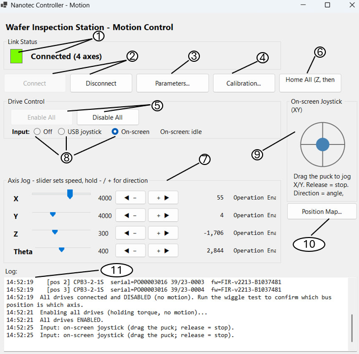
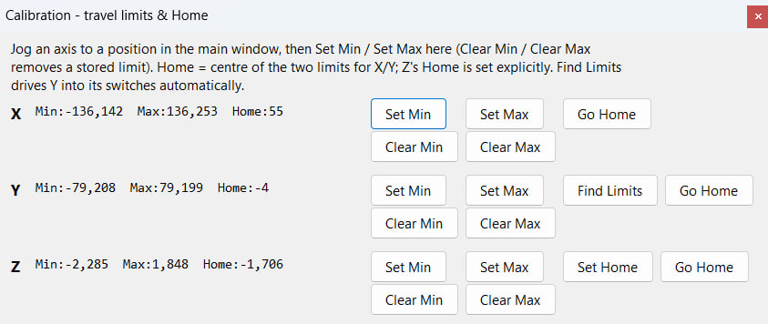
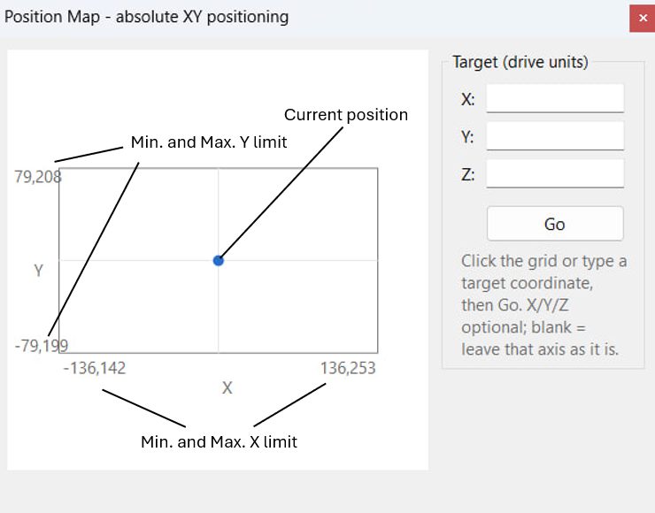
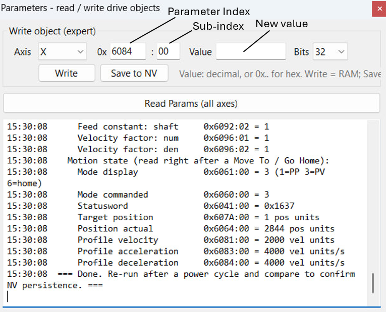

# User Guide — Nanotec Inspection-Table Controller

This is the operator guide for the multi-axis motion application that drives the
inspection table's four EtherCAT axes — **X, Y, Z, and Θ (the rotary chuck)** — through
Nanotec drives using **NanoLib** over **EtherCAT (CoE / CiA 402)** with an **Npcap soft
master**.

> **Status:** This application is still being brought up on real hardware. Treat every
> first motion on a new machine as a commissioning step: keep the E-stop within reach,
> start at low jog speeds, and confirm each axis moves the way you expect before trusting
> automated moves (Home All, Go Home, Find Limits).

For how the software works internally, see the **[Developer Guide](../developer-guide/)**.

---

## 1. Before you start

### Software the PC needs
* **Npcap** — installed with **"Install Npcap in WinPcap API-Compatible Mode"** ticked.
  NanoLib's EtherCAT master sends raw packets through Npcap; without it, no drives are found.
* **.NET 10 (Windows) runtime / SDK** — to build and run.
* The **NanoLib** package (`nanotec.services.nanolib` 1.4.0) is restored automatically as
  a project dependency.

### The application must run **as Administrator**
Raw packet access through Npcap requires elevation. If you launch without admin rights,
the bus scan will either find no adapters or fail to open the EtherCAT NIC.

### Hardware connections
1. Connect the PC's dedicated NIC straight into the **EtherCAT IN** port of the first
   drive in the chain.
2. Power the drive stage from its external supply.
3. The four drives are daisy-chained. Their **bus order is fixed as X, Y, Z, Θ** — i.e.
   the first drive on the line is X, the last is Θ.

---

## 2. The main window at a glance

| Ref. no | Area | What it does |
|---|---|---|
| 1.|**Connection LED + status** | Red = disconnected, **green** = connected, **amber** = busy (an operation is running). |
| 2.|**Connect / Disconnect** | Open or close the link to all drives. |
| 3.|**Parameters…** | Opens the parameters window: a read-only dump of each drive's limits & unit/scaling settings, plus an **expert** option to write objects (RAM) or save to NV (see §10). |
| 4.|**Calibration…** | Opens the travel-limits & Home window (see §8). |
| 5.|**Enable All / Disable All** | Energise / de-energise all drives. |
| 6.|**Home All** | Retract Z, then send X & Y to their home positions (see §7). |
| 7.|**Per-axis rows (X / Y / Z / Θ)** | Speed slider, **−/+ hold-to-jog** buttons, and a live position + state readout per axis. |
| 8.|**Input source (Off / USB / On-screen)** | Selects the joystick input (see §6). |
| 9.|**On-screen joystick puck** | Drag-to-move analog joystick for X/Y. |
| 10.|**Position Map…** | Opens the absolute-positioning window: click an XY grid (or type X/Y/Z) to set a target, then Go (see §9). |
| 11.|**Log** | Timestamped record of everything the app did. Read it — it reports every stop, limit, and error. |

---

## 3. Connecting

1. Click **Connect**.
2. The app scans the PC's network adapters and shows a **bus picker** dialog. EtherCAT-
   capable adapters are tagged **`[EtherCAT]`**. Choose the one your drives are on and
   click **Connect**.
3. The app connects to **every drive on the line in bus order** and logs each drive's
   axis name, serial number, and firmware. Confirm it found **4 drives** and that the
   serials line up with the axes you expect.

**Connecting never moves anything.** All drives come up **disabled** (no torque, no
motion). This is deliberate — bring-up is always a separate, explicit step.

If the app finds a different number of drives than expected, it warns you in the log. If
the axis mapping can't be completed (e.g. a drive is missing), it disconnects rather than
run with a partial table.

---

## 4. Enabling the drives

Click **Enable All**. The app walks every drive through its power-on sequence and leaves
each one **holding position with zero commanded speed** — energised but not moving.

* The status row for each axis should read **Operation Enabled**.
* **No axis should move when you enable.** If one does, disable immediately and report it
  — that indicates a leftover motion target or a running on-drive program.

**Disable All** stops and de-energises every axis. Switching the input source to **Off**
or disabling always halts motion first.

---

## 5. Jogging with the on-screen buttons

Each axis row has:
* A **speed slider** — that axis's jog speed (in the drive's own velocity units). The
  live value is shown beside it. Each axis has its own sensible default and maximum.
* **− and +** buttons — **hold to move, release to stop.** Motion only lasts as long as
  you hold the button. There is no "latched" jog.

The speed is taken at the moment you press, so set the slider first, then press and hold.

---

## 6. Joystick control

Pick the input with the **Off / USB / On-screen** radio buttons (only available once
drives are enabled). The two joysticks are mutually exclusive.

### USB joystick
Any controller Windows lists in **`joy.cpl`** works. The default button map:

| Button | Function |
|---|---|
| **1** | **Deadman** — *must be held* for any motion. Release = immediate stop. |
| **2** | **Fast** — multiplies the jog speed (capped at each axis's slider maximum). |
| 3 / 4 | Z − / Z + |
| 5 / 6 | Θ − / Θ + |

The main stick drives **X/Y**; the D-pad/hat also works. Stick directions are digital
(full speed when deflected). **If the joystick is unplugged or vanishes mid-use, all
axes stop.**

### On-screen joystick (mouse)
Drag the **puck** inside the circle. Unlike the USB stick this is **analog**: the puck's
angle sets the X/Y direction and how far you push sets the speed (rim = that axis's slider
speed). **Release the mouse and the puck springs back to centre → motion stops.** There is
no deadman — holding the mouse *is* the intent.

---

## 7. Soft travel limits (automatic protection)

Once you've calibrated an axis's **Min/Max** (see §8), the app watches each axis while you
jog and **stops it if it tries to travel past a stored limit**. You can always jog **back
into range** — only further-out motion is blocked.

Important caveats:
* This is a **software** guard polled a few times a second, so expect a little overshoot
  at high speed. Where physical limit switches exist, **they** are the real safety; the
  soft limit is a convenience guard.
* On this machine, **X's + end and both ends of Z have no working limit switch**, so the
  soft limit is the *only* protection there. Calibrate those axes before jogging them far,
  and keep speeds modest.
* If `calibration.json` is missing or unreadable at startup, the app logs a **"starting
  with NO soft limits"** warning. Take it seriously — re-calibrate before jogging.

---

## 8. Calibration window (travel limits & Home)

Open it with **Calibration…**. It shows X, Y, Z (Θ has no home and is excluded). All
calibration values are saved to `calibration.json` next to the app and survive restarts.

For each axis:
* **Set Min / Set Max** — jog the axis to a position in the main window, then click to
  **capture the current position** as that limit.
* **Clear Min / Clear Max** — removes a stored limit (back to "none"). This is a local edit
  only — it moves nothing — and also drops any jog block that limit was enforcing.
* **Set Home** (Z only) — captures Z's explicit home position.
* **Find Limits** (Y only) — **automatically** drives Y into each end switch, records both
  edges as Min/Max, and sets Home to the centre. Watch it run; it backs off the switches
  when done.
* **Go Home** — moves the axis to its home (the **centre of Min/Max** for X/Y, the
  explicit Home for Z) and reports how close it landed.

Home model summary:
* **X / Y:** Home = midpoint of the two limits (needs both Min and Max set).
* **Z:** Home = the explicit position you captured with Set Home.

### Special Note
It is **highly recommended** to set the Z-minimum above the chuck.

### Home All
The **Home All** button on the main window runs a safe homing sequence:
1. **Z moves to its home first** (e.g. retracts to a safe height) — and the app **confirms
   Z arrived** before doing anything else.
2. **Then X and Y move to their homes together.**

It requires Home to be defined for **all three** of X, Y, Z; otherwise it refuses and tells
you which are missing — so X/Y never traverse while Z is still down.

---

## 9. Position Map (go to a coordinate)

Open it with **Position Map…**. It shows an **XY grid** of the table's travel envelope on the
left and numeric **X / Y / Z** target fields with a **Go** button on the right.

**Pick a target two ways — nothing moves until you press Go:**
* **Click the grid** — stages a target crosshair at that spot and fills the X/Y fields. The
  filled blue dot is the live current position; the hollow red crosshair is your staged target.
* **Type into X / Y / Z** — the crosshair follows what you type (Z has no grid axis, so it's
  numeric only).

Then press **Go** to move. The same rules as before apply:
* Any field left **blank** means "leave that axis where it is."
* Targets are **range-checked against each axis's Min/Max**. If any one is out of range, the
  **whole move is cancelled** and the offending value is logged.
* The entered axes move together. Values are in the same drive units shown as Min/Max.

Notes:
* The grid stays **greyed out until both X and Y limits are calibrated** (see §8) — it needs the
  envelope to map clicks to coordinates.
* **Z is not on the grid.** There is no automatic Z-collision check — guard it by setting Z's
  **Min limit above the chuck** so a too-low Z target is rejected by the range check.
* **Go** is only enabled while the drives are enabled and idle; the window can be left open
  while you jog from the main form to fine-tune.

---

## 10. Parameters (read & write drive settings)

Open it with **Parameters…**. It's a separate window with its own output log, and it does two
very different jobs.

### Read Params — safe, read-only
**Read Params (all axes)** dumps each connected drive's key configuration to the window's log
**without writing anything** — current/torque limits, max speed, the unit/scaling objects that
define what "position" and "velocity" units actually mean, and a motion-state snapshot (mode,
target, profile accel/decel).

Typical use: read once, **power-cycle the drives**, read again, and compare to confirm the
drives kept their settings in non-volatile memory.

### Write object / Save to NV — expert, changes the drive
The write row sets **any** object-dictionary entry on a chosen axis. Enter the object as
`index : sub` in hex (e.g. `6084 : 00`), the value in decimal or `0x…` hex, and its size in
bits (8 / 16 / 32):
* **Write** — writes the value to the drive's **RAM**: it takes effect now but is lost on the
  next power-cycle.
* **Save to NV** — persists that axis's **current** parameter values to non-volatile memory
  (object 0x1010:01), so they survive a power-cycle.

**Both ask for confirmation first**, because there is no validation beyond the drive's own — a
wrong object or value can change any writable setting. (For example, to fix X's slow stop you
can write `6084 = 20000` on X, then **Save to NV**.)

The window only works while the drives are connected, and pauses live polling while it reads or
writes.

---

## 11. Safety behaviours you can rely on

* **Connecting performs no motion.** Drives come up disabled.
* **Enabling holds position** with zero speed — no lurch (provided no on-drive program is
  running).
* **All jogging is momentary** — release the button, release the deadman, or re-centre the
  puck and motion stops.
* **Losing window focus stops everything** and pauses the joystick. (A running operation —
  Home, Find Limits, Move, or Go Home — is left alone, since it owns the drives.)
* **Losing the USB joystick stops all axes.**
* **Soft limits stop outward jogs** on calibrated axes.
* **Closing the window** disables the drives and disconnects cleanly.

---

## 12. Troubleshooting

| Symptom | Likely cause / fix |
|---|---|
| Connect finds **no buses** | Npcap not installed / not in WinPcap-compatible mode; app not run as Administrator. |
| Connect finds **no drives** | Cabling (IN vs OUT port), drive power, wrong adapter chosen in the bus picker. |
| **Wrong number of drives** found | An unpowered drive or a bad daisy-chain link — check the log for the count. |
| An axis **moves on Enable** | Disable immediately. Suspect a leftover target or an on-drive (NanoJ) program still running. |
| Jog buttons are **greyed out** | Drives aren't enabled, or an operation is busy (amber LED), or the axis is parked against a soft limit in that direction. |
| **"starting with NO soft limits"** at launch | `calibration.json` was missing/corrupt (a `calibration.corrupt.json` backup is kept). Re-calibrate. |
| **Lost contact with a drive** in the log | The link dropped after several failed reads; reconnect. The soft master is not real-time, so the occasional miss is tolerated before it gives up. |

---

*Position and velocity values are shown in the **drive's own configured units**, not yet
converted to millimetres or degrees. Until that scaling is confirmed on hardware, treat the
numbers as raw drive units and verify physical magnitudes by observation.*
