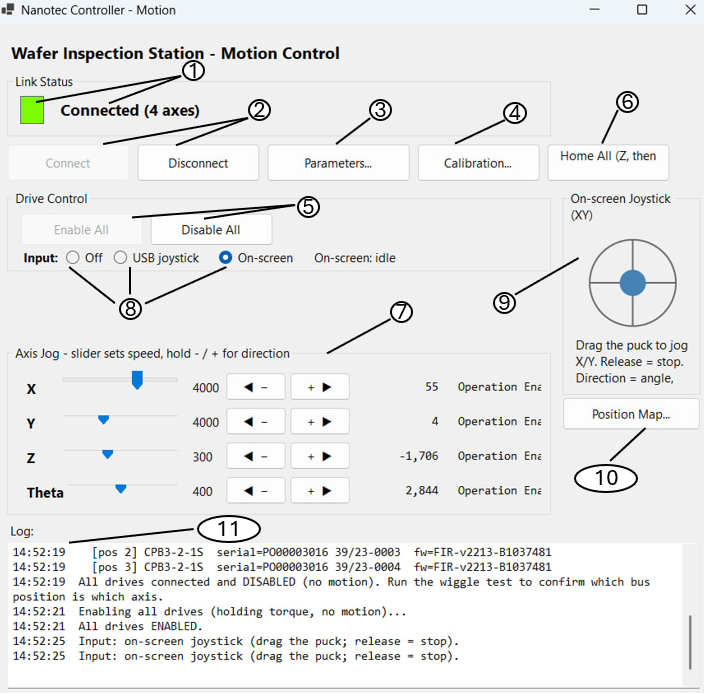
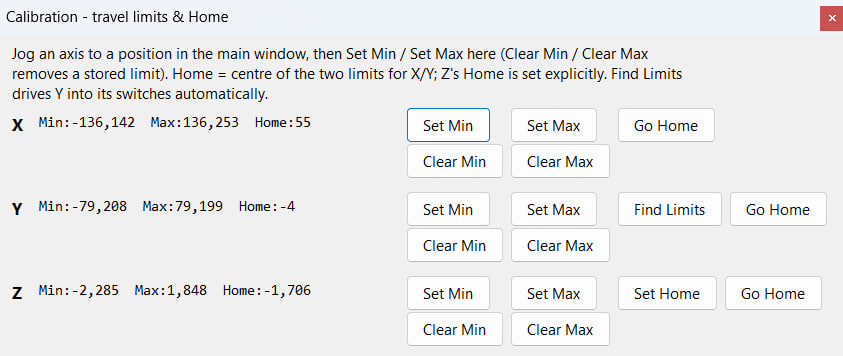
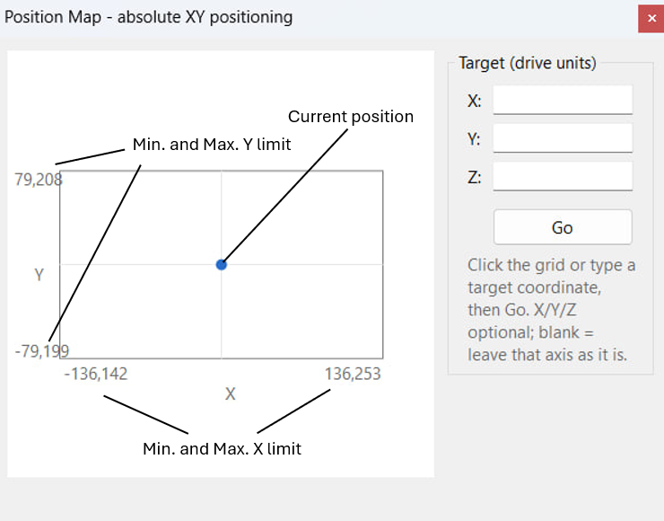

# User Guide — Nanotec Inspection-Table Controller

This is the operator guide for the multi-axis motion application that drives the
inspection table's four EtherCAT axes — **X, Y, Z, and Θ (the rotary chuck)** — through
Nanotec drives using **NanoLib** over **EtherCAT (CoE / CiA 402)** with an **Npcap soft
master**.

> **Commissioning note.** Treat every first motion on a new machine as a commissioning step:
> keep the E-stop within reach, start at low jog speeds, and confirm each axis moves the way
> you expect before trusting automated moves (Home All, Go Home, Find X & Y Limits, Auto
> Centre-Find). Position and velocity values are the **drive's own units**, not mm/deg.

For how the software works internally, see the **[Developer Guide](../developer-guide/)**.

---

## 1. Before you start

### Software the PC needs
* **Npcap** — installed with **"Install Npcap in WinPcap API-Compatible Mode"** ticked.
  NanoLib's EtherCAT master sends raw packets through Npcap; without it, no drives are found.
* **.NET 10 (Windows) runtime / SDK** — to build and run.
* The **NanoLib** package (`nanotec.services.nanolib` 1.4.0) is restored automatically as
  a project dependency.
* **HALCON** (26.05 Progress) — for the camera and the vision protocols. It is referenced by
  an absolute path in the project file, so it must be installed at that location to build.
  Motion works even if the camera fails to open; only the vision features go dark.

### The application must run **as Administrator**
Raw packet access through Npcap requires elevation. If you launch without admin rights,
the bus scan will either find no adapters or fail to open the EtherCAT NIC.

### Hardware connections
1. Connect the PC's dedicated NIC straight into the **EtherCAT IN** port of the first
   drive in the chain.
2. Power the drive stage from its external supply.
3. The four drives are daisy-chained. Their **bus order is fixed as X, Y, Z, Θ** — i.e.
   the first drive on the line is X, the last is Θ.

---

## 2. The main window at a glance

The window has a **left column** (all motion controls) and a **right column** (the live camera).

> ⚠️ **The screenshot below is out of date.** It predates the camera column, the STOP button,
> the RAW/VISION mode switch, the relative-move panel, the direction d-pad, and the move of the
> log into a pop-out window. Use the table, not the picture, until it is re-captured.

| Area | What it does |
|---|---|
| **Connection LED + status** | Red = disconnected, **green** = connected, **amber** = busy (an operation is running). |
| **Connect / Disconnect** | Open or close the link to all drives. |
| **Parameters…** | Opens the parameters window: a read-only dump of each drive's limits, unit/scaling and motion-state objects, plus an **expert** option to write objects (RAM) or save to NV (see §12). |
| **Calibration…** | Opens a small menu: **Axes — travel limits & home** (see §8), **Vision — camera scale & centres** (see §10), and **Home & centre chuck (auto)**, which runs the first window's X+Y limit-find and then the second's automatic chuck centre-find, back to back (see §10.3). |
| **Enable All / Disable All** | Energise / de-energise all drives. |
| **Home All** | Retract Z, then send X & Y to their home positions (see §8). |
| **STOP** (big red) | Aborts a **preplanned move in progress** — Home All, Go Home, Move To, a relative move, a rotation, Find X & Y Limits. Live only while an operation is running; jogging needs no STOP because it is momentary. |
| **RAW / VISION mode switch** | Changes what the whole motion cluster means (see §5). |
| **Per-axis rows (X / Y / Z / Θ)** | Speed slider + live position and state readout per axis. |
| **Direction d-pad** | ◀ ▶ for X, ▲ ▼ for Y, ▲ ▼ for Z, ↺ ↻ for Θ — **hold to move, release to stop**. |
| **Invert X/Y/Θ** | Flips the commanded direction of the in-plane and rotary axes so the controls match an inverted camera view. RAW mode only. |
| **Vision jog speed** | A separate speed slider used by VISION-mode X/Y motion. |
| **Input source (Off / Joystick / On-screen)** | Selects the manual input (see §6). |
| **On-screen joystick puck** | Drag-to-move analog joystick for X/Y. |
| **Relative move (mm / °)** | Type a distance and press Go; also **Move to chuck centre** / **Move to wafer centre** (see §11). |
| **Position Map…** | Opens the absolute-positioning window: click an XY grid (or type X/Y/Z) to set a target, then Go (see §9). |
| **Camera column** (right) | The live view plus its toolbar — zoom, crosshair, invert, mono, measure, capture, save — and a last-capture thumbnail with **Retry camera** (see §10). |
| **Log…** (status strip) | The strip shows the latest line; the button opens the full timestamped log in its own window. Read it — it reports every stop, limit, and error. |

---

## 3. Connecting

1. Click **Connect**.
2. The app scans the PC's network adapters and shows a **bus picker** dialog. EtherCAT-
   capable adapters are tagged **`[EtherCAT]`**. Choose the one your drives are on and
   click **Connect**.
3. The app connects to **every drive on the line in bus order** and logs each drive's
   axis name, serial number, and firmware. Confirm it found **4 drives** and that the
   serials line up with the axes you expect.

**Connecting never moves anything.** All drives come up **disabled** (no torque, no
motion). This is deliberate — bring-up is always a separate, explicit step.

If the app finds a different number of drives than expected, it warns you in the log. If
the axis mapping can't be completed (e.g. a drive is missing), it disconnects rather than
run with a partial table.

---

## 4. Enabling the drives

Click **Enable All**. The app walks every drive through its power-on sequence and leaves
each one **holding position with zero commanded speed** — energised but not moving.

* The status row for each axis should read **Operation Enabled**.
* **No axis should move when you enable.** If one does, disable immediately and report it
  — that indicates a leftover motion target or a running on-drive program.

**Disable All** stops and de-energises every axis. Switching the input source to **Off**
or disabling always halts motion first.

---

## 5. Jogging — and the RAW / VISION mode switch

Each axis row has a **speed slider** — that axis's jog speed, in the drive's own velocity
units, with the live value shown beside it. The **d-pad arrows** are **hold to move, release to
stop**; there is no "latched" jog. The speed is taken at the moment you press, so set the
slider first, then press and hold.

The same controls mean two different things depending on the mode:

| | **⚙ RAW** | **🎥 VISION** |
|---|---|---|
| X / Y | jog the drive axis directly | move along the **screen** axes — the image slides purely left/right or up/down even though the camera is mounted at an angle |
| Z | jog the drive axis | *(unchanged — Z is always raw)* |
| Θ | spin the chuck | **rotate about the crosshair**: the chuck turns while X/Y follow, so whatever is under the crosshair stays put |

Notes:
* **Switching mode stops everything first**, so nothing carries over with a changed meaning.
* VISION mode needs the **camera-scale calibration** (§10); rotating about the crosshair also
  needs a **chuck centre** and the rotation sign. If they're missing, the log says so and
  nothing moves.
* In VISION mode the X/Y speed comes from the separate **Vision jog speed** slider, and the Θ
  row slider becomes the **rotation** speed. The **Invert X/Y/Θ** toggle is disabled — the
  drift-corrected jog deliberately ignores it.

---

## 6. Joystick control

Pick the input with the **Off / Joystick / On-screen** radio buttons (only available once
drives are enabled). The two are mutually exclusive.

### The physical joystick
The joystick is **analog and wired directly into the drives** — it is *not* a USB game
controller, so nothing appears in `joy.cpl` and nothing needs installing. The app reads the
pots through the drives themselves.

* **Deflect to move, centre to stop.** Speed is proportional to how far you push; full
  deflection = that axis's slider speed.
* **Twisting the knob** drives Θ — a plain chuck spin in RAW mode, or a rotation about the
  crosshair in VISION mode (release the twist to stop).
* **There is no deadman button.** The machine's candidate deadman input is wired as the
  drives' interlock — pressing it *faults* X and Z rather than enabling motion — so it is not
  used. Moving requires only that the drives are enabled and the stick is deflected.

**Centring:** when you select the Joystick source, the app averages the first few readings to
learn where "centre" is. **Leave the stick alone for that moment** — the status label and the
live view both say `centring` while it happens. If you move it during the window the app
discards the samples and starts over, because a biased centre would make the stick appear
permanently deflected.

If a joystick read fails, the app stops the axes it was driving and shows `Joystick: read
FAILED`.

### On-screen joystick (mouse)
Drag the **puck** inside the circle. The puck's angle sets the X/Y direction and how far you
push sets the speed (rim = the relevant slider speed). **Release the mouse and the puck springs
back to centre → motion stops.** Holding the mouse *is* the intent. In VISION mode the puck
drives the drift-corrected screen jog instead of the raw axes.

---

## 7. Soft travel limits (automatic protection)

Once you've calibrated an axis's **Min/Max** (see §8), the app watches each axis while you
jog and **stops it if it tries to travel past a stored limit**. You can always jog **back
into range** — only further-out motion is blocked.

Important caveats:
* This is a **software** guard polled a few times a second, so expect a little overshoot
  at high speed. Where physical limit switches exist, **they** are the real safety; the
  soft limit is a convenience guard.
* On this machine, **both ends of Z have no working limit switch**, so the soft limit is the
  *only* protection there. **X** has a switch at each end, but its drive is configured to
  ignore them, so the app's guard is what actually stops it. Calibrate both axes before
  jogging them far, and keep speeds modest.
* If `calibration.json` is missing or unreadable at startup, the app logs a **"starting
  with NO soft limits"** warning. Take it seriously — re-calibrate before jogging.

---

## 8. Calibration window (travel limits & Home)

Open it with **Calibration… → Axes — travel limits & home**. It shows X, Y, Z (Θ has no home
and is excluded). All calibration values are saved to `calibration.json` next to the app and
survive restarts — that one file also holds the vision calibration from §10.

For each axis:
* **Set Min / Set Max** — jog the axis to a position in the main window, then click to
  **capture the current position** as that limit.
* **Clear Min / Clear Max** — removes a stored limit (back to "none"). This is a local edit
  only — it moves nothing — and also drops any jog block that limit was enforcing.
* **Set Home** (Z only) — captures Z's explicit home position.
* **Find X & Y Limits (auto)** — one button at the bottom of the window that calibrates **both
  axes in a single run**: X and Y each drive into their own end switches **at the same time**,
  both edges of each are recorded as that axis's Min/Max, and Home is set to the centre. It then
  **homes X and Y automatically**, so the chuck finishes centred in its travel rather than parked
  off an end switch — no separate Go Home needed. Z has no switches, so it is not included — set
  Z's limits by hand. Note that the auto-home does **not** retract Z first (unlike Home All): the
  find has just traversed the whole table at that same Z height, so the move back to the centre
  covers no new ground. **STOP** aborts the run (both axes) at any point; if you stop it, the
  limits found so far are still saved but the auto-home is skipped. If one axis fails — e.g. it
  never reaches a switch and times out — it is reported on its own and the other axis's result is
  still kept and homed; only an axis that found **both** its ends has its limits updated.
* **Go Home** — moves the axis to its home (the **centre of Min/Max** for X/Y, the
  explicit Home for Z) and reports how close it landed.
* **Steps/mm** — type the axis's motor steps per millimetre (from the stage's mechanical spec)
  and press **Save**. Nothing moves. This is what makes the **relative moves in mm** (§11) and
  the camera's **1 mm crosshair ticks** correct — enter it once per machine.

Home model summary:
* **X / Y:** Home = midpoint of the two limits (needs both Min and Max set).
* **Z:** Home = the explicit position you captured with Set Home.

### Special Note
It is **highly recommended** to set the Z-minimum above the chuck.

### Home All
The **Home All** button on the main window runs a safe homing sequence:
1. **Z moves to its home first** (e.g. retracts to a safe height) — and the app **confirms
   Z arrived** before doing anything else.
2. **Then X and Y move to their homes together.**

It requires Home to be defined for **all three** of X, Y, Z; otherwise it refuses and tells
you which are missing — so X/Y never traverse while Z is still down.

---

## 9. Position Map (go to a coordinate)

Open it with **Position Map…**. It shows an **XY grid** of the table's travel envelope on the
left and numeric **X / Y / Z** target fields with a **Go** button on the right.

**Pick a target two ways — nothing moves until you press Go:**
* **Click the grid** — stages a target crosshair at that spot and fills the X/Y fields. The
  filled blue dot is the live current position; the hollow red crosshair is your staged target.
* **Type into X / Y / Z** — the crosshair follows what you type (Z has no grid axis, so it's
  numeric only).

Then press **Go** to move. The same rules as before apply:
* Any field left **blank** means "leave that axis where it is."
* Targets are **range-checked against each axis's Min/Max**. If any one is out of range, the
  **whole move is cancelled** and the offending value is logged.
* The entered axes move together. Values are in the same drive units shown as Min/Max.

Notes:
* The grid stays **greyed out until both X and Y limits are calibrated** (see §8) — it needs the
  envelope to map clicks to coordinates.
* **Z is not on the grid.** There is no automatic Z-collision check — guard it by setting Z's
  **Min limit above the chuck** so a too-low Z target is rejected by the range check.
* **Go** is only enabled while the drives are enabled and idle; the window can be left open
  while you jog from the main form to fine-tune.

---

## 10. The camera and the vision protocols

### The live view (main window, right column)
The camera streams as soon as the app starts — it is independent of the drives, so a camera
problem never blocks motion (and vice versa). If it fails to open, a **Retry camera** button
appears; everything drive-side keeps working.

Toolbar:

| Control | What it does |
|---|---|
| **Zoom** (1×…10×) | A centred crop on the sensor — a *real* narrowing of the field of view, not a display scale. |
| **Crosshair** | Shows the centre crosshair with **1 mm tick marks**. The ticks only appear once both the camera scale (below) and the axis **steps/mm** (§8) are set. |
| **Invert** | 180° flip for display — on by default, because the camera is mounted inverted. |
| **Mono** | Grey + contrast stretch, display only. |
| **Measure** | A draggable ruler on the view; its length is reported in mm and follows the zoom automatically. |
| **Capture / Save** | Grab a full-resolution still into the thumbnail, then save it as a `.bmp` under `Desktop\images`. |

**Invert, Mono and Zoom are display settings — the detectors always run on the raw
full-resolution frame.**

### The protocols window
Open it with **Calibration… → Vision — camera scale & centres**. It owns no camera of its own:
it mirrors the main view on the left, shows each detection's overlay on the right, and drives
the stage through the main window. It also carries a convenience copy of the vision jog and
hold-to-rotate so you can nudge the stage while watching this window.

Do these in order — each one depends on the ones before it:

**1. Camera scale calibration.** Put the circular calibration fiducial in view, then repeatedly:
jog the table a little, press **Add Sample**. You need **≥3 samples that move in *both* X and
Y** — samples along a single line cannot define the mapping and will be rejected. Press
**Compute & Save A**. The result reports an RMS residual; a small one means the relationship
really is linear. Everything else on this page — the VISION jog, both centre-finds, the
rotation — depends on this.

> The detector picks its own brightness cut per frame, so it copes with a change of lighting,
> exposure or camera without retuning; a successful sample shows which cut it used. If it
> reports **fiducial NOT found**, the message says how close it got — for example *"closest was
> area=6,528 circ=0.805 (need area>=5,000, circ>=0.85)"* means it found the disk but the shape
> was too irregular, so improve focus and lighting. *"no candidate cut segmented anything"*
> instead means nothing stood out from the background at all: check the marker is lit and in view.

**2. Chuck centre-find.** With the chuck edge in view, press **Add Edge** at several spots
**spread around the rim** (≥3, more is better). Each press detects the rim point and records
where the table would have to be to put it on the crosshair. **Add at Crosshair** is the manual
alternative: jog the edge onto the crosshair by eye and record the position directly. You can
**Delete Selected** a bad point or **Clear Edges** and start over. Then **Compute Centre**, and
**Go to Centre** to drive there. The result is saved and reloaded on the next run.

**3. Auto chuck centre-find** (does step 2 for you, and finds its own starting point). Set focus,
type the **max search radius in steps**, and press **Auto Centre-Find**. The stage sends X and Y
to **Home**, moves a fixed offset along Y to land roughly over the chuck, probes outward in eight
directions returning to the centre estimate between each, fits the result, and finally **drives to
the centre it just found**. Before starting, confirm what it asks: Z/focus is set so the edge is
sharp, and the path from here to Home is clear. The log pane is the transcript of the run — which
directions found an edge and where. **Cancel** stops it; a cancelled or aborted run **discards its
points** rather than leaving a half-collected set.

Because the run *starts* at Home, **X and Y must already have their limits found** — Home for
those axes is the centre of the measured travel. If either has no Home the run refuses outright
and tells you to do the limit-find first.

**Calibration… → Home & centre chuck (auto)** does both halves in one press: the X+Y limit-find
(§8), then this centre-find. It confirms once up front, and the centre-find still asks its own
confirmation before it moves. Pressing **STOP** during the limit-find cancels the centre-find too.

> **Safety:** this is the one automatic feature that drives the table on its own. It never
> commands a target outside the stored X/Y travel limits, and it aborts any direction that travels
> past **the max search radius you typed** — that number is now the single limit on both how far a
> probe may travel and how far out a detection is still believed, so type it carefully. **Z is
> never moved.**

**4. Auto wafer centre-find (Θ scan).** Fully automatic — type the **Wafer Ø (mm)** and press
**Auto Wafer Centre (Θ)**. There is no point-by-point wafer flow, because the wafer rim is bigger
than the table's travel: you cannot drive all the way round it. Instead the stage finds one
reachable spot on the rim and the **chuck turns the wafer a full revolution underneath the camera**,
re-measuring the rim at each angle. **Samples** is how many angles it visits (24 by default). Expect
roughly three minutes, nearly all of it Θ turning.

It needs the chuck centre (step 3) and steps/mm on X and Y first, and it refuses to start without
them. The result panel reports the eccentricity in mm, the fitted radius against your nominal
diameter, and the fit RMS — a radius well off the nominal usually means the chuck centre is off,
not the wafer.

> **The wafer is vacuum-held for a reason:** if it slips on the chuck mid-scan, every earlier
> sample is wrong. The run re-measures its starting angle at the end as a closure check, and if
> that disagrees it reports the failure and **saves nothing**. Confirm the vacuum is on before
> starting. **Z is never moved.**

Because the wafer sits slightly off-centre on the chuck, **its centre moves as Θ turns** — up to
twice the eccentricity between opposite angles. So the scan does not store a single position; it
stores the offset and works out the right target for whatever angle the chuck is standing at. **Go
to Centre** is therefore correct at any Θ, with no need to re-scan after rotating.

**5. Rotate about the crosshair.** Needs the camera scale **and** a chuck centre. Run the
one-time **Sign test** first — it establishes which way a positive Θ move appears on screen and
is saved permanently. Then **Rotate by°** / **Rotate to°** turn the chuck while X/Y keep the
point under the crosshair pinned. The rotation *speed* is the Θ slider on the main window in
VISION mode.

---

## 11. Relative moves in mm and degrees

The **Relative move** panel takes a distance per axis — **mm** for X/Y/Z, **degrees** for Θ —
and a **Go**. It is mode-aware, exactly like the jog cluster:

* **RAW** — X/Y/Z move that many mm along the drive axis; Θ turns that many degrees.
* **VISION** — the mm is measured along the **screen** axis (so it tracks what you see
  regardless of camera rotation); Θ rotates about the crosshair.

Each **Go** stays greyed until the calibration its move needs exists: **steps/mm** for that
axis (§8), plus the camera scale for VISION X/Y, plus a chuck centre for VISION Θ. Targets go
through the same range check as everything else.

**Move to chuck centre** / **Move to wafer centre** drive X/Y to the centres found in §10. The
wafer one recomputes its target for the chuck's current Θ, so it stays correct after a rotation.
Both ask for confirmation first — they are unbounded table traverses.

---

## 12. Parameters (read & write drive settings)

Open it with **Parameters…**. It's a separate window with its own output log, and it does two
very different jobs.

### Read Params — safe, read-only
**Read Params (all axes)** dumps each connected drive's key configuration to the window's log
**without writing anything** — current/torque limits, max speed, the profile accel/decel ramps,
the unit/scaling objects that define what "position" and "velocity" units actually mean, and a
motion-state snapshot (commanded vs displayed mode, statusword, target vs actual position).
That last group is the one to read **right after** a move that didn't behave.

Typical use: read once, **power-cycle the drives**, read again, and compare to confirm the
drives kept their settings in non-volatile memory.

### Write object / Save to NV — expert, changes the drive
The write row sets **any** object-dictionary entry on a chosen axis. Enter the object as
`index : sub` in hex (e.g. `6084 : 00`), the value in decimal or `0x…` hex, and its size in
bits (8 / 16 / 32):
* **Write** — writes the value to the drive's **RAM**: it takes effect now but is lost on the
  next power-cycle.
* **Save to NV** — persists that axis's **current** parameter values to non-volatile memory
  (object 0x1010:01), so they survive a power-cycle.

**Both ask for confirmation first**, because there is no validation beyond the drive's own — a
wrong object or value can change any writable setting. (For example, to fix X's slow stop you
can write `6084 = 20000` on X, then **Save to NV**.)

The window only works while the drives are connected, and pauses live polling while it reads or
writes.

---

## 13. Safety behaviours you can rely on

* **Connecting performs no motion.** Drives come up disabled.
* **Enabling holds position** with zero speed — no lurch (provided no on-drive program is
  running).
* **All jogging is momentary** — release the arrow, centre the stick, or release the puck and
  motion stops.
* **STOP aborts any preplanned move** — Home All, Go Home, Move To, a relative move, a
  rotation, Find X & Y Limits.
* **Losing window focus stops everything** and pauses the joystick — including a hold-to-rotate
  that would otherwise keep turning because its mouse-release never arrives. (A running
  operation — Home, Find X & Y Limits, Move, Go Home — is left alone, since it owns the drives.)
* **A failed joystick read stops the axes it was driving.**
* **Switching RAW ⇄ VISION stops everything first**, so nothing carries over with a changed
  meaning.
* **While the auto centre-find runs, the manual controls are locked out** — the jog buttons,
  the puck and the joystick all stand down, so a stray nudge cannot corrupt the measurement.
* **Soft limits stop outward jogs** on calibrated axes.
* **A camera failure never stops the drives**, and a drive fault never stops the camera.
* **Closing the window** disables the drives and disconnects cleanly.

---

## 14. Troubleshooting

| Symptom | Likely cause / fix |
|---|---|
| Connect finds **no buses** | Npcap not installed / not in WinPcap-compatible mode; app not run as Administrator. |
| Connect finds **no drives** | Cabling (IN vs OUT port), drive power, wrong adapter chosen in the bus picker. |
| **Wrong number of drives** found | An unpowered drive or a bad daisy-chain link — check the log for the count. |
| An axis **moves on Enable** | Disable immediately. Suspect a leftover target or an on-drive (NanoJ) program still running. |
| Jog buttons are **greyed out** | Drives aren't enabled, or an operation is busy (amber LED), or an auto centre-find is running, or the axis is parked against a soft limit in that direction. |
| **"starting with NO soft limits"** at launch | `calibration.json` was missing/corrupt (a `calibration.corrupt.json` backup is kept). Re-calibrate. |
| **Lost contact with a drive** in the log | The link dropped after several failed reads; reconnect. The soft master is not real-time, so the occasional miss is tolerated before it gives up. |
| Joystick shows **"centring — leave the stick alone"** and won't move | It is still learning the stick's centre, and restarts the window whenever the stick moves. Let go of it for a second. |
| The chuck **keeps rotating** after you let go of the twist | The twist centre was captured while the knob was held. Switch the input source Off and back to Joystick — without touching the knob — to re-capture it. |
| VISION mode does nothing / logs "needs the camera-scale calibration" | Run the camera scale calibration (§10) first; rotating also needs a chuck centre and the sign test. |
| **No camera / black view** | Press **Retry camera**. Motion is unaffected — a camera failure never blocks the drives. |
| Auto centre-find says **"the rim is already in view"** | Jog nearer the centre so the rim is out of frame before starting; it can't tell its own starting edge from the one it's hunting. |
| Auto centre-find skips directions or reports **no edge within the guard** | Check Z/focus (the chuck detector needs a sharp edge) and the nominal radius you typed. |

---

*Position and velocity values are shown in the **drive's own configured units**, not yet
converted to millimetres or degrees. Until that scaling is confirmed on hardware, treat the
numbers as raw drive units and verify physical magnitudes by observation.*
