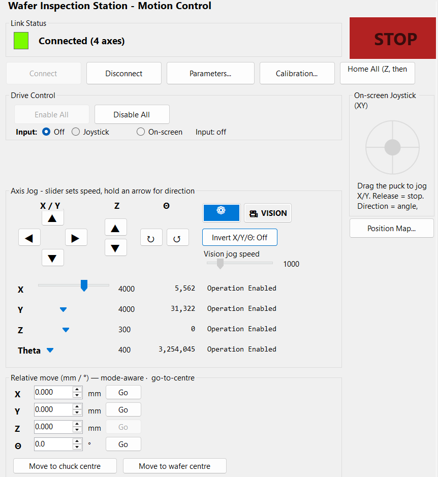
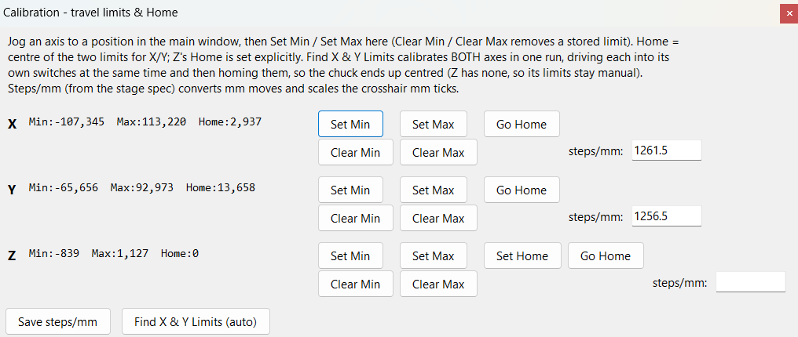
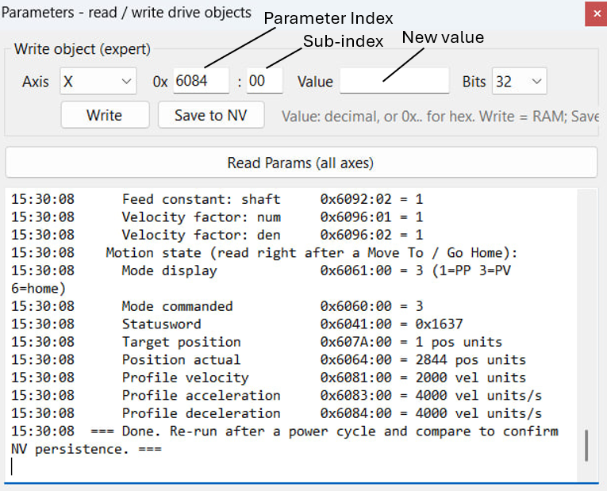

# User Guide — Nanotec Inspection-Table Controller

This is the operator guide for the multi-axis motion application that drives the
inspection table's four EtherCAT axes — **X, Y, Z, and Θ (the rotary chuck)** — through
Nanotec drives using **NanoLib** over **EtherCAT (CoE / CiA 402)** with an **Npcap soft
master**.

For how the software works internally, see the **[Developer Guide](../developer-guide/)**.

---

## 1. Before you start

### Software the PC needs
* **Npcap** — installed with **"Install Npcap in WinPcap API-Compatible Mode"** ticked.
  NanoLib's EtherCAT master sends raw packets through Npcap; without it, no drives are found.
* **.NET 10 (Windows) runtime / SDK** — to build and run.
* The **NanoLib** package (`nanotec.services.nanolib` 1.4.0) is restored automatically as
  a project dependency.
* **HALCON** (26.05 Progress) — for the camera and the vision protocols. It is referenced by
  an absolute path in the project file, so it must be installed at that location to build.
  Motion works even if the camera fails to open; only the vision features go dark.

### The application must run **as Administrator**
Raw packet access through Npcap requires elevation. If you launch without admin rights,
the bus scan will either find no adapters or fail to open the EtherCAT NIC.

### Hardware connections
1. Connect the PC's dedicated NIC straight into the **EtherCAT IN** port of the first
   drive in the chain.
2. Power the drive stage from its external supply.
3. The four drives are daisy-chained. Their **bus order is fixed as X, Y, Z, Θ** — i.e.
   the first drive on the line is X, the last is Θ.

---

## 2. The main window at a glance

The window has a **left column** (all motion controls) and a **right column** (the live camera).

<div align="center">



</div>

| Area | What it does |
|---|---|
| **Connection LED + status** | Red = disconnected, **green** = connected, **amber** = busy (an operation is running). |
| **Connect / Disconnect** | Open or close the link to all drives. |
| **Parameters…** | Opens the parameters window: a read-only dump of each drive's limits, unit/scaling and motion-state objects, plus an **expert** option to write objects (RAM) or save to NV (see §12). |
| **Calibration…** | Opens a small menu: **Axes — travel limits & home** (see §8), **Vision — camera scale & centres** (see §10), and **Home & centre chuck (auto)**, which runs the first window's X+Y limit-find and then the second's automatic chuck centre-find, back to back (see §10.3). |
| **Enable All / Disable All** | Energise / de-energise all drives. |
| **Home All** | Retract Z, then send X & Y to their home positions (see §8). |
| **STOP** (big red) | Aborts a **preplanned move in progress** |
| **RAW / VISION mode switch** | Changes what the whole motion cluster means (see §5). |
| **Per-axis rows (X / Y / Z / Θ)** | Speed slider + live position and state readout per axis. |
| **Direction d-pad** | ◀ ▶ for X, ▲ ▼ for Y, ▲ ▼ for Z, ↺ ↻ for Θ — **hold to move, release to stop**. |
| **Invert X/Y/Θ** | Flips the commanded direction of the in-plane and rotary axes. **RAW mode only** |
| **Vision jog speed** | A separate speed slider used by VISION-mode X/Y motion. |
| **Input source (Off / Joystick / On-screen)** | Selects the manual input (see §6). |
| **On-screen joystick puck** | Drag-to-move analog joystick for X/Y. |
| **Relative move (mm / °)** | Type a distance and press Go; also **Move to chuck centre** / **Move to wafer centre** (see §11). |
| **Camera column** (right) | The live view plus its toolbar — zoom, crosshair, invert, mono, measure, capture, save — and a last-capture thumbnail with **Retry camera** (see §10). |
| **Log…** (status strip) | The strip shows the latest line; the button opens the full timestamped log in its own window. Read it — it reports every stop, limit, and error. |

---

## 3. Connecting

1. Click **Connect**.
2. The app scans the PC's network adapters and shows a **bus picker** dialog. EtherCAT-
   capable adapters are tagged **`[EtherCAT]`**. Choose the one your drives are on and
   click **Connect**.
3. The app connects to **every drive on the line in bus order** and logs each drive's
   axis name, serial number, and firmware. Confirm it found **4 drives** and that the
   serials line up with the axes you expect.

**Connecting does not move anything.** All drives start **de-energised**.

If the app finds a different number of drives than expected, it warns you in the log. If
the axis mapping can't be completed (e.g. a drive is missing), it disconnects rather than
run with a partial table.

---

## 4. Enabling the drives

Click ```Enable All```. The app walks every drive through its power-on sequence and leaves
each one **holding position with zero commanded speed** — energised but not moving.

* The status row for each axis should read **Operation Enabled**.
* **No axis should move when you enable.** If one does, disable immediately and restart the app
  — that indicates a leftover motion target or a running on-drive program.

```Disable All``` stops and de-energises every axis. Switching the input source to **Off**
or disabling always halts motion first.

---

## 5. Jogging — and the RAW / VISION mode switch

Each axis row has a **speed slider** — that axis's jog speed, in the drive's own velocity
units, with the live value shown beside it. The **d-pad arrows** are **hold to move, release to
stop**.

The same controls mean two different things depending on the mode:

| | **⚙ RAW** | **🎥 VISION** |
|---|---|---|
| X / Y | jog the drive axis directly | move along the **live view** axes — the motors compensate for the camera misalignment and the image slides purely left/right or up/down |
| Z | jog the drive axis | *(unchanged — Z is always raw)* |
| Θ | spin the chuck | **rotate about the crosshair**: the chuck turns while X/Y follow, so whatever is under the crosshair stays put |

Notes:
* **Switching mode stops everything first**, so no pre-planned moves carry forward.
* `VISION` mode needs the **camera-scale calibration** (§10); rotating about the crosshair also
  needs a **chuck centre** (Link to the Automatic chuck centering docs).
* In `VISION` mode the X/Y speed comes from the separate **Vision jog speed** slider, and the Θ
  row slider becomes the **rotation** speed. The **Invert X/Y/Θ** toggle is disabled.

---

## 6. Joystick control

Pick the input with the **Off / Joystick / On-screen** radio buttons (only available once
drives are enabled). The two are mutually exclusive.

### The physical joystick
The joystick is **analog and wired directly into the drives**.

* **Deflect to move, centre to stop.** Speed is proportional to how far you push; where the full
  deflection = that axis's slider speed.
* **Twisting the knob** drives Θ — a plain chuck spin in `RAW` mode, or a `rotation` about the
  crosshair in VISION mode (release the twist to stop).

**Centering:** when you select the physical Joystick source, the app averages the first few readings to
set the center. **Leave the stick alone for that moment** — the status label and the
live view both say `centering` while it happens. If the joystick is deflected during the window the app
discards the samples and starts over, because a biased centre would make the stick appear
permanently deflected.

If a joystick read fails, the app stops the axes it was driving and shows `Joystick: read
FAILED`.

### On-screen joystick (mouse)
Drag the **puck** inside the circle. The puck's angle sets the X/Y direction and how far you
push sets the speed (rim = the relevant slider speed). **Release the puck to stop movement**.

---

## 7. Soft travel limits (automatic protection)

A digital/soft **Min/Max** can be set as well (see §8). The app watches each axis while you
jog and **stops it if it tries to travel past a stored limit**. You can always jog **back
into range**.

Important caveats:
* This is a **software** guard polled a few times a second, so expect a little overshoot
  at high speed. Physical limit switches exist for the X and Y axes (the motors will stop should the soft limits fail)
* On this machine, **both ends of Z have no working limit switch**, so the soft limit is the
  *only* protection there. **X** has a switch at each end, but its drive is configured to
  ignore them, so the app's guard is what actually stops it. Calibrate both axes before
  jogging them far, and keep speeds modest.
* If `calibration.json` is missing or unreadable at startup, the app logs a **"starting
  with NO soft limits"** warning.
* Motor positions reset to 0 at their resting position whenever power to the machine is cut. It is **strongly recommended** to reset the travel limits again. (The app will prompt you to do this)

---

## 8. Calibration window (travel limits & Home)

<div align="center">



</div>

Open it with **Calibration… → Axes — travel limits & home**. It shows X, Y, Z (Θ has no home
and is excluded). All calibration values are saved to `calibration.json` next to the app and
survive restarts — that one file also holds the vision calibration from §10.

For each axis:
* **Set Min / Set Max** — jog the axis to a position in the main window, then click to
  **current position** as that limit.
* **Clear Min / Clear Max** — removes a stored limit (back to "none").
* **Set Home** (Z only) — captures Z's explicit home position. `Home` for X and Y are set to the midpoint between their `Min` and `Max` limits.
* **Find X & Y Limits (auto)** — one button at the bottom of the window that calibrates **both
  axes in a single run**: X and Y each drive into their own end switches,
  both edges of each are recorded as that axis's Min/Max, and Home is set to the centre. It then
  **homes X and Y automatically**. Z has no switches, so it is not included — set
  Z's limits by hand. Note that the auto-home does **not** retract Z first (unlike Home All)
* **Go Home** — moves the axis to its home (the **centre of Min/Max** for X/Y, the
  explicit Home for Z). Z is homed first, then X and Y.
* **Steps/mm** — type the axis's motor steps per millimetre (from the stage's mechanical spec)
  and press **Save**. Nothing moves. This is the reference for the **relative moves in mm** (§11) and
  the camera's **1 mm crosshair ticks**.

Home model summary:
* **X / Y:** Home = midpoint of the two limits (needs both Min and Max set).
* **Z:** Home = the explicit position you captured with Set Home.

### Special Note
It is **highly recommended** to set the Z-minimum above the chuck.

### Home All
The **Home All** button on the main window runs a safe homing sequence:
1. **Z moves to its home first** (e.g. retracts to a safe height) — and the app **confirms
   Z arrived** before doing anything else.
2. **Then X and Y move to their homes together.**

It requires Home to be defined for **all three** of X, Y, Z; otherwise it refuses and tells
you which are missing — so X/Y never traverse while Z is still down.

---

## 10. The camera and the vision protocols

### The live view (main window, right column)
The camera streams as soon as the app starts — it is independent of the drives, so a camera
problem never blocks motion (and vice versa). If it fails to open, a **Retry camera** button
appears; everything drive-side keeps working.

Toolbar:

| Control | What it does |
|---|---|
| **Zoom** (1×…10×) | A centred crop on the sensor — a *real* narrowing of the field of view, not a display scale. |
| **Crosshair** | Shows the centre crosshair with **1 mm tick marks**. The ticks only appear once both the camera scale (below) and the axis **steps/mm** (§8) are set. |
| **Invert** | 180° flip for display — on by default, because the camera is mounted inverted. |
| **Mono** | Grey + contrast stretch, display only. |
| **Measure** | A draggable ruler on the view; its length is reported in mm and follows the zoom automatically. |
| **Capture / Save** | Grab a full-resolution still into the thumbnail, then save it as a `.bmp` under `Desktop\images`. |

**Invert, Mono and Zoom are display settings — the detectors always run on the raw
full-resolution frame.**

### The protocols window
Open it with **Calibration… → Vision — camera scale & centres**. It mirrors the main view on the left, shows each detection's overlay on the right, and drives
the stage through the main window. It also carries a convenience copy of the vision jog and
hold-to-rotate so you can nudge the stage while watching this window.

Do these in order — each one depends on the ones before it:

**1. Camera scale calibration.** Put the circular calibration fiducial in view, then repeatedly:
jog the table a little, press **Add Sample**. You need **≥3 samples that move in *both* X and
Y** — it is recommended to collect 6 samples in a 2x3 uniform arrangement. Press
**Compute & Save A**. The result reports an RMS residual - the smaller it is, the more linear the relationship. Everything else on this page — the `VISION` jog, both centre-finds, the
rotation — depends on this.

**2. Chuck centre-find.** With the chuck edge in view, press **Add Edge** at several spots
**spread around the rim** (≥3, more is better). Each press detects the rim point and records
where the table would have to be to put it on the crosshair. **Add at Crosshair** is the manual
alternative: jog the edge onto the crosshair by eye and record the position directly. You can
**Delete Selected** a bad point or **Clear Edges** and start over. Then **Compute Centre**, and
**Go to Centre** to drive there. The result is saved and reloaded on the next run.

**3. Auto chuck centre-find** (does step 2 for you, and finds its own starting point). Set focus,
type the **max search radius in steps**, and press **Auto Centre-Find**. The stage sends X and Y
to **Home**, moves a fixed offset along Y to land roughly over the chuck, probes outward in eight
directions returning to the centre estimate between each, fits the result, and finally **drives to
the centre it just found**. Before starting, confirm what it asks: the innermost ring of the chuck is in focus.

Because the run *starts* at Home, **X and Y must already have their limits found** — Home for
those axes is the centre of the measured travel. If either has no Home the run refuses outright
and tells you to do the limit-find first.

**Calibration… → Home & centre chuck (auto)** does both halves in one press: the X+Y limit-find
(§8), then this centre-find. It confirms once up front, and the centre-find still asks its own
confirmation before it moves. Pressing **STOP** during the limit-find cancels the centre-find too.

**4. Auto wafer centre-find (Θ scan).** Fully automatic — type the **Wafer Ø (mm)** and press
**Auto Wafer Centre (Θ)**. There is no point-by-point wafer flow, because the wafer rim is bigger
than the table's travel: you cannot drive all the way round it. Instead the stage finds one
reachable spot on the rim and the **chuck turns the wafer a full revolution underneath the camera**,
re-measuring the rim at each angle. **Samples** is how many angles it visits (24 by default). Expect
roughly three minutes, nearly all of it Θ turning.

What you will see it do: first it drives to the **corner of its travel** (X at its minimum, Y at its
maximum) — that corner is the furthest point from the chuck's axis the table can reach, and the only
place a 200 mm rim comes into view. Then it steps **down** in Y until the wafer edge appears, and
from there it mostly just turns. X and Y move again only when the edge drifts out of view, which it
does as the chuck turns if the wafer is off-centre; the run steps Y up and down a little to bring it
back and carries on. Angles where it cannot find the edge are simply skipped. When the fit is saved
it **drives to the wafer centre it just measured**, so the run ends looking at the middle of the
wafer.

**It may find the notch during this routine as well.** If one of those dropped angles turns out to be the notch — with
the whole notch in view, which happens on a minority of runs — the scan measures it there and then
and saves it with the fit. The log says `NOTCH … saved with the fit`, the result panel shows the
angle, and `Rotate to datum` (step 5) is ready to use without running the notch search at all.
Nothing is lost when it does not happen: the sample was correctly dropped either way.

It needs the chuck centre (step 3), steps/mm on X and Y, and both travel limits first. It also checks the diameter you typed up front: if that rim could
never cross the corner line it says so immediately rather than searching for two minutes. The result
panel reports the eccentricity in mm, the fitted radius against your nominal diameter, and the fit
RMS — a radius well off the nominal usually means the chuck centre is off, not the wafer.

**5. Notch find (Θ sweep).** Finds the wafer's notch and remembers where it is, so the wafer can be
turned to a known orientation. Press **Find Notch (Θ sweep)** and leave it alone.

It needs the **auto wafer centre-find (step 4) to have run on this wafer first** — the sweep uses
that measurement to keep the rim in view.

**Trigger (mm)** is how big a departure from a smooth rim is worth stopping for. The default of
**0.30** is well clear of both ends: a clean rim reads 0.01–0.05 mm and the notch reads 0.54 mm.
Dust is not just rejected on size — the run also requires the departure to persist along the edge. Raise it if the run keeps stopping on artefacts that are not notches; lower it
only if a wafer you know has a notch is being swept straight past.

The chuck turns **continuously** while the camera watches the rim go past, stopping the moment it
sees something that is not a smooth edge, then backing up to measure it properly. Expect **about a
minute**, and up to two if the notch happens to sit just behind the starting point. That time is set
by how fast Θ is allowed to turn, not by the camera — a full revolution simply takes 112 seconds.
The log panel reports each step. The result is the notch's angle, its depth (a 200 mm wafer's notch
measures very close to **1.00 mm**) and its width.

To rotate the wafer about it's axis to an angle, with reference to the notch, enter the angle into `Datum` and press `Rotate to  datum` - where 0$^o$ **North** (facing directly opposite from the operator).

**What Datum° means.** It is the **direction you want the notch to point.

**The camera is the reference, not the stage.** The camera is mounted at a certain angle off the machine's
axes, and the datum now allows for that: the chuck is turned that extra angle so the wafer ends up
square to *live view picture*. The log prints both numbers on every move.

**Check notch angle**, below, works the number out exactly and prints it in both frames - showing the specific point detected.

If it sweeps a whole revolution and finds nothing, the usual causes are the rim drifting out of view
(the stored wafer measurement is stale — re-run step 4) or the lighting having changed enough that
the edge no longer reads clearly. Both are reported in the log rather than guessed at. **Z is never
moved.**

**6. Rotate about the crosshair.** Needs the camera scale **and** a chuck centre. Run the
one-time **Sign test** first — it establishes which way a positive Θ move appears on screen and
is saved permanently. Then **Rotate by°** / **Rotate to°** turn the chuck while X/Y keep the
point under the crosshair pinned. The rotation *speed* is the Θ slider on the main window in
`VISION` mode.

---

## 11. Relative moves in mm and degrees

The **Relative move** panel takes a distance per axis — **mm** for X/Y/Z, **degrees** for Θ —
and a **Go**. It is mode-aware, exactly like the jog cluster:

* **RAW** — X/Y/Z move that many mm along the drive axis; Θ turns that many degrees.
* **VISION** — the mm is measured along the **screen** axis (so it tracks what you see
  regardless of camera rotation); Θ rotates about the crosshair.

Each **Go** stays greyed until the calibration its move needs exists: **steps/mm** for that
axis (§8), plus the camera scale for VISION X/Y, plus a chuck centre for VISION Θ. Targets go
through the same range check as everything else.

**Move to chuck centre** / **Move to wafer centre** drive X/Y to the centres found in §10. The
wafer one recomputes its target for the chuck's current Θ, so it stays correct after a rotation.
Both ask for confirmation first — they are unbounded table traverses.

---

## 12. Parameters (read & write drive settings)

Open it with **Parameters…**. It's a separate window with its own output log, and it does two
very different jobs.

### Read Params — safe, read-only
**Read Params (all axes)** dumps each connected drive's key configuration to the window's log
**without writing anything** — current/torque limits, max speed, the profile accel/decel ramps,
the unit/scaling objects that define what "position" and "velocity" units actually mean, and a
motion-state snapshot (commanded vs displayed mode, statusword, target vs actual position).
That last group is the one to read **right after** a move that didn't behave.

Typical use: read once, **power-cycle the drives**, read again, and compare to confirm the
drives kept their settings in non-volatile memory.



### Write object / Save to NV — expert, changes the drive
The write row sets **any** object-dictionary entry on a chosen axis. Enter the object as
`index : sub` in hex (e.g. `6084 : 00`), the value in decimal or `0x…` hex, and its size in
bits (8 / 16 / 32):
* **Write** — writes the value to the drive's **RAM**: it takes effect now but is lost on the
  next power-cycle.
* **Save to NV** — persists that axis's **current** parameter values to non-volatile memory
  (object 0x1010:01), so they survive a power-cycle.

**Both ask for confirmation first**, because there is no validation beyond the drive's own — a
wrong object or value can change any writable setting. (For example, to fix X's slow stop you
can write `6084 = 20000` on X, then **Save to NV**.)

The window only works while the drives are connected, and pauses live polling while it reads or
writes.

---

## 13. Safety behaviours

* **Connecting performs no motion.** Drives come up disabled.
* **Enabling holds position** with zero speed — no lurch (provided no on-drive program is
  running).
* **All jogging is momentary** — release the arrow, centre the stick, or release the puck and
  motion stops.
* **STOP aborts any preplanned move** — Home All, Go Home, Move To, a relative move, a
  rotation, Find X & Y Limits.
* **Losing window focus stops everything** and pauses the joystick — including a hold-to-rotate
  that would otherwise keep turning because its mouse-release never arrives. (A running
  operation — Home, Find X & Y Limits, Move, Go Home — is left alone, since it owns the drives.)
* **A failed joystick read stops the axes it was driving.**
* **Switching RAW ⇄ VISION stops everything first**, so nothing carries over with a changed
  meaning.
* **While the auto centre-find runs, the manual controls are locked out** — the jog buttons,
  the puck and the joystick all stand down, so a stray nudge cannot corrupt the measurement.
* **Soft limits stop outward jogs** on calibrated axes.
* **A camera failure never stops the drives**, and a drive fault never stops the camera.
* **Closing the window** disables the drives and disconnects cleanly.

---

## 14. Troubleshooting

| Symptom | Likely cause / fix |
|---|---|
| Connect finds **no buses** | Npcap not installed / not in WinPcap-compatible mode; app not run as Administrator. |
| Connect finds **no drives** | Cabling (IN vs OUT port), drive power, wrong adapter chosen in the bus picker. |
| **Wrong number of drives** found | An unpowered drive or a bad daisy-chain link — check the log for the count. |
| An axis **moves on Enable** | Disable immediately. Suspect a leftover target or an on-drive (NanoJ) program still running. |
| Jog buttons are **greyed out** | Drives aren't enabled, or an operation is busy (amber LED), or an auto centre-find is running, or the axis is parked against a soft limit in that direction. |
| **"starting with NO soft limits"** at launch | `calibration.json` was missing/corrupt (a `calibration.corrupt.json` backup is kept). Re-calibrate. |
| **Lost contact with a drive** in the log | The link dropped after several failed reads; reconnect. The soft master is not real-time, so the occasional miss is tolerated before it gives up. |
| Joystick shows **"centring — leave the stick alone"** and won't move | It is still learning the stick's centre, and restarts the window whenever the stick moves. Let go of it for a second. |
| The chuck **keeps rotating** after you let go of the twist | The twist centre was captured while the knob was held. Switch the input source Off and back to Joystick — without touching the knob — to re-capture it. |
| VISION mode does nothing / logs "needs the camera-scale calibration" | Run the camera scale calibration (§10) first; rotating also needs a chuck centre and the sign test. |
| **No camera / black view** | Press **Retry camera**. Motion is unaffected — a camera failure never blocks the drives. |
| Auto centre-find says **"the rim is already in view"** | Jog nearer the centre so the rim is out of frame before starting; it can't tell its own starting edge from the one it's hunting. |
| Auto centre-find skips directions or reports **no edge within the guard** | Check Z/focus (the chuck detector needs a sharp edge) and the nominal radius you typed. |

---

*Position and velocity values are shown in the **drive's own configured units**, not yet
converted to millimetres or degrees. Until that scaling is confirmed on hardware, treat the
numbers as raw drive units and verify physical magnitudes by observation.*
